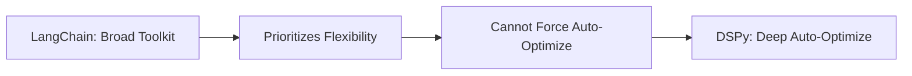

# dspy

_A product story reverse engineered from the codebase._

## The pitch

> It's like writing Python programs, but for Large Language Models, where you define the AI's step-by-step logic directly in code instead of manually crafting text prompts, and DSPy then automatically improves those underlying instructions.

## The pain

> A junior developer named Alex is struggling to make their AI consistently classify customer feedback; every time they tweak the prompt to fix one error, a new type of customer input makes the AI fail elsewhere. Their real competitor isn't another AI tool, it's continuously editing a Python prompt string in a text editor like VS Code and manually re-running their script, hoping it finally works.

## Where it sits

### What it gives up

- DSPy has a smaller, less established ecosystem of integrations compared to larger incumbents like LangChain.
- It may require more adherence to its programmatic, module-based patterns, which can feel less flexible than raw prompt templating for simple cases.
- DSPy's focus on auto-optimization means developers might initially invest more time in defining metrics and datasets.

### What it gets in return

- DSPy offers powerful, integrated auto-optimization of LLM programs (prompts, few-shots, weights) as a first-class feature.
- Its programmatic abstraction leads to more robust, testable, and maintainable LLM applications.
- DSPy emphasizes 'programming' the LM rather than 'prompting' it, aiming for higher performance and reliability with less manual prompt engineering.
- The integrated code interpreter (RLM/CodeAct) provides a safer, more controlled environment for AI agents to execute code.

### Why incumbents can't copy this

LangChain's business model and architecture are built around being a very broad, flexible "toolkit" for developers to stitch together LLMs with other services. Adding deep, opinionated, data-driven auto-optimization as a core feature for prompt and weight optimization would fundamentally alter its "toolkit" identity. This would require a significant shift in its API design, potentially breaking existing user patterns that prioritize explicit control over automatic inference-time modification. The complexity of integrating such optimization deeply would also conflict with its current emphasis on breadth and ease of integration across a huge surface area.

### Side by side

**Dimensions**

- **Logic defined by**: This describes how you write down the steps and rules for your LLM program. Is it like writing software, or more like giving instructions?
- **Auto optimize prompts**: Can the system automatically improve its own instructions or internal reasoning steps based on data, without you manually tweaking the text?
- **Code is open**: Can you view and change the framework's underlying programming code, or is it a closed, paid service?
- **Agent sandbox**: Can the AI agent execute its own code in a controlled, safe environment within the framework itself?

| Product | Logic defined by | Auto optimize prompts | Code is open | Agent sandbox |
| --- | --- | --- | --- | --- |
| **DSPy** | **Python code**. You write Python modules that define inputs, outputs, and how LLMs compose to solve a task. | **Full auto**. Core feature with optimizers (e.g., GEPA, MIPROv2) that refine prompts, few-shot examples, and even fine-tune LMs. | **Open**. The entire framework is a Python library with an MIT license; you can fork it. | **Built-in**. Includes PythonInterpreter (using Deno/Pyodide) for safe, sandboxed execution of agent-generated Python code (RLM, CodeAct). |
| **LangChain** | **Python + DSL**. You write Python code but often use specialized objects like LCEL for chains or specific prompt templates. | **Some helpers**. Offers tools for prompt templating and some basic evaluators, but lacks integrated auto-optimization of LLM calls. | **Open**. A Python library with open-source code and a permissive license. | **Via tools**. Relies on integrating external tools (e.g., Python REPL tool) that might have their own sandbox. |
| **LlamaIndex** | **Python + RAG DSL**. You write Python, focusing on data loading, indexing, and querying logic for retrieval. | **Limited**. Focuses on RAG optimization (e.g., re-ranking, query transformation), but less on the LLM prompt itself. | **Open**. A Python library with open-source code and a permissive license. | **Via tools**. Similar to LangChain, uses external tools for code execution. |
| **OpenAI API (raw)** | **Manual prompts**. You directly craft text prompts or message lists for each individual LLM call. | **None**. You manage all prompt iteration and evaluation yourself without framework assistance. | **Partial**. The client libraries (e.g., openai-python) are open, but the LLM provider's backend is not. | **None**. You must implement any code execution environment externally. |
| **OpenAI Assistants API** | **JSON config**. You define a 'persona,' functions, and tool usage in a declarative JSON schema or web UI. | **None**. The API executes what you define; you manually update configurations for improvement. | **Closed**. It's a proprietary cloud service with no public source code for the backend. | **Built-in**. Provides a 'Code Interpreter' tool as a managed service within the API. |

## Hiding in the code

### Sandboxed Python Code Interpreter
_dspy/primitives/python_interpreter.py, dspy/primitives/code_interpreter.py, dspy/primitives/runner.js_

The product is deeply committed to advanced, agentic LLM workflows that involve iterative code execution, self-correction, and robust tool use within a secure and controlled environment, moving beyond simple API calls.

### Native Multimodal Content Types
_dspy/adapters/types/image.py, dspy/adapters/types/audio.py, dspy/adapters/types/file.py, dspy/adapters/types/document.py, dspy/core/types.py_

The product anticipates widespread adoption of multimodal LLMs and is building first-class support for rich inputs beyond plain text, enabling sophisticated AI applications that interact with various data types (visual, audio, documents).

### Research-Grade Meta-Optimization Engines
_dspy/teleprompt/gepa/gepa.py, dspy/teleprompt/simba.py, dspy/teleprompt/mipro_optimizer_v2.py, dspy/teleprompt/bettertogether.py_

DSPy aims to be the leading platform for building truly intelligent, self-improving AI systems, not just a framework for prompting. This focus on bleeding-edge research-to-product suggests a deep investment in AI performance and robustness.

### Unified LLM Fine-tuning & RL Lifecycle
_dspy/clients/provider.py, dspy/clients/databricks.py, dspy/clients/openai.py, dspy/clients/lm_local.py, dspy/teleprompt/bootstrap_finetune.py, dspy/teleprompt/grpo.py_

The product acknowledges that prompt engineering alone has limits and that true LLM specialization will increasingly come from finetuning and reinforcement learning. It provides a consistent, provider-agnostic infrastructure to manage these complex model lifecycle workflows.

### Granular LLM Exception Handling
_dspy/utils/exceptions.py, dspy/clients/lm.py, dspy/clients/_litellm.py_

The product is designed for building resilient, production-grade AI applications where precise understanding and programmatic recovery from diverse LLM API failures (e.g., rate limits, context window overruns, authentication errors) are critical for stability and user experience.

### Smart Parallel Execution with Straggler Handling
_dspy/utils/parallelizer.py, dspy/utils/unbatchify.py_

The product is built for scale and efficiency in complex LLM workloads. It anticipates numerous concurrent calls and provides robust, self-optimizing mechanisms to prevent individual slow tasks or API responses from creating system-wide bottlenecks, ensuring smooth operation.

## Missing on purpose

### No Cloud LLM Deployment/Hosting
_The `dspy.clients.provider.py` abstract class and its concrete implementations focus on *finetuning* and *provider-specific deployment* (e.g., OpenAI, Databricks). There is no generic abstraction or implementation for deploying arbitrary LLMs (e.g., open-source models) to cloud-agnostic serving infrastructure._

DSPy chooses to focus on orchestrating existing LLM services and their native deployment mechanisms rather than competing with cloud providers or specialized MLOps platforms on LLM infrastructure. This avoids the immense operational complexity and cost of managing diverse LLM serving environments. Risk: Users who wish to self-host custom or open-source models in a cloud environment directly via DSPy would need to implement custom integrations or rely on external tools.

### No Built-in Data Annotation/Labeling UI
_The `dspy/datasets/` modules (`dataset.py`, `dataloader.py`) focus on loading pre-existing data from various formats (HuggingFace datasets, CSV, JSON, Parquet). There are no modules or UI components related to human-in-the-loop data labeling, active learning annotation workflows, or integrations with specialized annotation platforms._

DSPy prioritizes the programmatic optimization of LLM pipelines, intentionally leaving the complex domain of data generation, human annotation, and quality control to dedicated data labeling tools or external processes. This strategic choice narrows the product scope, allowing for deeper focus on core LLM programming. Risk: Users without readily available pre-labeled datasets may face an initial hurdle in acquiring the necessary training data, as DSPy doesn't offer tools to create it.

### No Real-time User Analytics Dashboards
_The `dspy/utils/usage_tracker.py` module explicitly tracks *LLM token usage* for cost and resource monitoring during optimization. However, the codebase lacks modules for general application-level user analytics, performance dashboards for deployed applications, or integration with external observability platforms (e.g., Datadog, Grafana) to monitor user engagement or end-user latency._

DSPy focuses on the internal performance and optimization of LLM programs, rather than the broader observability of deployed AI applications. This simplifies the core offering and avoids the overhead of building and maintaining a full-stack MLOps monitoring solution. Risk: Users must integrate their own external monitoring and analytics solutions to gain insights into how their DSPy-powered applications perform in a production environment from an end-user perspective.

### No Integrated Program Version Control
_While `dspy.primitives.base_module.py` provides `save` and `load` methods for program states to file paths, there is no built-in system for managing different *versions* of a DSPy program (e.g., a program registry, branching, merging, or rollback features) directly within the framework. Versioning metadata in `.github/` is for the `dspy` library itself, not user programs._

DSPy leverages existing external version control systems (like Git for code, or MLflow for model artifacts) for managing the evolution of LLM programs. This avoids reinventing a complex and well-solved problem, offering flexibility for users to choose their preferred tools. Risk: Users must meticulously manage their program versions through external systems, as the framework offers no internal mechanisms for tracking or reverting program changes.

### No Native Chat UI/Frontend
_The codebase is entirely focused on backend logic and LLM orchestration (`dspy/`). There are no modules for building user interfaces, frontend components, or integrations with web frameworks (e.g., Flask, Django, React, Vue). The `streamify` feature outputs raw data chunks or `dspy.Prediction` objects, which require external rendering logic._

DSPy's strategic choice is to be a powerful backend library for AI application development, providing core LLM programming capabilities without prescribing or building specific frontend solutions. This offers maximum flexibility for developers to integrate DSPy into any existing application or create custom user experiences. Risk: Developers are responsible for building or integrating their own frontend to interact with DSPy-powered applications.
