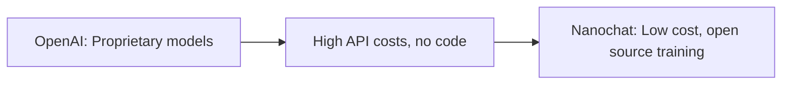

# nanochat

_A product story reverse engineered from the codebase._

## The pitch

> It's ChatGPT, but a minimal Python tool you can run to train your own comparable chatbot from scratch on a GPU for under $50.

## The pain

> Maya, a grad student in AI, dreams of building her own custom language model, but every online guide points to a different, complex framework designed for massive budgets. Her real competitor isn't another tool, it's the sheer effort of stitching together various open-source projects, debugging obscure errors, and battling her single GPU's memory limits.

## Where it sits

### What it gives up

- Ease of use of a finished, pre-trained model via simple API calls.
- Guaranteed high quality and massive scale of models trained on huge proprietary datasets.
- Broad general knowledge and robust performance across diverse tasks.
- Extensive safety guardrails and moderation layers built into a commercial API.
- Dedicated customer support and enterprise-grade uptime/reliability.

### What it gets in return

- The ability to train a full LLM from scratch for an incredibly low cost (e.g., $48 for GPT-2 capability).
- Complete transparency and control over the entire codebase, from tokenizer to optimizer.
- Deep understanding of LLM training mechanics by engaging with a minimalist, hackable stack.
- Freedom to integrate any novel research idea or tweak without complex framework limitations.
- Full ownership of the model weights and intellectual property, enabling private, custom deployments.

### Why incumbents can't copy this

OpenAI's entire business model and competitive advantage rest on their proprietary, large-scale, pre-trained models. Their users pay for the convenience and quality of a black-box service. If OpenAI were to offer an open-source, train-your-own-for-$50 alternative, it would directly cannibalize their core revenue, devalue their massive research and compute investments, and expose their most guarded intellectual property. Such a move would fundamentally undermine the very foundation of their existing, successful business.

### Side by side

**Dimensions**

- **Code you can read?**: Can you see and change the core program files that make the model work?
- **Train from scratch cost?**: How much money does it take to train a capable model, like GPT-2, from the very beginning on your own hardware?
- **How much control?**: Can you deeply change how the model learns and behaves, beyond simple settings, or are you limited to presets?
- **Learning curve to start?**: How hard is it for someone new to LLM training to get started and achieve a basic working model?

| Product | Code you can read? | Train from scratch cost? | How much control? | Learning curve to start? |
| --- | --- | --- | --- | --- |
| **nanochat** | **Yes**. The entire codebase is Python, openly available under the MIT license, including model architecture and training scripts (e.g., nanochat/gpt.py, scripts/base_train.py). | **Low**. Can train a GPT-2 equivalent from scratch for as little as ~$48 (~2 hours on an 8xH100 GPU node) on rented GPUs, with full pipeline guides. | **Full**. Designed for end-to-end modification of all stages, from tokenization to custom optimizers and architectural tweaks. | **Moderate**. Requires understanding Python, PyTorch, and distributed training concepts to fully utilize, but provides clear, simplified scripts and documentation. |
| **OpenAI API (GPT-4)** | **No**. Only provides API access; the model architecture, training code, and weights are proprietary and not publicly visible. | **Very High**. Not designed for training from scratch; costs are per-token for inference or fine-tuning existing models, which scales quickly. | **Limited**. Customization is restricted to fine-tuning existing models with your data, prompt engineering, and API parameters. | **Easy**. Using the API requires basic coding skills to send requests and parse responses, abstracting away all ML complexities. |
| **Hugging Face Transformers** | **Yes**. The entire library is open-source, allowing full inspection and modification of models, pipelines, and trainer implementations. | **Moderate**. Costs depend on chosen model size and compute resources, typically requiring cloud GPUs; smaller models can be trained on a single powerful GPU. | **High**. Offers extensive configuration options for models, optimizers, schedulers, and custom training loops, often through flexible `Trainer` abstractions. | **High**. Its comprehensive ecosystem, extensive API, and many abstractions (models, tokenizers, datasets, trainers) lead to a steep initial learning curve. |
| **Google Cloud Vertex AI** | **Partial**. You can provide your own training code, but the underlying infrastructure, base models, and managed services are proprietary and not inspectable. | **High**. Costs are based on managed GPU usage and platform fees, making it expensive to train large models or fine-tune extensively. | **Some**. Offers configuration for data, hyperparameters, and model deployment, but abstracts away low-level training details and infrastructure management. | **Moderate**. Requires understanding cloud concepts, specific Vertex AI workflows, and data preparation, but provides a user-friendly managed platform. |

## Hiding in the code

### Sandboxed Python for tool use
_nanochat/execution.py, nanochat/engine.py, tasks/gsm8k.py, tasks/humaneval.py_

The product is betting on agentic LLMs that can use external tools to verify their own reasoning and execute code, not just produce plausible text. This positions it for more complex, verifiable AI applications.

### Custom BPE Tokenizer pipeline
_nanochat/tokenizer.py, scripts/tok_train.py, scripts/tok_eval.py_

Ownership of the tokenizer training and inference pipeline ensures maximal control over data compression and input representation. This is crucial for fine-tuning model performance and efficiency, especially for 'micro models' that are sensitive to tokenization details.

### Muon/AdamW Hybrid Optimizer
_nanochat/optim.py, nanochat/gpt.py (setup_optimizer), dev/LOG.md_

Optimizing the training loop beyond standard AdamW with a custom, performance-oriented hybrid optimizer suggests a relentless pursuit of training efficiency and stability for state-of-the-art LLMs, even at smaller scales and across different parameter types.

### FP8 Training Support
_nanochat/fp8.py, scripts/base_train.py (--fp8)_

A commitment to leveraging the latest bleeding-edge hardware capabilities (H100+ tensor cores) to push the boundaries of training speed and cost-effectiveness, acknowledging that hardware advancements are critical for maintaining a competitive edge in LLM development.

### Per-layer Residual and x0 Scalars
_nanochat/gpt.py (resid_lambdas, x0_lambdas), dev/LOG.md (2026-01-11: Per-Layer Residual Scalars)_

Fine-grained, learnable control over information flow within the transformer allows the model to adaptively learn optimal skip connections and residual scaling. This indicates a focus on subtle architectural optimizations for maximizing model quality and learning efficiency.

### Internal AI Research Agent Skills
_.claude/skills/read-arxiv-paper/SKILL.md, dev/LOG.md_

The explicit markdown document defining a skill for an AI agent to read research papers, alongside a detailed experiment log, indicates a profound commitment to systematic, data-driven research and rapid iteration on architectural and training improvements for LLMs.

## Missing on purpose

### No Graphical User Interface (GUI)
_No nanochat/web.py or ui directories, only CLI scripts like scripts/chat_cli.py_

Stays lean and focused on core model development and research workflows via CLI. This avoids the significant overhead of UI development, maintenance, and deployment complexity inherent in user-facing applications.

### No Multi-User / Multi-Tenancy
_No user or organization tables, no API keys for individual users, no authorization checks in code_

Prioritizes simplicity and single-researcher iteration. Avoids the security, data isolation, and operational overhead of managing multiple users, allowing the team to focus purely on LLM capabilities.

### No Comprehensive Cloud Deployment
_README.md suggests 'Boot up a new 8XH100 GPU box from your favorite provider,' implying manual setup. No cloud-specific APIs (AWS, GCP, Azure)._

Keeps the platform infrastructure-agnostic and minimal, giving researchers flexibility to choose their compute environment. Avoids vendor lock-in and the complexity of maintaining cloud-specific integrations.

### No Real-time Prompt Engineering UI
_scripts/chat_cli.py is a simple console interface; scripts/chat_sft.py takes CLI args, not interactive input._

Maintains a code-centric workflow favored by researchers for reproducibility and version control. Avoids the design and implementation effort of an interactive, visually rich development environment, keeping focus on core training logic.

### No Custom Metrics Dashboards
_wandb is a core dependency (pyproject.toml), scripts/base_train.py logs extensively to wandb_run. No custom nanochat/dashboard.py or /metrics API._

Delegates comprehensive metrics visualization and logging to a specialized third-party tool. This allows nanochat to focus on the core LLM training and evaluation logic without reinventing monitoring infrastructure.
