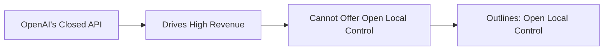

# outlines

_A product story reverse engineered from the codebase._

## The pitch

> It's like Google's Gemini, but instead of generating free-form text, Outlines guarantees that large language models (LLMs) produce output that strictly follows a predefined structure, such as a JSON schema, a regular expression, or a list of choices, as they generate each word.

## The pain

> Sarah, a customer support manager, wants AI to categorize urgent emails for fast routing, but the model constantly spits out malformed JSON—a missing bracket, a typo in a category. Her current solution is a manual game of 'spot the error' in a text editor or a Python script with more `try-except` blocks than actual logic.

## Where it sits

### What it gives up

- Outlines does not have its own flagship LLM, relying instead on others' models (local or API).
- It requires users to manage their own infrastructure (e.g., GPUs, model dependencies) when using local models.
- It might have a steeper initial learning curve for basic text generation compared to simple 'generate text' API calls.
- It cannot guarantee structured output for all API models, only those that expose sufficient control or through its own `dottxt` API.

### What it gets in return

- Outlines provides guaranteed structural correctness for local models, drastically reducing the need for unreliable post-processing and retry logic.
- It enables significant cost savings by allowing users to run structured generation on local or self-hosted models, avoiding expensive per-token API fees.
- It offers flexibility and vendor independence, allowing users to switch models or providers without rewriting their core structured output logic.
- Advanced users gain greater control and customization options, such as defining custom grammars or logits processors.
- Its open-source nature provides full transparency and auditability of the structured generation process.

### Why incumbents can't copy this

OpenAI's dominant business model relies on a proprietary, black-box API with per-token pricing for its powerful LLMs. To copy Outlines' core strength—open-source, local-first structured generation with direct token-level control—OpenAI would need to open-source its frontier models, provide software for local execution with logit access, and fundamentally shift its competitive advantage from a service provider to a library provider. This would directly cannibalize its highly profitable API revenue and expose its core intellectual property, effectively destroying its existing business. Their current structured output features are tightly coupled to their closed API, not designed for open, vendor-agnostic control.

### Side by side

**Dimensions**

- **Output check time**: When the library makes sure the output matches the desired structure.
- **Supports local LLMs**: Can run with models downloaded to your computer without paying a per-token API fee.
- **Source code open**: Is the code that performs the core structured generation publicly available to read and change?
- **Structure definition**: How you describe the output format you want.

| Product | Output check time | Supports local LLMs | Source code open | Structure definition |
| --- | --- | --- | --- | --- |
| **Outlines** | **During generation**. Masks invalid tokens at each step, preventing incorrect outputs from ever being generated for local models (using FSMs, `outlines/backends/*`), and leverages native API capabilities for black-box models. | **Full**. Integrates directly with HuggingFace transformers, llama.cpp, and MLX-LM to enforce structured generation on user-managed hardware. | **Open**. The entire library, including core Finite State Machine (FSM) logic, is open-source under the Apache 2.0 license. | **Python types, Regex, CFG**. Uses standard Python types (Literal, Enum, Pydantic models, list, dict), regular expressions, or Context-Free Grammars as direct inputs to define the desired output structure. |
| **Guidance** | **During generation**. Directly controls the token generation process for local models by masking invalid tokens based on the specified structure. | **Full**. Primarily designed for local HuggingFace transformers models, allowing direct control over the generation process. | **Open**. The library is open-source under the MIT license, allowing full inspection and modification. | **Handlebars syntax**. Defines output structure and control flow using a custom 'handlebars' templating language integrated into prompts. |
| **OpenAI API (native)** | **During generation**. The API itself handles the constraint enforcement on the server side, ensuring generated tokens conform to the specified `response_format='json_object'` or tool call schema. | **None**. This is an API-only cloud service; it does not run models locally on user hardware. | **Closed**. The underlying LLM models and their structured generation mechanisms are proprietary and not publicly accessible. | **JSON Schema, tool calls**. Requires defining output using JSON Schema (for `response_format='json_object'`) or OpenAPI-like function definitions for tool calling. |
| **Instructor** | **After generation**. Generates output, then parses it with Pydantic; if validation fails, it provides feedback to the model and retries, looping until valid output is produced. | **None**. It wraps API calls (primarily OpenAI's) and does not directly execute or constrain local LLMs. | **Open**. The Python library is open-source under the MIT license. | **Python types (Pydantic)**. Relies heavily on Pydantic models to define expected output structures, automatically generating prompts with schema instructions. |

## Hiding in the code

### Persistent Caching for LLM Calls
_src/outlines/caching.py (Cache, CloudpickleDisk, get_cache)_

The product is betting on operational efficiency for production systems where repeated LLM calls can be expensive or slow, prioritizing performance and cost reduction.

### Pluggable Constraint Backends
_src/outlines/backends/__init__.py (LLGuidanceBackend, OutlinesCoreBackend, XGrammarBackend)_

This strategy offers multiple highly optimized ways to enforce structured outputs, allowing Outlines to adapt to evolving research in efficient token masking and support diverse model architectures without being locked into a single implementation.

### Extensive Multimodal Input Support
_src/outlines/inputs.py (Image, Video, Audio, Chat), src/outlines/models/transformers.py (TransformersMultiModal)_

Outlines is positioned for the future of multimodal LLMs. The detailed support for various media types across multiple model integrations suggests a belief that multimodal inputs will become central to many structured generation tasks.

### Domain-Specific Type Definitions
_src/outlines/types/airports.py (IATA Enum), src/outlines/types/countries.py (Alpha2, Alpha3, Numeric, Name, Flag Enums), src/outlines/types/locale/us.py (zip_code, phone_number Regex)_

By providing out-of-the-box support for precise, validated data formats, Outlines targets specific verticals (e.g., travel, logistics, government) where high-precision data extraction is critical, hinting at future domain-specific solutions.

### Python-native Regex DSL with Pydantic Integration
_src/outlines/types/dsl.py (Term hierarchy, python_types_to_terms, to_regex), src/outlines/types/__init__.py (pre-defined Regex types like uuid4, ipv4, semver)_

Outlines prioritizes developer experience for complex constraint definition. By enabling developers to compose structured types using Pythonic constructs, it lowers the barrier to entry for highly precise output control, fostering broader adoption.

### Normalized API Error Handling
_src/outlines/exceptions.py (APIError hierarchy, normalize_provider_errors context manager)_

This robust error handling abstracts away vendor-specific API failure modes, providing a consistent, actionable interface for developers to build resilient applications. This minimizes the operational burden of managing diverse vendor APIs in production.

## Missing on purpose

### No Integrated RAG/Vector Database
_No dedicated 'vector_db' or 'retrieval' modules, no imports for common vector database clients like Chroma or Pinecone._

Outlines stays lean and focused exclusively on generation-time control. This avoids the complexity, cost, and operational burden of managing external knowledge bases and retrieval systems, but requires users to integrate a separate RAG solution for knowledge-intensive tasks.

### No Built-in UI or Analytics Dashboard
_Only Google Analytics for documentation (`mkdocs.yml`), no 'dashboards', 'metrics', or 'logs_viewer' modules or associated web framework dependencies._

The product maintains a developer-tool library focus, prioritizing programmatic control and integration flexibility. This avoids the significant effort of building and maintaining a web-based UI and operational dashboards, but enterprises might need to build custom monitoring around Outlines integrations.

### No Direct Fine-tuning or Model Training
_Release notes explicitly state 'The `load_lora` methods...have been deprecated' and delegates to upstream model libraries; no 'trainer' or 'finetune' modules are present._

Outlines focuses on inference-time structured generation. It delegates the complex and resource-intensive task of model training and fine-tuning to specialized libraries, limiting customization for users who require model-level behavioral changes.

### No User Authentication or Multi-tenancy
_No 'User', 'Tenant', or 'Auth' models/tables, nor any standard authentication or authorization libraries (e.g., Flask-Login, Django-Auth) within the codebase._

Operating purely as a library avoids the substantial overhead of a multi-user SaaS platform, including user management, access control, and billing infrastructure. However, organizations requiring these features for centralized control must build or integrate them externally.

### No High-Level Agent Orchestration Framework
_An 'examples/react_agent.md' exists, but the core library lacks a comprehensive framework (like LangChain or LlamaIndex) for complex reasoning loops or tool orchestration beyond providing structured output for function calls._

The library maintains a modular design focused on its core strength of structured generation, avoiding the opinionated design choices and rapidly evolving complexity of a full-stack agent framework. Users building complex autonomous agents must integrate Outlines with another agent library.

### No Built-in Content Moderation
_Error handling for OpenAI models (`openai.py`) includes checking for `message.refusal` but there are no custom 'moderation_filter' or 'safety_check' modules, indicating reliance on upstream models._

Outlines delegates the complex, sensitive, and constantly evolving challenge of content moderation to underlying LLM providers or dedicated third-party services. This avoids the significant ethical, legal, and engineering burden of maintaining its own safety systems, but users are entirely reliant on external mechanisms.
