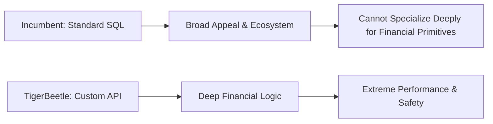

# tigerbeetle

_A product story reverse engineered from the codebase._

## The pitch

> It's like a PostgreSQL database, but it's built specifically for financial transactions with native features like accounts and transfers that automatically handle debits and credits to ensure accuracy and high speed.

## The pain

> Sarah, a backend engineer at an online marketplace, just got another urgent alert: hundreds of payment holds expired overnight but weren't automatically released, leaving customer funds stuck and manual fixes piling up. Her real competitor isn't another ledger; it's her team's intricate codebase with separate tables, cron jobs, and rollback scripts that constantly break.

## Where it sits

### What it gives up

- TigerBeetle does not offer a standard SQL interface, increasing the learning curve and integration effort for developers familiar with relational databases.
- It currently lacks official managed cloud offerings, requiring users to handle their own infrastructure, deployment, and operational management.
- Its highly specialized focus limits its applicability to financial transaction processing, making it unsuitable for general-purpose data storage.
- As a newer technology, it has a less mature ecosystem, fewer pre-built tools, and a smaller community compared to established database solutions.

### What it gets in return

- It achieves unparalleled transactional performance and throughput for financial ledgers due to its purpose-built design and choice of low-level language (Zig).
- It ensures strong financial correctness and data integrity directly at the database layer, significantly reducing application-side complexity and potential accounting errors.
- Its simplified data model, focused exclusively on financial primitives, eliminates the overhead associated with general-purpose database features.
- The immutable, double-entry ledger design provides inherent auditability for all transactions, simplifying compliance and reconciliation processes.

### Why incumbents can't copy this

Traditional RDBMS like PostgreSQL and distributed SQL databases like CockroachDB derive significant value from their broad applicability and standard SQL interfaces. To copy TigerBeetle's deep integration of financial primitives and low-level performance optimizations, they would need to fundamentally alter their core data models and query languages. This would break backward compatibility, alienate their vast existing user bases, and undermine the very "general purpose" appeal that defines their business. Their current architectures, optimized for flexibility and wide adoption, introduce overheads that prevent them from matching TigerBeetle's extreme specialization and raw performance for ledger operations without destroying their core value proposition.

### Side by side

**Dimensions**

- **Built-in Accounting Logic**: It has core features that automatically handle financial rules like debits, credits, and two-phase transfers, ensuring account balances are always consistent.
- **Standard SQL Access**: Data interaction primarily happens through widely recognized SQL (Structured Query Language), offering familiarity and compatibility with many tools.
- **Cloud Managed Service**: A vendor provides the database as a hosted solution, taking care of setup, scaling, backups, and maintenance, reducing your operational burden.
- **Low-Level Performance**: Its architecture is fundamentally optimized for extreme transaction throughput and low latency by minimizing overhead and direct hardware interaction.

| Product | Built-in Accounting Logic | Standard SQL Access | Cloud Managed Service | Low-Level Performance |
| --- | --- | --- | --- | --- |
| **TigerBeetle** | **Yes**. Purpose-built for double-entry accounting, ACID guarantees, and pending transfers. | **No**. Uses a custom binary protocol API; no SQL support. | **No**. Requires users to self-host and manage their own infrastructure. | **Extreme**. Written in Zig, optimized for ultra-low latency and high-volume financial transactions. |
| **PostgreSQL** | **No**. Requires extensive application logic or third-party extensions for accounting rules. | **Yes**. Provides full support for standard SQL queries and commands. | **Yes**. Widely available through numerous managed cloud providers (e.g., AWS RDS, Google Cloud SQL). | **Moderate**. A general-purpose relational database, capable but not designed for extreme raw financial transaction throughput. |
| **CockroachDB** | **No**. Accounting logic must be implemented at the application layer. | **Yes**. Offers a distributed SQL interface compatible with PostgreSQL. | **Yes**. Available as a fully managed cloud service (CockroachDB Cloud). | **High (Distributed)**. Optimized for distributed ACID transactions and horizontal scalability, but still a general-purpose database. |
| **Custom Ledger on PostgreSQL** | **Partial (App Layer)**. Accounting rules are enforced by application code, not natively by the database engine. | **Yes**. Interacts with the underlying PostgreSQL database using standard SQL. | **Depends on Hosting**. The PostgreSQL instance can be cloud-managed, but the custom application logic is not. | **Moderate**. Performance is limited by the underlying PostgreSQL database and the overhead of application-side accounting logic. |

## Hiding in the code

### Cluster-wide synchronized clock
_src/vsr/clock.zig, src/vsr/marzullo.zig_

The product is betting that perfectly ordered, globally synchronized timestamps are a critical primitive for financial integrity and complex ledger rules, far beyond what simple `now()` calls or NTP provide. This enables robust fraud detection, accurate accounting, and complex financial product modeling without relying on external time services.

### Proactive data scrubbing and repair
_src/vsr/grid_scrubber.zig, src/vsr/grid.zig, src/vsr/repair_budget.zig_

TigerBeetle prioritizes absolute data integrity and continuous availability even in the face of hardware failures and network issues. This builds trust by ensuring the ledger is self-healing and resistant to subtle data degradation, minimizing the risk of data loss from multiple intersecting faults.

### Atomic linked operations
_src/tigerbeetle.zig (AccountFlags, TransferFlags), src/state_machine.zig (scope_open, scope_close, linked_event_failed)_

Many complex financial operations involve multiple interdependent ledger entries (e.g., transfers between internal accounts, multi-party settlements). Providing native, performant atomic linking simplifies application logic and ensures strong consistency for these compound operations, reducing the burden on application developers.

### Flexible query engine over LSM trees
_src/lsm/groove.zig, src/lsm/scan_builder.zig, src/lsm/scan_merge.zig, src/lsm/scan_tree.zig, src/lsm/table.zig, src/state_machine.zig (prefetch_query_accounts, prefetch_query_transfers)_

While a core ledger needs high-throughput writes, the ability to perform arbitrary, powerful analytical queries on transactional data is a significant differentiator. The custom LSM is built for this dual goal of high-throughput writes and flexible reads, not just simple ID lookups, positioning it for rich financial analytics.

### Historical data import/migration
_src/tigerbeetle.zig (AccountFlags.imported, TransferFlags.imported), src/state_machine.zig (create_account, create_transfer logic for imported flag), src/clients/python/README.md_

The product anticipates that large enterprises will need to migrate massive amounts of historical financial data into TigerBeetle without altering historical timestamps, providing a critical feature for adoption in regulated industries that value audit trails and data immutability.

### Fine-grained error codes and idempotency
_src/tigerbeetle.zig (CreateAccountStatus, CreateTransferStatus), src/state_machine.zig (transient_error function), src/clients/*/README.md_

Financial systems demand extremely precise feedback on transaction outcomes, enabling intelligent application-side retry logic and robust system integrations. Built-in idempotency simplifies client-side error recovery and ensures ledger consistency even with retries, fostering trust and operational efficiency.

## Missing on purpose

### No general-purpose SQL interface
_The codebase lacks a SQL parser, query optimizer, or execution engine. Querying is exposed through specific API calls like `query_accounts` or `get_account_transfers` using structured filter structs (e.g., `QueryFilter` in `src/tigerbeetle.zig`), rather than arbitrary string queries._

Prioritizes extreme performance, type safety, and direct control over query execution, avoiding the overhead and potential for inefficient queries that a generic SQL engine might introduce. This comes at the cost of developer familiarity and ad-hoc querying flexibility; complex data retrieval patterns not directly supported by current filters require more application-side code.

### No user-defined logic/smart contracts
_There is no `EVM`, WebAssembly runtime, or any other mechanism to embed custom business logic or 'smart contracts' within the ledger itself. All operations (`Operation` enum in `src/tigerbeetbe.zig`) are predefined ledger primitives._

Focuses solely on being a highly performant, auditable, and immutable ledger primitive. Offloads complex business logic to the application layer, reducing the attack surface and increasing predictability and performance of the core ledger. This risks alienating users who seek more 'programmable' ledgers, increasing application-side complexity for ledger-driven logic.

### No integrated auditing/reporting dashboards
_While `ChangeEvent` and `AccountEvent` structs in `src/state_machine.zig` store detailed audit trails, there is no built-in web UI, API for reporting dashboards, or visualization tools within the codebase. The `README.md` and client samples focus entirely on programmatic interaction._

Maintains a minimalist, headless database design, focusing on its core strengths as a backend ledger. Avoids the overhead and maintenance burden of UI components. Assumes users will integrate with existing Business Intelligence (BI) tools or build their own custom dashboards on top of the raw data. This can increase the barrier to initial data exploration and operational visibility for non-developers.

### No multi-tenancy or fine-grained access control
_The codebase does not contain tables or logic for `Tenant` management, `User` roles, or `ACL` mechanisms tied to specific operations or data subsets within the ledger itself. Access control is primarily at the client and cluster ID level._

Simplifies the core security model to focus on data integrity and correctness across a single logical cluster. Assumes that multi-tenancy and fine-grained authorization are handled at the application layer, which is a common pattern for high-performance financial systems. This shifts the burden of implementing complex, secure access control to the application, which can be challenging to implement correctly and consistently.

### No built-in replication topology management UI
_The `README.md` shows command-line tools (`tigerbeetle format`, `tigerbeetle start`) for basic cluster operations. There is no web-based or API-driven UI for managing the VSR cluster topology (adding/removing replicas, monitoring health beyond raw logs, configuring parameters dynamically)._

Prioritizes automated, resilient cluster management via consensus protocols over manual, operator-driven configuration changes through a UI. Aims for a 'hands-off' operational model for the core database where the system self-organizes. This means operational tasks that require manual intervention might be complex, relying on scripting or external tooling rather than integrated graphical features.
