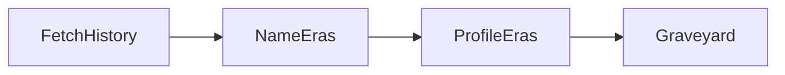

# Chapter 6. Git History

> Your product roadmap is already written — in the commit log. Three prompts turn a raw `git log` into named eras, per-era cast-and-mood profiles, and a graveyard of killed features.

## What this chapter ships

A twenty-line git crawler, three prompts that each read the history at a different zoom level, a workflow that runs them in order, and a renderer that emits a self-contained HTML timeline plus a markdown twin.

```
ch06-git-history/
├── prompts/
│   ├── name-eras.md         # bird's-eye: split the whole history into 3-5 named eras
│   ├── profile-era.md       # one era's cast (who) and mood (what)
│   └── graveyard-entry.md   # read a bulk deletion's code: the bet the team killed
├── workflow/
│   ├── gitlog.py            # listing 6.2 crawler + the summaries the prompts need
│   ├── nodes.py             # FetchHistory → NameEras → ProfileEras → Graveyard
│   ├── flow.py
│   ├── main.py              # CLI
│   ├── render.py            # timeline HTML + markdown
│   └── requirements.txt
├── skill/GIT-HISTORY.md     # agent equivalent (drop into Claude Code or Cursor)
└── output/<repo>-history/
    ├── index.md
    └── index.html
```

## Quickstart

```bash
pip install -r ../../utils/requirements.txt
export ANTHROPIC_API_KEY=...     # or OPENAI_API_KEY, or GEMINI_API_KEY

git clone https://github.com/TryGhost/Ghost path/to/Ghost
cd workflow
python main.py path/to/Ghost
```

Output (an actual run — the model names the eras, so yours will differ):

```
  Crawled 51,747 commits (2013-05..2026-07), 335 bulk adds, 324 bulk deletions
  Named 4 eras: The Core Publishing Promise -> Expanding to Audience & Rich Content -> The Monorepo & Lexical Refoundation -> Modular Admin & Platform Growth
  Profiling era 1/4: The Core Publishing Promise
  ...
  Wrote 6 graveyard entries

Wrote ../output/Ghost-history/index.md
Wrote ../output/Ghost-history/index.html
  Open ../output/Ghost-history/index.html in a browser
```

It reads the log only; nothing in the repo changes. (The book's chapter walks
through a hand-edited four-era version of this same history; a live run names
the eras itself, so the exact labels and count vary.)

## Three zoom levels

Each pass reads the history at exactly one depth — the wrong one shows you nothing but routine refactors, or flies you over the pivots:

| Granularity | Command | What you get per commit |
|---|---|---|
| commit | `git log` | hash, author, date, message |
| file | `git log --name-only` | the above, plus files each commit touched |
| code | `git show <hash>` | the above, plus lines added / removed |

- **NameEras** aggregates *file*-level changes into product areas over time.
- **ProfileEras** works at the *commit* level (one line per commit) with a few *code*-level landmark diffs as anchors.
- **Graveyard** starts at the *file* level to find bulk deletions, then drops to *code* to read what died.

## How it works



`FetchHistory` runs one `git log` and pulls the bulk-addition/deletion rosters. Every later node slices that same commit list a different way — one `git log`, never a re-query (§6.2). Each LLM node uses `Node(max_retries=3, wait=2)`; JSON parsing is strict, so a malformed reply retries cleanly. The only swallowed errors are git's own subprocess reads.

Prompts contain literal JSON examples, so `nodes.py` fills their `{slots}` by targeted replacement (`fill()`), not `str.format` — the prompt files stay clean copies of what's in the book.

## The data layer

`gitlog.py` keeps `git_log_commits` byte-faithful to the book's listing 6.2 (one dict per commit) and adds the compression the prompts need:

- `heatmap_summary` / `pivots_summary` — directory-by-month activity and when each directory was born or went silent.
- `bulk_changes(repo, "A"|"D", min_files)` — the commits that added or removed many files at once (the era boundaries and the graves).
- `era_commits`, `commit_stream`, `landmarks`, `show_diff` — slice one era into a commit stream plus five sampled diffs.

## Example output

[`output/Ghost-history/`](output/Ghost-history/) is a real run on the full Ghost
repo (51,747 commits, 2013–2026): four named eras, a cast-and-mood profile for
each, and a graveyard of six killed features — the standalone Ember admin UI, the
versioned APIs, the 4.x migrations, and more, each read from the deleted code.
Open [`index.html`](output/Ghost-history/index.html) for the polished page;
[`index.md`](output/Ghost-history/index.md) reads fine on GitHub. Regenerate with
your own key, or point `main.py` at any local clone.

## How the page is built

One self-contained HTML file (embedded CSS, fonts + Mermaid via CDN, no build
step), with **one section per prompt in the chapter** so the page mirrors the
analyses:

1. **The eras** — a horizontal timeline you swipe through; each card has the
   era's story, a small ```mermaid diagram of its shift, and its turning point.
2. **Cast & mood** — one card per era: contributor and work-pattern bars.
3. **The graveyard** — a tombstone per killed feature.

Every section is a left-to-right rail so you get the big picture first, and each
card is a fixed frame that scrolls up/down inside instead of growing into a wall
of text. The prompts ask Gemini to write like a friendly teammate giving a
first-day tour — plain words, everyday analogies, and the occasional diagram or
code snippet — so the output reads as a story, not a report.

## Agent equivalent

[`skill/GIT-HISTORY.md`](skill/GIT-HISTORY.md) runs the same three passes inside an agent session. Best when you're already exploring a repo in Claude Code or Cursor and want the history read without switching to the CLI.
