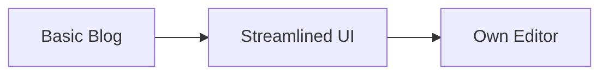
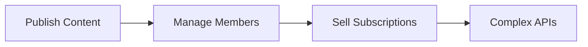
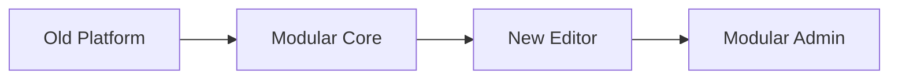
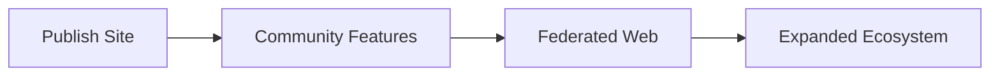
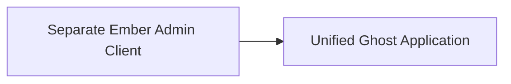
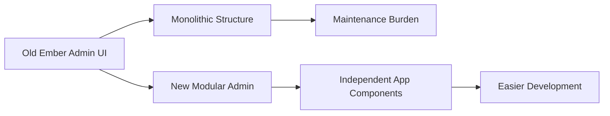
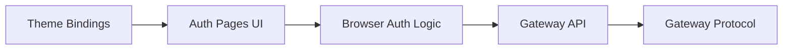

# Ghost: git history

_51,747 commits, read as eras and a graveyard._

Ghost is an open-source publishing platform, and this 51,747-commit codebase reveals its architectural evolution from a focused content management system to an extensible, modular platform supporting audience engagement and monetization. The git history surfaces key shifts in the data models, API contracts, and core service integrations that underpin its strategic growth.

## The eras

### Era 1: The Core Publisher (2013-05 → 2018-11)

Welcome to the very beginning of Ghost, back when the project was taking its first steps to be the best open-source blogging platform. Picture a small startup, super focused on just one thing: making writing and publishing content frictionless. We see the birth of our foundational directories like `core/` (the heart of the application), `core/server/` (our backend engine), `ghost/admin/` (where you'd manage your site), and `core/frontend/` (what your visitors saw). There was an early `core/client/` for the admin that got replaced by an 'Ember admin' by 2014, showing a quick iteration to get the UI right. We even tried an off-the-shelf editor, `koenig/kg-simplemde/`, but quickly pivoted to developing our own, laying the groundwork for what would become our renowned editor experience. This era was all about building a solid, fast, and elegant platform for writers.



**Turning point:** The team realized that simply providing a great writing experience wasn't enough. Publishers needed to connect directly with their audience, collect emails, and even charge for content. This shift in focus set the stage for building audience management features.

### Era 2: Unlocking Audience & Monetization (2018-12 → 2022-08)

Building on the solid publishing core, this era was all about empowering creators to build sustainable businesses around their content. We started adding crucial functionality to manage your audience directly within Ghost. The `ghost/members-api/` directory came to life, allowing publishers to handle member sign-ups and subscriptions. We introduced `ghost/portal/`, a user-facing component that lets your audience sign up and manage their membership. To support this growth and future features, we also saw the introduction of `canary` API endpoints (like a beta track for our API), allowing us to test new features more rapidly. Our CI/CD (`.github/workflows/`) setup was born, professionalizing our development process. However, all this rapid expansion and API versioning (v1, v2, v3) eventually led to a complex `core/server/` architecture that needed a fresh approach.



**Turning point:** The existing monolithic `core/server/` (one big piece of server-side code) and its multiple, versioned APIs had become a significant hurdle for rapid development and future innovation. The team made the bold decision to fundamentally overhaul the backend architecture, paving the way for a more modular and scalable system. (`a4a9ba7940`)

### Era 3: The Modular Platform & Next-Gen Editor (2022-09 → 2024-11)

With the decision to modernize our backend made, this era kicked off with a massive re-architecture. The old `core/server/`, `core/frontend/`, and other `core/` directories went silent, replaced by the nimble `ghost/core/` package. The jewel of this era was the complete rewrite of our editor: we ditched `koenig-react` and launched `koenig/koenig-lexical/`, a cutting-edge rich-text editor that forms the backbone of your writing experience today. The entire admin interface also underwent a significant modularization, with old 'Ember settings pages' being 'Deleted' (`e8e0d84d50`) and new 'app'-like components such as `apps/admin-x-settings/` appearing. We also saw new features like `apps/comments-ui/` for direct audience engagement, signaling our continued commitment to building community tools. This was all about making Ghost more flexible, maintainable, and ready for whatever came next.



**Turning point:** With the core platform rebuilt, the admin interface modularized, and the editor perfected, the team was ready to push Ghost beyond a standalone publishing tool and explore its role in the broader, connected web. (`e8e0d84d50`)

### Era 4: Extending the Network & Modular Apps (2024-12 → 2026-07)

You're joining us right in the thick of this exciting era! Having modernized the core and editor, the team is now exploring how Ghost can connect to the wider internet and offer even more sophisticated features. We saw the experimental `apps/admin-x-activitypub/` emerge, a fascinating exploration into the federated social web (think Mastodon integration!). While that specific app might have evolved, it shows our intent to connect. We're continuing to modularize the admin experience with new 'app' packages like `apps/shade/` and `apps/posts/`, making the platform even more flexible and adaptable. Legacy components are still being 'Removed', like the `legacy Ember members list` (`1dd3f89137`), as we refine the entire system. This era is about pushing the boundaries of what a publishing platform can be, connecting content creators to networks and communities in innovative ways.



**Turning point:** This era is still very much active and evolving, with new ideas and applications continually being explored and integrated. There's no fixed 'end' yet, only ongoing innovation!

## Cast & mood

### Era 1: The Core Publisher

**Cast:**
- Hannah Wolfe (19%) — A core developer and technical lead, Hannah guided the project through its initial build and continuous refinement across all areas.
- Kevin Ansfield (8%) — A key contributor to the Ghost admin's evolving user interface, focusing on components, modals, and editor enhancements in the later half of the era.
- John O'Nolan (6%) — A co-founder, John shaped the early product vision and contributed significantly to the initial administrative interface and overall project direction.
- Sebastian Gierlinger (5%) — A consistent backend contributor, Sebastian focused on server-side logic, security, and API improvements throughout the era.
- kirrg001 (4%) — Becoming a prominent figure later in the era, kirrg001 focused on broader core updates, migrations, and system-level enhancements.

_This era was heavily steered by co-founder John O'Nolan and lead developer Hannah Wolfe, who laid the foundation; a growing group of contributors then helped expand and refine the platform._

**Mood:**
- Admin UI & Editor Experience (50%) — Developing and iterating on the core administrative interface, including user management, settings, and the increasingly sophisticated content editor.
- Core Application Logic (25%) — Building out the backend engine, API functionalities, and foundational server-side features like security, data handling, and theme support.
- Developer Tooling & Infrastructure (25%) — Maintaining and evolving the project's build processes, code quality, dependencies, and underlying technical setup.

_The primary focus was on delivering a polished writing and publishing experience through extensive admin UI work, supported by a solid core backend and continuous investment in developer tooling._

### Era 2: Unlocking Audience & Monetization

**Cast:**
- Renovate Bot (16%) — An automated bot ensuring dependencies remained updated and secure across the entire codebase.
- Kevin Ansfield (9%) — A primary owner of the admin interface and Koenig editor, focusing on UI features, bug fixes, and the publisher's experience.
- Fabien O'Carroll (9%) — Heavily involved in the backend architecture for members and subscriptions, including API development and integrations.
- Naz (7%) — A key backend developer, contributing significantly to core server logic, API refactoring, and initial member import functionality.
- Daniel Lockyer (7%) — Orchestrated CI/CD improvements, managed releases, and oversaw the structural organization of various Ghost packages.

_This era saw a significant growth in the core team, moving from its founder-led origins to a distributed group of specialized contributors, reflecting the increasing complexity of a monetization-focused product._

**Mood:**
- Developer Tooling & CI/CD (26%) — A major investment in automating dependency updates, professionalizing development with GitHub Actions, and robust testing frameworks.
- Publisher Admin & Editor Experience (24%) — Continuous enhancements to the Ghost admin panel and the Koenig editor, improving the daily workflow for content creators.
- Core Platform & API Infrastructure (21%) — Ongoing work to support the expanding API versions, database migrations, and maintain the underlying stability of the Ghost platform.
- Audience & Monetization Features (20%) — Dedicated effort to build out member sign-ups, subscription management, and the user-facing Portal for creators.
- New Audience Engagement Tools (3%) — Early exploration and development of interactive features like commenting and improved search for the audience.

_The work was heavily skewed towards building robust member and monetization features, backed by a significant investment in development infrastructure, while still refining the core publishing and admin experience._

### Era 3: The Modular Platform & Next-Gen Editor

**Cast:**
- Kevin Ansfield (19%) — A primary engineer for the cutting-edge Lexical editor, driving its integration and new card features.
- Daniel Lockyer (13%) — A core architect, shepherding the backend modernization and the shift to modular 'apps' in Ghost.
- Simon Backx (12%) — Focused on the new AdminX settings interface, ensuring smooth functionality for various admin features.
- Djordje Vlaisavljevic (11%) — Instrumental in shaping the user experience and visual design of the modular admin settings and new apps.
- Ronald Langeveld (9%) — Heavily involved in building new content cards for the Lexical editor, including Unsplash and Header Cards.

_This era saw a strong core team of specialized contributors emerge, each owning major parts of the modular rewrite, moving beyond the founder-led origins._

**Mood:**
- Modular Admin & Apps (29%) — Rebuilt the admin interface into a modular system with dedicated 'apps' for settings, comments, and other features.
- Lexical Editor & Content Cards (28%) — Ditched the old editor for a Lexical-based rewrite, focusing on rich-text capabilities and new content cards.
- Core Platform & Backend (17%) — Modernized the backend architecture, including core services, collections, and overall Ghost platform enhancements.
- Dependency & Tooling Updates (16%) — Kept the platform current by regularly updating dependencies, improving CI, and maintaining development tools.
- Audience & Monetization Features (8%) — Continued to enhance membership features, portal functionality, and audience engagement tools like mentions and recommendations.

_The primary focus was on a complete re-platforming, delivering a modern editor and modular admin, supported by significant core backend and tooling updates._

### Era 4: Extending the Network & Modular Apps

**Cast:**
- Steve Larson (11%) — A key architect of the platform's data and analytics, he also maintained core services and ensured testing infrastructure was solid.
- Kevin Ansfield (7%) — Deeply involved in evolving the Koenig editor and the admin UI, ensuring a polished experience across various member-facing flows.
- Sodbileg Gansukh (5%) — A primary driver for the ActivityPub integration, shaping its design and user experience within the new modular admin apps.
- Peter Zimon (5%) — Focused on UI/UX consistency across the new modular apps like Shade and ActivityPub, and enhancing the analytics dashboards.
- Chris Raible (5%) — Contributed significantly to Portal and the backend analytics infrastructure, alongside crucial CI/CD and build process improvements.

_This era saw a dedicated core team, with Steve Larson leading on data and infrastructure, while a distributed group of specialists built new modular apps and features; meanwhile, a busy bot diligently kept all dependencies up-to-date, making it the top contributor by commit count._

**Mood:**
- Platform Infrastructure & Tooling (47%) — This includes major dependency updates, CI/CD (continuous integration/continuous deployment) pipeline enhancements, core refactoring (like removing legacy testing frameworks), and modernizing build processes.
- Audience & Monetization Features (22%) — Developing new analytics dashboards, member management capabilities, advanced email flows, and monetization features like offers and integrations (e.g., Transistor.fm for podcasts).
- Modular Admin Apps & UI/UX (19%) — Building out new administrative applications such as ActivityPub (for federated social web integration), Shade (a design system), and Posts, focusing on a more flexible and adaptable user interface.
- Editor & Content Refinement (12%) — Enhancing the core Koenig editor experience, expanding internationalization support for more languages, and addressing general bug fixes and minor UI improvements.

_Work focused heavily on foundational platform modernization and expanding new modular applications, while simultaneously enhancing core audience engagement and content creation tools._

## The graveyard

### ⚰ Remove split Ghost-Admin code
_2016-05-18 · `1b85d67` · 514 files · `core/client/`_

**What it was: a dedicated admin client.** This was a complete Ember.js application responsible for Ghost's entire administration dashboard, including content creation and editing, user management, site settings, and file uploads, all running in the browser.

**What they believed: publishers wanted a desktop-like experience.** The team believed that a rich, standalone client-side application would offer the fastest, most interactive, and "frictionless" experience for managing a Ghost blog, allowing complex UI interactions without full page reloads.

**Why it died: the admin became one with the platform.** Rather than being killed, this separate admin application was integrated into the main Ghost codebase, eliminating the overhead of maintaining distinct frontend and backend repositories and build processes for the admin.

**What it signals: architectural simplification for faster iteration.** Consolidating the admin code into a unified Ghost application indicated a strategic shift towards a more streamlined development workflow, reducing complexity and focusing on a single, coherent platform to accelerate future feature development.



*Name:* The Split Admin Ember App. *Tagline:* When the dashboard decided to move back home. *Epitaph:* Its dedicated client served well, until Ghost decided unity made it stronger.

### ⚰ Deleted old Ember settings pages (#18740)
_2023-11-06 · `e8e0d84` · 303 files · `ghost/admin/`_

**WHAT IT WAS: The Ember-powered Admin Settings.** These files formed the user interface (UI) for nearly all of Ghost's administrative settings — from managing your theme and newsletters to configuring membership and staff accounts. They were built using the Ember.js framework, which is a way of structuring web applications, and they were the backbone of how creators customized their sites for years.

**WHAT THEY BELIEVED: Ember offered a stable foundation for Ghost's admin.** The team initially chose Ember.js, betting its structured approach would deliver a comprehensive and stable platform. This allowed for rich, interactive settings that were tightly integrated, helping users manage their publication with ease.

**WHY IT DIED: A necessary upgrade for a modular future.** This entire codebase wasn't a feature that failed, but a foundational technology that reached its planned retirement. As Ghost moved towards a more flexible, "modular" architecture (the "Modular Platform" era), the tightly-knit Ember settings became hard to evolve quickly. They were replaced by a new, independent "app"-like component system, essentially rebuilding the same beloved features with a more modern and maintainable approach.

**WHAT IT SIGNALS: A strategic leap towards a flexible, future-proof admin.** This deletion signals a major commitment to behind-the-scenes architectural improvements. It shows Ghost's dedication to building a foundation that enables faster new feature development, makes it easier for new teammates to contribute, and ensures the product can scale without being held back by older tech. It's a shift from one big admin system to a collection of independent "apps" that work together.



*Name:* The Ember Admin's Sunset. *Tagline:* When the whole admin system got a modern rebuild. *Epitaph:* A beloved foundation retired, paving the way for a more flexible and modular Ghost.

### ⚰ 🔥 Removed versioned APIs
_2022-04-06 · `a4a9ba7` · 218 files · `core/server/`_

**What it was: Parallel API paths for developers.** This was a comprehensive system that offered external developers multiple, stable "doors" (`/api/v2/` and `/api/v3/`) to connect with Ghost's features, ensuring their integrations wouldn't break with every product update, by maintaining separate code for each version of content, member, and platform management.
**What they believed: Stable API meant more integrations.** The team believed that by offering predictable and unchanging API versions, they would foster a robust ecosystem where developers could build reliable applications, ultimately empowering creators and boosting Ghost's audience and monetization capabilities.
**Why it died: Too much to maintain.** The overhead of keeping two (and previously more) separate API versions in sync, debugging issues across them, and duplicating new features in each led to a significantly complex and slow-to-evolve server architecture, hindering the very innovation it sought to support.
**What it signals: Simplified, forward-looking API.** This deletion signals a strategic shift from supporting multiple historical API versions to focusing on a single, continuously evolving API, prioritizing faster core product development and a more streamlined architecture over explicit, versioned backward compatibility.

```mermaid
flowchart LR
    "Integrations" --> "API v2 Endpoints"
    "Integrations" --> "API v3 Endpoints"
    "API v2 Endpoints" --> "Ghost Core Logic"
    "API v3 Endpoints" --> "Ghost Core Logic"
```

*Name:* The Versioned API Fork. *Tagline:* When keeping old paths made all paths slow. *Epitaph:* A complex labyrinth of duplicate APIs, sacrificed for the sake of speed and simplicity.

### ⚰ Removed 4.x migrations, added final error migration  (#24075)
_2025-06-27 · `c642fa1` · 142 files · `ghost/core/`_

**What it was: a historical log of database changes.** A massive collection of database instructions, called 'migrations', for every minor version of Ghost 4.x. These scripts were like a detailed historical log, guiding Ghost's database to evolve its structure and content for features like members, paid subscriptions, and offers, as users updated their software.

**What they believed: a simpler upgrade path was necessary.** The path to update from any Ghost 4.x version to the newest Ghost 6.x had become too complex to maintain. The team felt it was better to guide users through a simpler two-step update (first to the very latest 4.x or any 5.x, then to 6.x) rather than support a dizzying array of direct jumps from every old 4.x version.

**Why it died: the maintenance burden was too high.** The technical cost of ensuring compatibility for over a hundred different 4.x migrations when jumping to a new major version (6.x) became too high. To simplify, the team removed all these old migration scripts and instead added a special 'guard' migration. If someone tries to jump directly from an old 4.x version to 6.x, this guard now explicitly stops the process with a clear error message, pointing them to the correct, simpler upgrade path.

```javascript
// From ghost/core/core/server/data/migrations/versions/4.47/2022-05-03-15-30-final-v4.js
module.exports = createIrreversibleMigration(async (knex) => {
    // This is NOT the right way to get to 6.x
    // It will delete everything and exit with a fatal error
    await knex.raw('DROP SCHEMA public CASCADE; CREATE SCHEMA public;');

    throw new Error('Please update to the very latest 4.x first, then update to 5.0. Read more: https://ghost.org/docs/update-major-version/.');
});
```

**What it signals: a focus on streamlined development and maintainability.** This is a strategic decision to prioritize long-term maintainability and a streamlined developer experience over supporting every possible historical upgrade route. This cleanup allows the team to move faster on new features and reduce 'technical debt' related to old database schemas.

*Name:* The Upgrade Gatekeeper. *Tagline:* When simpler upgrades meant enforcing the path. *Epitaph:* We removed old detours, pointing all travelers to the clearer road ahead.

### ⚰ Removed unused packages
_2019-09-16 · `55d9bb6` · 89 files · `ghost/`_

**What it was: a self-contained membership platform.** This was a complete, early system for managing user authentication and paid subscriptions directly within Ghost, including all the user-facing signup, sign-in, and password reset pages, a full Stripe checkout flow, its own API backend, and integration points for Ghost themes.

**What they believed: creators needed an all-in-one monetization tool.** The team bet that offering robust, built-in forms and payment processing would empower publishers to easily build sustainable businesses around their content, making audience and monetization a core part of Ghost itself.

**Why it died: a better, more integrated solution emerged.** While the idea of direct memberships remained crucial, this specific set of "unused packages" was replaced or absorbed by Ghost's newer `members-api` and `portal` architecture, which are explicitly mentioned as coming to life in the same period. This allowed for a more unified and refined approach to member management.

**What it signals: a commitment to evolving core features.** This deletion shows the product's iterative nature; even large, functional codebases are replaced when a more strategic or better-integrated path for delivering key user value becomes clear, prioritizing a cohesive platform experience.



*Name:* The Proto-Memberships. *Tagline:* When the membership dream found its permanent home. *Epitaph:* An early, comprehensive effort at empowering creators that cleared the path for Ghost's future of audience and monetization.

### ⚰ Removed unused mobiledoc packages (TryGhost/Koenig#2028)
_2026-07-03 · `fc5f3c9` · 82 files · `koenig/`_

**What it was: Ghost's Mobiledoc content format.** It was the structured JSON format that Ghost's editor, Koenig, used internally to represent all rich text and embedded content (like images or custom cards). This deletion removed several core packages that handled everything from converting plain HTML *into* this Mobiledoc format, converting Mobiledoc back *into* HTML for display, and defining specific content blocks like default "atoms" and "parser plugins" for the editor.

**What they believed: a standardized content blueprint was the way forward.** The team believed that adopting a structured, portable content format like Mobiledoc would provide a stable and flexible foundation for the editor. This would make content creation and rendering consistent, enabling a "modernized editor" capable of sophisticated features.

**Why it died: Ghost replaced its underlying editor architecture.** The commit message states that Ghost no longer used "mobiledoc-based editing internals." This means the team had already moved to a different, likely custom-built or more suitable, internal system for handling content. This bulk deletion was a cleanup, removing all the now-unused pieces of the old Mobiledoc system.

**What it signals: a deepened commitment to custom core technology.** By replacing Mobiledoc with an internal solution, Ghost demonstrated a clear preference for owning its fundamental content infrastructure. This move indicates a desire for more control and tailoring of the core editing experience to Ghost's specific needs, rather than relying on an external standard.

*Name:* The Mobiledoc Sunset. *Tagline:* When the editor evolved beyond an external standard. *Epitaph:* A faithful content blueprint, retired as Ghost built its own path forward.
