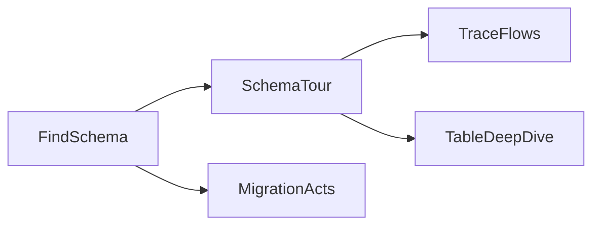

# Chapter 7. Schema

> A schema is a fossilized argument — the most stable map of what an app remembers. Four prompts turn a flat, alphabetical list of tables into a map of the business.

## What this chapter ships

A finder that locates the schema file (and migration folder) in any stack, four prompts that each read it a different way, a workflow that runs them in order, and a renderer that emits a self-contained HTML page plus a markdown twin.

```
ch07-schema/
├── prompts/
│   ├── schema-tour.md        # narrate the schema as a story + a Mermaid ERD
│   ├── trace-flows.md        # trace 3-6 user actions across the tables
│   ├── table-deep-dive.md    # per-table columns + indexes, a few tables at a time
│   └── migration-acts.md     # cluster the migration folder into product eras
├── workflow/
│   ├── schema_find.py        # find + read the schema file and migration history
│   ├── nodes.py              # FindSchema → SchemaTour → TraceFlows → TableDeepDive → MigrationActs
│   ├── flow.py
│   ├── main.py               # CLI
│   ├── render.py             # 4-section HTML + markdown
│   └── requirements.txt
├── skill/SCHEMA-MAP.md       # agent equivalent (drop into Claude Code or Cursor)
└── output/<repo>-schema/
    ├── index.md
    └── index.html
```

## Quickstart

```bash
pip install -r ../../utils/requirements.txt
export ANTHROPIC_API_KEY=...     # or OPENAI_API_KEY, or GEMINI_API_KEY

git clone https://github.com/calcom/cal.com path/to/cal.com
cd workflow
python main.py path/to/cal.com
```

Output:

```
  Schema: packages/prisma/schema.prisma (prisma, 101,057 chars); 595 migrations
  Tour: 20 core tables (ERD: 42 lines)
  Flows: 4 actions traced
  Deep dive: tables 1-4 of 20 ... 17-20 of 20
  Migrations: 6 acts

Wrote ../output/cal.com-schema/index.html
```

It finds the schema file itself; pass `--schema packages/prisma/schema.prisma` to override the guess.

## Four views, one section each

| # | Section | Prompt | What it answers |
|---|---|---|---|
| 01 | The tour | `schema-tour` | What are the ~20 core tables, and how do they connect? (a Mermaid ERD + a 6-8 step story) |
| 02 | The flows | `trace-flows` | What happens in the DB when a user clicks *Cancel*? (reads/writes/external calls, in order) |
| 03 | Table deep dive | `table-deep-dive` | What do one table's columns and indexes reveal? (decisions + hot queries) |
| 04 | Migration history | `migration-acts` | When did each business concept ship? (the roadmap the live schema erases) |

## How it works



`FindSchema` reads the schema file once. `SchemaTour` runs next because its ERD names the ~20 core tables that `TraceFlows` and `TableDeepDive` reuse (§7.4). `MigrationActs` reads the migration folder instead of the schema.

Robustness notes from building this against Cal.com's real 119-model schema:
- **The deep dive is batched** (a few tables per LLM call). A single call for 20 detailed cards overflows the model's output budget and truncates mid-table.
- **Migration analysis is skipped on a squashed history** (fewer than 4 migrations) — §7.6's warning that an LLM will invent a fictional roadmap from a history with no time axis.
- Diagrams render client-side with a parse-guard: a Mermaid diagram the model gets wrong is dropped silently, never shown as an error box. Index code blocks are syntax-highlighted.

## Example output

[`output/cal.com-schema/`](output/cal.com-schema/) is a real run on the full Cal.com repo (a 101 KB Prisma schema, 595 migrations): a 20-table ERD, four user-action traces (including the multi-write "confirm a booking" and "reschedule" flows), a deep dive on all 20 core tables, and six migration-era acts. Open [`index.html`](output/cal.com-schema/index.html); [`index.md`](output/cal.com-schema/index.md) reads on GitHub.

## Agent equivalent

[`skill/SCHEMA-MAP.md`](skill/SCHEMA-MAP.md) runs the same four views inside an agent session — best when you're already exploring a repo in Claude Code or Cursor.
