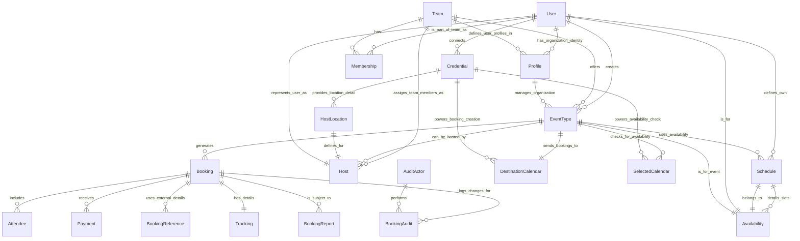
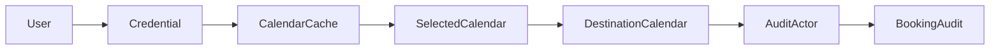
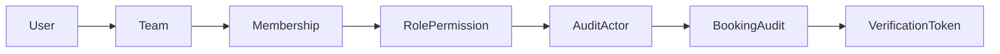
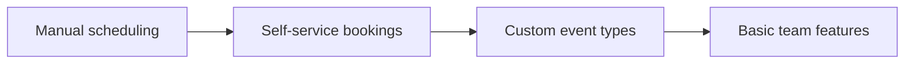
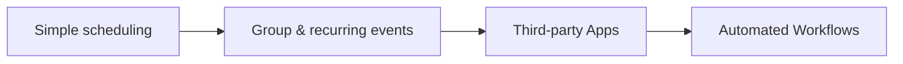
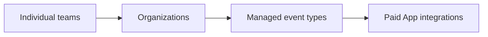
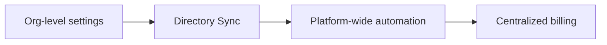
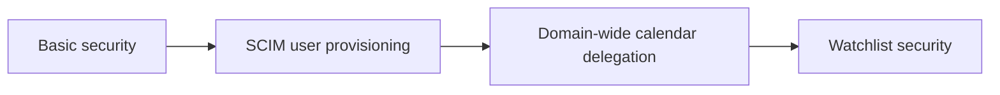
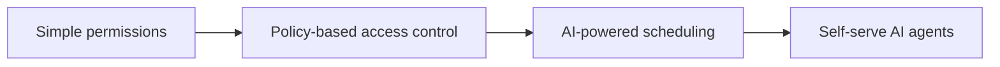

# Cal.com: schema

_The schema reveals a complex, multi-tenant scheduling system that prioritizes deep customization for users and organizations, with robust audit trails, granular access control, and advanced billing features._

Cal.com is a complex, multi-tenant scheduling system whose schema, built across 20 core tables and 595 migrations, reveals a platform prioritizing deep customization for users and organizations. This architecture supports robust audit trails, granular access control, and advanced billing features, reflecting a sophisticated approach to managing diverse scheduling requirements.

## The tour

**Product:** Cal.com
**Schema one-liner:** The schema reveals a complex, multi-tenant scheduling system that prioritizes deep customization for users and organizations, with robust audit trails, granular access control, and advanced billing features.



### Step 1 — The User and Their Basic Availability (`User`, `Schedule`, `Availability`)
At the heart of our product is the `User` — the person who wants to offer or book time. We remember their `email`, `name`, and their `timeZone` so we can correctly display times for everyone. Each user can define one or more `Schedule`s, which are like reusable templates for their general working hours, and within those schedules, `Availability` records the specific blocks of time (e.g., `startTime`, `endTime`, `days` of the week) they are generally open for meetings. This lets the system know when a user is "on duty."

### Step 2 — Defining What Can Be Booked (`EventType`)
Once a user has their basic availability set, they define *what kinds of meetings* people can book with them. This is where `EventType` comes in. Think of an EventType as a template for a meeting — it has a `title`, a unique `slug` for its public URL, a `length` (in minutes), and a `description`. Crucially, an EventType can specify different `locations` (like Zoom or a physical address), determine if `requiresConfirmation` from the host, and even define `customInputs` to ask specific questions from bookers, like "What topic do you want to discuss?".

### Step 3 — External Calendar Integration (`Credential`, `SelectedCalendar`, `DestinationCalendar`)
To prevent double bookings and manage new events, our system needs to talk to external calendars like Google Calendar or Outlook. This is handled by `Credential`, which securely stores the API `key` or token for a user's connection to an external service. A user can then tell the system which of their connected calendars it should look at to determine their *actual* free/busy slots via `SelectedCalendar`, ensuring they don't get booked when they're already busy. Finally, `DestinationCalendar` specifies which particular external calendar a *new* `Booking` should be added to once it's confirmed.

### Step 4 — The Actual Booking (`Booking`, `Attendee`, `BookingReference`, `Tracking`, `Payment`)
When someone successfully schedules a meeting, a `Booking` record is created. This is the central event, remembering the `startTime` and `endTime`, the `title`, and its current `status` (e.g., `ACCEPTED`, `CANCELLED`). The `Attendee` table captures who booked the meeting (`name`, `email`, `timeZone`), while `BookingReference` stores any external meeting details like a Zoom `meetingUrl` or ID, so everyone knows where to go. If the booking originated from a marketing campaign, `Tracking` can store `utm_source` details. Should money be involved, the `Payment` table records the `amount`, `currency`, and `success` status of the transaction.

### Step 5 — Managing Group & Team Scheduling (`Team`, `Membership`, `Host`, `HostGroup`, `Profile`)
Scheduling isn't just for individuals; organizations have their own needs. A `Team` represents an organization or a department, with its own `name` and `slug`. `Membership` links a `User` to a `Team`, defining their `role` (like `MEMBER` or `ADMIN`). For `EventType`s that can be hosted by multiple team members (e.g., a "Sales Demo" where any sales rep can take it), the `Host` table lists which `User`s are eligible and can even assign a `priority` or `weight` for round-robin scheduling. `HostGroup`s allow you to categorize these hosts. And for users who belong to an organization, `Profile` provides a distinct identity tied to that `Team`, allowing for organization-specific settings and usernames.

### Step 6 — Credit-based Features and Core Billing (`CreditBalance`, `CreditExpenseLog`, `CreditPurchaseLog`, `TeamBilling`, `OrganizationBilling`, `PlatformBilling`)
Beyond individual meeting payments, the system also tracks how users and organizations pay for the platform's features. `CreditBalance` holds pre-paid credits, which can be spent on features like SMS reminders or AI phone calls, with `CreditExpenseLog` detailing each credit `creditFor` type and `credits` used, and `CreditPurchaseLog` recording when `credits` were bought. For larger accounts, `TeamBilling`, `OrganizationBilling`, and `PlatformBilling` manage subscriptions, storing `subscriptionId`, `planName`, and `pricePerSeat`. The `highWaterMark` on these tables is an important product decision, tracking the maximum number of seats used in a billing period, even if some users are later removed, to ensure fair billing.

### Step 7 — Audit Trails, Reports, and Watchlists (`BookingAudit`, `AuditActor`, `BookingReport`, `WrongAssignmentReport`, `Watchlist`)
In a complex system, it's critical to know `what happened, when, and by whom`. `BookingAudit` provides an immutable record of every significant change to a `Booking` (e.g., `status` changes, `attendee_added`). The `AuditActor` table ensures we always know who (a `User`, a `GUEST`, or `SYSTEM`) performed the action, even if their original record is later deleted, preserving audit integrity. If a user encounters a problematic booking, they can create a `BookingReport` specifying a `reason` like `SPAM`. For incorrect host assignments in round-robin, `WrongAssignmentReport` exists. Finally, `Watchlist` helps enforce policies by allowing the system to `BLOCK` or `REPORT` bookings from specific `email`s, `domain`s, or `username`s, either globally or per organization.

### Step 8 — Developer Tools and Background Processing (`App`, `Webhook`, `ApiKey`, `PlatformOAuthClient`, `DSyncData`, `DelegationCredential`, `Task`)
Behind the scenes, several tables power integrations and internal operations. `App` defines available third-party applications. `Webhook` allows external systems to subscribe to real-time events, like `BOOKING_CREATED`, by sending data to a `subscriberUrl`. Developers can get programmatic access using `ApiKey`s. For large enterprise integrations, `PlatformOAuthClient` provides secure access for external applications to manage organization data. `DSyncData` facilitates directory synchronization (like SCIM) for managing user and group memberships directly from an organization's directory. `DelegationCredential` allows a service account to manage calendars on behalf of an entire organization. Finally, `Task` is a general queue that remembers background jobs (`type`, `payload`, `scheduledAt`) that need to be processed asynchronously, like sending reminder emails or syncing data.

## The flows

Hey team, welcome aboard! It's awesome to have you here. I know navigating a new codebase, especially one with a database as central as ours, can feel like trying to map out a bustling city you've never visited. But don't worry, we'll get you up to speed.

Let's dive into some core user actions and trace what happens under the hood in our database. Think of it like a detective story, following the data's journey as a user clicks around. We'll see how tables talk to each other and why the order of operations matters.

### A user books an event

This is probably the most common flow in our system – someone schedules a meeting. It seems simple on the surface, but a lot of moving pieces work together to make sure that slot is truly available and everyone gets the right notifications.

1.  **Check for available time slots and hosts.**
    *Reads:* `EventType`, `User`, `Host`, `Schedule`, `Availability`, `SelectedCalendar`, `CalVideoSettings`. *Writes:* `SelectedSlots`. *External:* External Calendar API (e.g., Google Calendar, Outlook Calendar) to fetch real-time free/busy times for hosts.

    When a user lands on a booking page, we first figure out *what* kind of event they're looking at (`EventType`). Then, for each potential host, we check their `Schedule` and `Availability` to see when they're generally free. The crucial part here is `SelectedCalendar`: we make a live call to their connected calendar (Google, Outlook, etc.) to get their *actual* free/busy status. To prevent two people from booking the exact same slot at the same time, we temporarily reserve the slot in `SelectedSlots` as soon as someone selects it. We also quickly check `CalVideoSettings` for any specific video conferencing requirements for this event type.

2.  **Create the core booking record and attendee details.**
    *Reads:* `User`, `EventType`. *Writes:* `Booking`, `Attendee`, `BookingAudit`, `AuditActor`, `Tracking`. *External:* none.

    Once the user confirms, we create the main `Booking` record with all the event details. We also add an `Attendee` record for the person who just booked. This is where our audit trail begins: we create an `AuditActor` record for the booker (or reuse an existing one if they're a known user) and then log the `BookingAudit` event, marking the booking as "created." If there were any tracking parameters like UTMs, those get stored in the `Tracking` table.

3.  **Process payment (if the event isn't free).**
    *Reads:* `Booking`, `EventType`. *Writes:* `Payment`, `CreditExpenseLog`. *External:* Payment Provider (e.g., Stripe).

    If the event has a cost, this is where we talk to our payment provider. We create a `Payment` record to log the transaction details, including the amount, currency, and whether it was successful. If the user paid with credits, we'd also log that in `CreditExpenseLog`. This step is critical; if payment fails, the booking process stops here.

4.  **Sync the event to external calendars.**
    *Reads:* `Booking`, `Attendee`, `EventType`, `DestinationCalendar`, `SelectedCalendar`, `Credential`, `DelegationCredential`. *Writes:* `BookingReference`, `CalendarCacheEvent`. *External:* External Calendar API.

    Now for the "magic" that puts the event on everyone's calendar! We use the host's `DestinationCalendar` (and possibly `DelegationCredential` if they're part of an organization using a service account) and the booker's email to add the event to their respective external calendars. We create a `BookingReference` to store the external event IDs, linking our internal booking to the external calendar entries. We also cache the event details in `CalendarCacheEvent` for faster lookups later.

5.  **Trigger post-booking actions and notifications.**
    *Reads:* `Booking`, `EventType`, `Webhook`. *Writes:* `WebhookScheduledTriggers`, `BookingAudit`. *External:* Webhook endpoints, Email Service.

    Finally, we tie up loose ends. The `Booking` status is updated (e.g., from PENDING to ACCEPTED). We might schedule `WebhookScheduledTriggers` for reminders or other integrations. We also send out confirmation emails to both the host and the attendee using our Email Service. Another `BookingAudit` record is created to log the status change.


---

Next up, let's look at how a user brings a new tool into their workflow.

### A user connects a new calendar integration

Connecting an integration is like giving us a key to a new room in their digital house. It allows us to read their availability and add events on their behalf.

1.  **Authorize with the external service.**
    *Reads:* `User`. *Writes:* `Credential`. *External:* OAuth Provider (e.g., Google, Microsoft).

    When a user clicks "Connect," we send them to the calendar provider's login page. After they grant us permission, the provider gives us an authorization code. We then exchange this code for access and refresh tokens via the OAuth Provider's API, and store these securely in our `Credential` table, linked to the `User`. This `Credential` is our "key."

2.  **Fetch the user's available calendars.**
    *Reads:* `Credential`. *Writes:* `CalendarCache`. *External:* External Calendar API.

    Using the shiny new `Credential`, we make a call to the External Calendar API (like Google Calendar API) to list all the calendars associated with the user's account (e.g., "Work," "Personal," "Holidays"). We might temporarily store this raw list in `CalendarCache` so the user can pick and choose.

3.  **Save selected calendars and set a primary destination.**
    *Reads:* `User`, `Credential`. *Writes:* `SelectedCalendar`, `DestinationCalendar`. *External:* External Calendar API.

    The user then tells us which of those calendars we should actually *use* for checking availability and which one is their `DestinationCalendar` – where we should *put* new events. For each selected calendar, we create a `SelectedCalendar` record and, importantly, we subscribe to push notifications from the external calendar API so we get real-time updates on their free/busy status.

4.  **Log the integration event.**
    *Reads:* `User`. *Writes:* `AuditActor`, `BookingAudit`. *External:* none.

    Just like with booking, we log this important action. We ensure an `AuditActor` exists for the `User` and then record a `BookingAudit` entry, marking that the user has successfully connected a new calendar integration. This helps us trace system changes and user activity.



---

Sometimes, plans change, and we need to gracefully handle that.

### A host cancels a booking

Cancelling a booking means undoing some of the actions from the booking flow, ensuring everyone is informed, and the host's calendar is freed up.

1.  **Verify permissions and retrieve booking details.**
    *Reads:* `User`, `Booking`, `EventType`, `Team`, `Membership`, `RolePermission`. *Writes:* `AuditActor`, `BookingAudit`. *External:* none.

    First, we need to confirm that the `User` attempting to cancel actually has the right to do so. We check their `Membership` and `RolePermission` within any relevant `Team`. Then, we fetch the `Booking` details and log the *attempt* to cancel in `BookingAudit` via an `AuditActor`, capturing who is performing this action.

2.  **Update the booking status and handle refunds.**
    *Reads:* `Booking`. *Writes:* `Booking`, `Payment`, `CreditExpenseLog`, `BookingAudit`. *External:* Payment Provider.

    The `Booking` record's `status` is updated to `CANCELLED`, along with the `cancellationReason` and `cancelledBy` fields. If the original booking involved a `Payment`, we initiate a refund through the Payment Provider, updating the `Payment` record's `refunded` status. If credits were used, `CreditExpenseLog` would be adjusted. Another `BookingAudit` entry records the definitive status change.

3.  **Remove or update events on external calendars.**
    *Reads:* `Booking`, `BookingReference`, `Credential`, `DelegationCredential`. *Writes:* `BookingReference`. *External:* External Calendar API.

    Since the meeting is off, we need to remove it from the host's and attendee's calendars. We look up the `BookingReference` to get the external event IDs and use the `Credential` (or `DelegationCredential` for team accounts) to tell the External Calendar API to cancel or delete these events. The `BookingReference` might also be updated to reflect the deletion.

4.  **Stop scheduled actions and send notifications.**
    *Reads:* `Booking`, `WebhookScheduledTriggers`, `Webhook`. *Writes:* `WebhookScheduledTriggers`. *External:* Webhook endpoints, Email Service.

    Any pending `WebhookScheduledTriggers` related to this booking (like reminders) are cancelled. We also trigger the `BOOKING_CANCELLED` `Webhook` event, notifying integrated apps, and send out cancellation emails to all relevant parties (host, attendee) via our Email Service.

```mermaid
flowchart LR
  User --> Booking --> EventType --> Team --> Membership --> RolePermission --> AuditActor --> BookingAudit --> Payment --> CreditExpenseLog --> BookingReference --> Credential --> DelegationCredential --> WebhookScheduledTriggers --> Webhook
```



---

Finally, let's explore how a team grows.

### An admin adds a new member to a team

This process is like adding a new keyholder to a shared office – granting access and responsibility within a `Team`.

1.  **Verify admin privileges and retrieve team context.**
    *Reads:* `User` (admin), `Team`, `Membership`, `RolePermission`. *Writes:* `AuditActor`, `BookingAudit`. *External:* none.

    Before anything else, we confirm the `User` initiating the action is indeed an `ADMIN` of the `Team`. We check their existing `Membership` and `RolePermission` to ensure they have the authority. An `AuditActor` is created (if new) and a `BookingAudit` entry is made to record that this admin is performing an "add member" action.

2.  **Identify or create the new user.**
    *Reads:* `User` (for invitee email). *Writes:* `User`, `UserPassword`. *External:* none.

    We check if the invitee's email address already belongs to an existing `User` in our system. If not, a new `User` record might be provisioned. If it's a local account, a `UserPassword` hash would be stored (though many users sign up via OAuth). This step ensures we have a `User` entity to link the `Membership` to.

3.  **Create a pending team membership and an invite token.**
    *Reads:* `Team`, `User` (invitee). *Writes:* `Membership`, `VerificationToken`. *External:* Email Service.

    Now, the core of the invite: a new `Membership` record is created, linking the `User` to the `Team`, but it's initially marked as `accepted=false`. We also generate a unique `VerificationToken` for the invite link. This token is then sent to the invitee's email address using our Email Service, allowing them to accept the invitation and join the team.

4.  **Log the invitation event.**
    *Reads:* `Membership`, `VerificationToken`. *Writes:* `BookingAudit`. *External:* none.

    As a final step, we log this invitation in `BookingAudit`. This record tracks the event, including details about the team, the invited user, and the `VerificationToken` used, providing a clear history of team management actions.



## Table deep dive

### User — Stores all account information for individuals on the platform

The `User` table holds the core information for every individual account, managing their personal details, settings, and the various entities they create or interact with in the scheduling system.

| Column             | Type               | Required | Why it exists                                                                                                |
| :----------------- | :----------------- | :------- | :----------------------------------------------------------------------------------------------------------- |
| `uuid`             | `String` (`Uuid`)  | Required | A public, immutable identifier for the user, separate from the auto-incrementing `id`, for external references and privacy. |
| `email`            | `String`           | Required | The user's unique login and contact email, fundamental for identification and communication.                   |
| `timeZone`         | `String`           | Required | The user's default timezone, influencing how their availability and event times are displayed.               |
| `hideBranding`     | `Boolean`          | Required | A toggle for premium users to remove Cal.com branding from their booking pages.                              |
| `role`             | `UserPermissionRole` | Required | Defines the user's base permissions within the system, like `USER` or `ADMIN`.                               |
| `organizationId`   | `Int?`             | Optional | Links a user to their primary organization, though deprecated in favor of `Profile` for multi-organization scenarios. |
| `locked`           | `Boolean`          | Required | A flag to indicate if a user's account has been intentionally locked, preventing login.                      |
| `metadata`         | `Json?`            | Optional | A flexible field to store extra, unstructured data about the user that doesn't fit into dedicated columns.  |

*   The `uuid` is a clever move for public references, as it avoids exposing sequential internal IDs that could be predictable.
*   The `organizationId` being deprecated hints at a refactor to handle users belonging to multiple organizations more flexibly, now handled by the `Profile` model.
*   The `metadata` field, while flexible, will require careful handling to query and validate its contents, suggesting a growing need for extensible user data that the core schema doesn't predict.
*   `UserPassword` is a separate table, which is a good security practice, keeping password hashes isolated from core user data.
*   `timeZone` and `weekStart` defaults show the product's origin or default market, but are customizable by the user.

```prisma
@@unique([email])
@@unique([email, username])
@@unique([username, organizationId])
@@unique([movedToProfileId])
```
*   `@@unique([email])`: This enforces that no two users can register with the same email address, which is fundamental for individual user accounts.
*   `@@unique([email, username])`: This makes sure that even if a `username` is often `null`, if it *is* present, the combination of `email` and `username` is unique.
*   `@@unique([username, organizationId])`: This is key for multi-tenancy; it allows `username` reuse across different organizations but prevents conflicts *within* the same organization.
*   `@@unique([movedToProfileId])`: This ensures that a user's migration status to a `Profile` is clearly tracked and singular, preventing ambiguous data.

This table is a powerhouse, clearly evolving over time with smart additions like `uuid` and `UserPassword` separation. However, the `organizationId` deprecation points to the challenges of retrofitting complex multi-tenancy, and the widespread use of `Json?` fields (like `metadata` here) suggests that the schema is highly adaptable but could lead to less structured data over time if not well-managed through code.

---

### EventType — Defines the configurable templates for scheduling different kinds of meetings

Moving from individual users, the `EventType` table describes all the different kinds of meetings or appointments that a user or team can offer, acting as a customizable blueprint for booking.

| Column                | Type               | Required | Why it exists                                                                                                |
| :-------------------- | :----------------- | :------- | :----------------------------------------------------------------------------------------------------------- |
| `title`               | `String`           | Required | The human-readable name of the event type, like "30-minute meeting" or "Discovery Call".                   |
| `slug`                | `String`           | Required | A URL-friendly identifier for the event type, often used in public booking links.                            |
| `length`              | `Int`              | Required | The default duration of the event in minutes.                                                                |
| `periodType`          | `PeriodType`       | Required | How long this event type is available for booking (e.g., `UNLIMITED`, `ROLLING` for a fixed number of days). |
| `metadata`            | `Json?`            | Optional | A flexible JSON field for storing additional, unstructured data like pricing (which was deprecated from dedicated columns). |
| `parentId`            | `Int?`             | Optional | Allows for creating a hierarchy of event types, where one event type can be managed under another (e.g., a sub-event). |
| `schedulingType`      | `SchedulingType?`  | Optional | Determines how hosts are assigned for team events (e.g., `ROUND_ROBIN` for even distribution, `COLLECTIVE` for all hosts). |
| `requiresConfirmation` | `Boolean`          | Required | A flag indicating whether a booking for this event type needs explicit host approval before being finalized. |

*   The `slug` field, combined with `userId` or `teamId` in unique indexes, forms the core of how event types are accessed publicly, ensuring unique, readable URLs.
*   The existence of `parentId` and `children` relations suggests a sophisticated "managed events" feature, likely for organizations that want to standardize event offerings.
*   The deprecation of `price` and `currency` columns in favor of `metadata.apps.stripe.price` indicates a move towards externalizing app-specific data into JSON blobs. While flexible, this means specific values like `price` are now hidden from direct database schema visibility and require application-level parsing.
*   `bookingFields` as `Json?` (not in the table but related) allows for highly customized booking forms, which is powerful but also means custom validation logic lives outside the database schema.
*   `minimumBookingNotice`, `beforeEventBuffer`, and `afterEventBuffer` show a detailed approach to managing a host's time and preventing last-minute bookings or back-to-back meetings.

```prisma
@@unique([userId, slug])
@@unique([teamId, slug])
@@unique([userId, parentId])
@@index([parentId, teamId])
```
*   `@@unique([userId, slug])`: This makes sure that each individual user has unique, discoverable links for their event types.
*   `@@unique([teamId, slug])`: Similarly, this guarantees unique, discoverable links for event types within a specific team.
*   `@@unique([userId, parentId])`: This seems to enforce that a user can only have one "managed" child event type directly under a specific parent, crucial for maintaining hierarchy and preventing accidental duplicates in a nested event structure.
*   `@@index([parentId, teamId])`: This index helps quickly find all sub-events or managed events that belong to a particular parent event type within a specific team context, which is useful for organizational oversight.

`EventType` is clearly designed for a highly configurable and flexible scheduling product. The extensive use of `Json?` for fields like `locations`, `bookingFields`, `metadata`, and `recurringEvent` offers immense adaptability but pushes schema validation and data consistency concerns to the application layer. The deprecation comments highlight a pattern of moving specific fields into generic `metadata` JSON, which prioritizes flexibility over strict schema enforcement.

---

### Schedule — Defines a reusable set of availability rules for a user or event type

Building on the concept of an `EventType`, the `Schedule` table provides a way to define and reuse specific blocks of time when a user or group is available for bookings, which can then be applied to one or many event types or hosts.

| Column       | Type             | Required | Why it exists                                                                                    |
| :----------- | :--------------- | :------- | :----------------------------------------------------------------------------------------------- |
| `userId`     | `Int`            | Required | The user who owns and defines this particular schedule.                                          |
| `name`       | `String`         | Required | A human-readable name for the schedule (e.g., "Working Hours", "Weekend Availability").          |
| `timeZone`   | `String?`        | Optional | The specific timezone for this schedule, allowing it to override the user's default if needed.   |
| `availability` | `Availability[]` | Relation | The collection of actual time slots (e.g., "Monday 9-5") that make up this schedule.             |

*   `Schedule` is a core abstraction, allowing users to define availability once and apply it to many event types, reducing redundancy and simplifying management.
*   The `timeZone` being optional but present here allows for more granular control over availability, letting a user manage different schedules in different timezones (e.g., a "Europe Sales Schedule" versus a "US Sales Schedule").
*   It plays a central role in connecting a `User` and `EventType` to concrete `Availability` blocks.
*   The multiple relationships to `EventType` (`eventType`, `instantMeetingEvents`, and `restrictionSchedule`) show how a single schedule can serve different purposes, from general availability to specifically blocking times or defining instant meeting slots.

```prisma
@@index([userId])
```
*   `@@index([userId])`: This index makes it very fast to retrieve all schedules created or owned by a specific user, which is essential for managing their availability settings.

The `Schedule` model is a clean and effective way to manage reusable availability, showing a thoughtful approach to preventing data duplication. Its simplicity is a strength, focusing solely on naming and grouping `Availability` entries. The multiple relations to `EventType` are a bit verbose but clearly define the different roles a schedule can play, demonstrating robust control over how and when events can be booked.

---

### Credential — Stores authentication details for third-party integrations

Beyond scheduling, the `Credential` table securely holds all the necessary authentication information (like API keys or OAuth tokens) for users or teams to connect their Cal.com account with various third-party applications and services.

| Column                 | Type                  | Required | Why it exists                                                                                                |
| :--------------------- | :-------------------- | :------- | :----------------------------------------------------------------------------------------------------------- |
| `type`                 | `String`              | Required | Identifies the type of integration this credential is for (e.g., "google_calendar", "zoom", "stripe").         |
| `key`                  | `Json`                | Required | Stores the actual credential data, which could be an OAuth token or API key. This is likely encrypted at the application layer. |
| `encryptedKey`         | `String?`             | Optional | Potentially stores an encrypted version of the `key` or a different type of encrypted credential.              |
| `userId`               | `Int?`                | Optional | The user who owns this credential, if it's a personal integration.                                           |
| `teamId`               | `Int?`                | Optional | The team that owns this credential, if it's a team-level integration.                                        |
| `appId`                | `String?`             | Optional | Links to the specific `App` in the App Store that this credential enables.                                   |
| `invalid`              | `Boolean?`            | Optional | A flag to indicate if the credential has become invalid (e.g., token expired, revoked), for proactive management. |
| `delegationCredentialId` | `String?`             | Optional | Links to a `DelegationCredential` if this credential is used on behalf of a delegated service account (e.g., for Google Workspace). |

*   The `key` column being `Json` allows for a lot of flexibility in storing different types of authentication data without schema migrations, but it hides the actual structure from the database layer, meaning validation happens in application code.
*   The `userId` and `teamId` being optional, but presumably exclusive (a credential belongs to a user *or* a team), indicates support for both personal and shared integrations.
*   `invalid` is a critical flag for proactively identifying and handling broken integrations, which is essential for a reliable scheduling service to notify users.
*   The presence of `delegationCredentialId` points to advanced enterprise features, enabling credentials to operate under a broader organizational service account for centralized management.
*   The comment `// How to make it a required column?` on `appId` suggests a known technical debt or a design challenge where it *should* be linked to an `App`, but isn't strictly enforced at the database level, possibly due to legacy data or complex creation flows.

```prisma
@@index([appId])
@@index([subscriptionId])
@@index([invalid])
@@index([userId, delegationCredentialId])
@@index([teamId])
```
*   `@@index([appId])`: This allows the system to quickly find all stored credentials that belong to a specific application, useful for managing integrations.
*   `@@index([subscriptionId])`: This index helps find credentials linked to a particular subscription, likely for paid apps or services, speeding up billing-related queries.
*   `@@index([invalid])`: This is a very practical index that allows the system to quickly identify and manage credentials that are no longer working, crucial for operational health.
*   `@@index([userId, delegationCredentialId])`: This helps in efficiently querying credentials that a specific user has, especially when those credentials might be operating under a delegated service account for organizational contexts.
*   `@@index([teamId])`: This speeds up looking up all credentials associated with a particular team, enabling team-level integration management.

The `Credential` table is robust, clearly designed with security and flexibility in mind, especially with the `key` field (presumably encrypted). The clear distinction between user and team ownership, alongside the `invalid` flag, shows good operational consideration. However, the `appId` not being strictly required and the `type` being a `String` rather than an `Enum` could lead to data inconsistencies or runtime errors if not carefully managed at the application layer. The introduction of `delegationCredentialId` adds significant complexity, reflecting enterprise-level features.

### Table: Membership — Defines a user's role and acceptance status within a team or organization.

1.  This table acts like an address book for teams, detailing which `User` belongs to which `Team` and what their specific role is, along with whether they've accepted their invitation.

| Column          | Type            | Required | Why it exists                                                                                                              |
| :-------------- | :-------------- | :------- | :------------------------------------------------------------------------------------------------------------------------- |
| `accepted`      | Boolean         | true     | Tracks if a user has formally accepted a team invitation, indicating a pending or active membership.                         |
| `role`          | `MembershipRole` | true     | Assigns a predefined access level (MEMBER, ADMIN, OWNER), simplifying common permission structures.                         |
| `customRoleId`  | String?         | false    | Allows for more granular, custom permission sets beyond the standard roles defined in the `Role` table.                    |
| `createdAt`     | DateTime?       | true     | Records when the membership was first established, useful for auditing or onboarding flows.                                |
| `Host`          | `Host[]`        | false    | This relation shows that a membership can be linked to multiple host assignments for various event types.                  |
| `AttributeToUser` | `AttributeToUser[]` | false    | Links this membership to specific attributes or characteristics assigned to the user within this team.                   |

3.  **Column Takeaways**:
    *   The `accepted` field is key for an invitation system, preventing users from being members before they explicitly agree.
    *   The combination of `role` and `customRoleId` shows a smart approach to permissions: easy-to-use default roles with the flexibility of custom roles for advanced setups.
    *   The `AttributeToUser` relation hints at a robust system for organizations to define and assign custom properties to their members, like skills or departments, which can be used for things like advanced routing.

4.  ```prisma
    @@unique([userId, teamId])
    ```
    This ensures that a user can only be a member of a specific team once, preventing duplicate entries.

    ```prisma
    @@index([teamId])
    ```
    This speeds up queries to find all members belonging to a particular team.

    ```prisma
    @@index([userId])
    ```
    This makes it fast to look up all the teams a specific user is a part of.

    ```prisma
    @@index([accepted])
    ```
    This index helps quickly filter members by their acceptance status, e.g., finding all pending invitations.

    ```prisma
    @@index([role])
    ```
    This makes it efficient to query for all members with a certain standard role, like all team 'ADMIN's.

    ```prisma
    @@index([customRoleId])
    ```
    This helps find all members assigned to a particular custom role quickly.

5.  This table is well-designed for managing team access, cleverly balancing simplicity with the power of custom roles. The `accepted` field is a thoughtful touch for managing invitations.

### Table: Profile — Creates a distinct identity for a user within a particular organization.

1.  Building on `Membership`, the `Profile` table allows a single `User` to have multiple distinct identities or "personas," each tied to a specific `Organization` (which is a type of `Team`), enabling customized settings and usernames per organization.

| Column         | Type       | Required | Why it exists                                                                                                   |
| :------------- | :--------- | :------- | :-------------------------------------------------------------------------------------------------------------- |
| `uid`          | String     | true     | A stable, system-generated identifier for the profile, useful for external references or data migrations.       |
| `userId`       | Int        | true     | The core `User` account this profile is associated with.                                                        |
| `organizationId` | Int        | true     | The specific `Team` (acting as an organization) this profile belongs to, separating user settings per org.      |
| `username`     | String     | true     | The username specifically for *this* profile within *this* organization, allowing reuse across different orgs. |
| `movedFromUser` | `User?`    | false    | Indicates if this profile was created as part of a migration from a standalone user account.                    |

3.  **Column Takeaways**:
    *   The `uid` alongside the auto-incrementing `id` often suggests that `uid` is used for external-facing identifiers or for robust referencing during complex data operations, while `id` is for internal database relationships.
    *   The core idea here is multi-tenancy: a user can be "John Doe" in Organization A with a specific username and settings, and also "John Smith" in Organization B with different ones, all tied to one `User` record.
    *   Making `username` unique *per organization* (`@@unique([username, organizationId])`) is a great design choice for platforms with many users and organizations.
    *   The `movedFromUser` relation is a strong hint that the product evolved its user identity model, separating global user data from organization-specific profile data—a common pattern in growing platforms.

4.  ```prisma
    @@unique([userId, organizationId])
    ```
    This ensures that a user can only have one unique profile within any given organization, keeping their organizational identity distinct and singular.

    ```prisma
    @@unique([username, organizationId])
    ```
    This allows the same username (e.g., "johndoe") to exist in different organizations but enforces uniqueness within a single organization.

    ```prisma
    @@unique([movedToProfileId])
    ```
    (This unique index is actually on the `User` table, pointing *to* `Profile`). It means a `User` record can only have been moved *to* one specific `Profile` as the target of a migration, ensuring a clean transition.

    ```prisma
    @@index([uid])
    ```
    This makes lookups by the internal unique ID (`uid`) efficient, often used for external integrations or immutable references.

    ```prisma
    @@index([userId])
    ```
    This speeds up queries to find all profiles associated with a particular core `User` account.

    ```prisma
    @@index([organizationId])
    ```
    This makes it fast to retrieve all profiles belonging to a specific organization.

5.  This is a sophisticated approach to managing user identities in a multi-tenant environment. It adds flexibility for organizations to customize user profiles without forcing users to manage multiple primary accounts. The `movedFromUser` field is a transparent sign of smart schema evolution.

### Table: Team — Represents groups of users, ranging from small teams to large organizations, with hierarchical structures and shared settings.

1.  Expanding on the organizational structure, the `Team` table is the central hub for groups of users, allowing them to collaborate, manage shared `EventType`s, define billing parameters, and even structure themselves into hierarchies (like departments within a larger company).

| Column                     | Type           | Required | Why it exists                                                                                                              |
| :------------------------- | :------------- | :------- | :------------------------------------------------------------------------------------------------------------------------- |
| `name`                     | String         | true     | The primary, human-readable name of the team or organization.                                                              |
| `slug`                     | String?        | false    | A URL-friendly identifier for the team, often used for public profile pages.                                               |
| `isOrganization`           | Boolean        | true     | A critical flag that differentiates a top-level organization from a smaller team that might belong to an organization.      |
| `parentId`                 | Int?           | false    | Establishes a hierarchical relationship, allowing teams to be nested under a parent organization or another team.          |
| `rrResetInterval`          | `RRResetInterval?` | false    | Defines how frequently round-robin assignment weights are reset, crucial for balanced host distribution.                   |
| `rrTimestampBasis`         | `RRTimestampBasis` | true     | Determines whether round-robin calculations are based on creation time or event start time.                                |
| `metadata`                 | Json?          | false    | A flexible JSON field for storing additional, schema-less information about the team, allowing for future expansion.       |
| `managedOrganizations`     | `ManagedOrganization[]` | false    | This relation indicates if this team is a "manager" organization overseeing other "managed" organizations (e.g., for platform clients). |

3.  **Column Takeaways**:
    *   The `isOrganization` flag is a powerful way to model both organizations and sub-teams within a single table, but requires careful handling in application logic to distinguish between them.
    *   `parentId` creates a robust hierarchy, allowing for complex organizational structures like departments within a larger company.
    *   The `rrResetInterval` and `rrTimestampBasis` fields are clear indicators of a sophisticated, fair round-robin scheduling system, vital for distributing work evenly among hosts.
    *   `metadata` and `bookingLimits` as `Json` fields offer excellent flexibility for evolving product features without constant database migrations, but they do shift some schema validation responsibility to the application code.
    *   The `managedOrganization` relations point to an advanced platform feature, where one organization can act as an administrator or reseller for other organizations, which is a significant product capability.

4.  ```prisma
    @@unique([slug, parentId])
    ```
    This ensures that a team's URL-friendly slug is unique within its immediate parent, meaning different organizations can have a "marketing" team, but you can't have two "marketing" teams under the same parent.

    ```prisma
    @@index([parentId])
    ```
    This makes it very fast to query for all sub-teams or departments belonging to a specific parent organization.

5.  This `Team` model is highly adaptable, serving as a cornerstone for both simple teams and complex organizational hierarchies. The depth of customization for round-robin scheduling and the `managedOrganization` feature clearly show a focus on enterprise-level capabilities. Just remember that `Json` fields require good application-level validation!

### Table: Host — Configures a specific user's ability to host a particular event type, including their scheduling preferences.

1.  Following the team structure, the `Host` table details how individual `User`s are assigned to host specific `EventType`s, offering granular control over their availability, priority, and participation in sophisticated scheduling algorithms like round-robin.

| Column           | Type            | Required | Why it exists                                                                                                              |
| :--------------- | :-------------- | :------- | :------------------------------------------------------------------------------------------------------------------------- |
| `userId`         | Int             | true     | The identifier of the `User` who is acting as a host.                                                                      |
| `eventTypeId`    | Int             | true     | The specific `EventType` that this user is configured to host.                                                             |
| `isFixed`        | Boolean         | true     | Determines if this host is a permanent fixture for the event type or part of a dynamic assignment pool.                    |
| `priority`       | Int?            | false    | A numerical value indicating preference in host assignment, often used in round-robin scheduling.                          |
| `weight`         | Int?            | false    | Another factor for host assignment, possibly for more nuanced distribution in round-robin or similar algorithms.           |
| `weightAdjustment` | Int?            | false    | **Deprecated**: A previous method for calibrating host weight, now calculated on-the-spot. Plan to drop this.            |
| `scheduleId`     | Int?            | false    | Overrides the user's default schedule, allowing this host to use a specific schedule for this `EventType`.               |
| `groupId`        | String?         | false    | Connects this host to a `HostGroup`, likely for managing a collection of hosts together for group events.                  |
| `memberId`       | Int?            | false    | Links to the `Membership` table, providing context about the host's team role when hosting.                                |
| `location`       | `HostLocation?` | false    | Defines a specific location for this host *for this event type*, allowing for host-specific location overrides.         |

3.  **Column Takeaways**:
    *   The `@@id([userId, eventTypeId])` composite primary key is fundamental: it defines a host's unique identity for a specific event type, preventing them from being configured twice.
    *   `isFixed`, `priority`, and `weight` are key columns that enable advanced scheduling logic, particularly for round-robin assignments, showing a deep focus on balancing bookings among available hosts.
    *   The `weightAdjustment` being `deprecated` tells a story of feature evolution—they tried one approach, learned from it, and now have a better, more dynamic way to handle host calibration.
    *   `scheduleId` is a great feature, allowing hosts to set tailored availability for specific event types (e.g., always available for quick calls, but restricted for longer meetings).
    *   The `groupId` and `memberId` relations highlight that hosts are often managed within a team context, linking hosting capabilities to team membership and group assignments.
    *   The `HostLocation` relation indicates very fine-grained control, allowing locations to be specified *per host, per event type*, rather than just per event type or user.

4.  ```prisma
    @@id([userId, eventTypeId])
    ```
    This is the primary key for the table, establishing that a specific user can only be configured as a host for a specific event type once.

    ```prisma
    @@index([memberId])
    ```
    This allows for quick retrieval of all hosting assignments for a particular `Membership` record (i.e., a specific user within a specific team).

    ```prisma
    @@index([userId])
    ```
    This speeds up queries to find all event types that a particular user is configured to host.

    ```prisma
    @@index([eventTypeId])
    ```
    This makes it fast to find all users who are configured to host a specific event type.

    ```prisma
    @@index([scheduleId])
    ```
    This helps to quickly find all hosts that are utilizing a particular custom schedule for their event types.

5.  The `Host` table demonstrates a robust and highly configurable system for assigning users as event hosts, especially for complex scenarios like round-robin distribution and custom availability. The deprecated `weightAdjustment` is a practical example of a living schema reflecting product iterations—good to call out for cleanup in the future!

---

Overall, this schema for Cal.com reveals a highly ambitious and feature-rich product. It's built for complexity, allowing for deep customization at the user, team, and organizational levels, with a clear emphasis on flexible scheduling and multi-tenancy. Good work!

### Booking — Tracks every scheduled meeting or event on the platform

This table is the central record for every appointment, meeting, or event scheduled using the product, holding all the core details about when, where, and with whom it happens.

| Column           | Type             | Required | Why it exists                                                                                                                              |
| :--------------- | :--------------- | :------- | :----------------------------------------------------------------------------------------------------------------------------------------- |
| `uid`            | `String`         | Yes      | A public, unique identifier for sharing or referencing specific bookings.                                                                  |
| `idempotencyKey` | `String?`        | No       | Prevents accidental duplicate bookings if the same request is sent multiple times, often seen in payment or critical transaction flows.    |
| `userPrimaryEmail` | `String?`        | No       | Records the booker's email at the time of booking, preserving historical data even if their account email changes later.                 |
| `title`          | `String`         | Yes      | The short, descriptive name of the meeting visible to all participants.                                                                    |
| `customInputs`   | `Json?`          | No       | Stores dynamic answers to questions (like "What's your primary goal?") configured for the event type.                                      |
| `startTime`      | `DateTime`       | Yes      | The exact moment the event is scheduled to begin.                                                                                          |
| `status`         | `BookingStatus`  | Yes      | The current state of the booking, such as `ACCEPTED`, `CANCELLED`, or `PENDING`.                                                           |
| `fromReschedule` | `String?`        | No       | Holds the `uid` of the original booking if this event is a result of a reschedule, creating a history chain.                             |
| `metadata`       | `Json?`          | No       | A flexible bucket for storing any additional, unstructured data related to the booking without changing the database schema.             |
| `oneTimePassword` | `String?`        | No       | A unique, single-use password for guests to securely access their booking details without needing an account.                              |
| `isRecorded`     | `Boolean`        | Yes      | Indicates if the meeting associated with this booking is set up for recording.                                                             |
| `ratingFeedback` | `String?`        | No       | A text field for participants to leave qualitative feedback about their experience with the booking or meeting.                            |
| `creationSource` | `CreationSource?` | No       | Tracks where the booking originated, such as from the `WEBAPP` or through an `API_V1` integration.                                         |

*   The `idempotencyKey` is a clever addition that helps prevent common issues in distributed systems, especially important for ensuring a single charge or avoiding double-bookings from accidental retries.
*   Having `customInputs` and `metadata` as `Json` fields offers incredible flexibility for rapidly adding new data points without constant schema migrations, though it means you rely more on application-level validation.
*   The `fromReschedule` field allows tracing the lineage of a booking, which is fantastic for understanding booking history and providing context in support or analytics.
*   Separate fields for `cancellationReason`, `rejectionReason`, and `reassignReason` show that the product clearly distinguishes between different states of a failed or altered booking.
*   `oneTimePassword` is an elegant solution for providing guest access to booking details without requiring them to create a full user account.

```prisma
@@unique([uid]) // Ensures every booking has a universally unique identifier for public referencing.
@@unique([idempotencyKey]) // Guarantees that payment or critical booking requests are processed exactly once.
@@unique([oneTimePassword]) // Provides a unique and secure way for guests to access their booking details.
@@index([eventTypeId]) // Speeds up queries to find all bookings of a specific type of event, like "Demo Call".
@@index([userId]) // Makes it fast to retrieve all bookings made by a particular user.
@@index([destinationCalendarId]) // Helps quickly find bookings that are associated with a specific external calendar where they're synced.
@@index([recurringEventId]) // Optimizes searching for all instances that belong to a particular series of recurring events.
@@index([uid]) // Provides quick lookup for a booking by its unique identifier.
@@index([status]) // Enables rapid filtering of bookings based on their current state (e.g., all "pending" bookings).
@@index([startTime, endTime, status]) // Is key for checking time slot availability, quickly finding events that overlap or are in specific states within a time range.
@@index([fromReschedule]) // Allows efficient querying to find bookings that originated from a reschedule action.
@@index([userId, endTime]) // Useful for displaying a user's upcoming or past bookings, ordered by when they conclude.
@@index([userId, status, startTime]) // Helps retrieve a user's bookings with a specific status, ordered by their start time (e.g., all accepted upcoming meetings).
@@index([eventTypeId, status]) // Accelerates finding bookings of a particular event type that are in a specific state.
@@index([userId, createdAt]) // Efficiently fetches a user's booking history, ordered by when the booking was made.
```

The `Booking` table is impressively comprehensive, capturing the rich lifecycle of a scheduled event. While the extensive use of JSON fields offers development flexibility, it also shifts some data integrity and validation responsibilities from the database to the application code, which could be a source of future bugs if not meticulously managed.

### DestinationCalendar — Where a user or event type sends new events

This table acts like a smart mail sorter, telling the system exactly which external calendar (like a personal Google Calendar or an Outlook work calendar) new bookings for a user or specific event type should be automatically pushed to.

| Column                 | Type        | Required | Why it exists                                                                                                                            |
| :--------------------- | :---------- | :------- | :--------------------------------------------------------------------------------------------------------------------------------------- |
| `integration`          | `String`    | Yes      | Specifies the external calendar service, such as "google_calendar" or "outlook_calendar".                                                |
| `externalId`           | `String`    | Yes      | The unique identifier for the actual calendar on the external service (e.g., a specific calendar ID in Google).                            |
| `primaryEmail`         | `String?`   | No       | The email address associated with the external calendar, used for clarity and to confirm identity.                                       |
| `userId`               | `Int?`      | Yes      | The user who owns this destination calendar configuration.                                                                               |
| `eventTypeId`          | `Int?`      | Yes      | The specific event type for which this destination calendar is configured, allowing overrides of user defaults.                            |
| `credentialId`         | `Int?`      | No       | Links to the authentication details required to access and write to the external calendar.                                               |
| `delegationCredentialId` | `String?`   | No       | Used when an organization manages calendar access for its members via a central service account.                                         |
| `customCalendarReminder` | `Int?`      | No       | Allows for setting a specific reminder time (in minutes before the event) for events added to this external calendar.                    |

*   The table's design allows for granular control: a destination calendar can be set for an individual user (all their events) or overridden for a specific `eventTypeId`.
*   Support for both `credentialId` and `delegationCredentialId` indicates the system handles both individual user connections and organizational delegation for calendar management.
*   `integration` and `externalId` provide a universal way to identify and interact with calendars from various providers.
*   The `customCalendarReminder` field suggests a user-friendly feature allowing customization of notification settings at the integration point.

```prisma
@@unique([userId]) // Ensures each user has only one default destination calendar configured for all their events.
@@unique([eventTypeId]) // Ensures each event type can have only one specific destination calendar configured, overriding user defaults.
@@index([userId]) // Allows for rapid lookup of a user's primary destination calendar.
@@index([eventTypeId]) // Speeds up queries to find the specific destination calendar for an event type.
@@index([credentialId]) // Helps efficiently find destination calendars that are using a particular set of authentication credentials.
```

The `DestinationCalendar` table clearly distinguishes between user-level and event-type-level calendar targets, which is a powerful feature for flexibility. However, the `@@unique` constraints on both `userId` and `eventTypeId` mean that a user or event type can *only* have one primary destination calendar. If the product ever needs to support pushing a single booking to *multiple* external calendars by default, this design would require significant modification or a workaround.

### SelectedCalendar — Which external calendars the system reads for availability

In contrast to `DestinationCalendar`, this table is about listening: it tells the system which external calendars to *monitor* for a user's existing commitments, so the system knows when that user is busy and shouldn't be booked.

| Column                   | Type         | Required | Why it exists                                                                                                                            |
| :----------------------- | :----------- | :------- | :--------------------------------------------------------------------------------------------------------------------------------------- |
| `userId`                 | `Int`        | Yes      | The user whose availability is being determined by reading this external calendar.                                                       |
| `integration`            | `String`     | Yes      | Identifies the external calendar service (e.g., "google_calendar", "outlook_calendar").                                                  |
| `externalId`             | `String`     | Yes      | The unique ID of the specific calendar on the external service to be read.                                                               |
| `credentialId`           | `Int?`       | No       | The authentication details required to access and read events from this external calendar.                                               |
| `channelId`              | `String?`    | No       | A unique identifier for the push notification channel, enabling real-time updates when the external calendar changes.                    |
| `channelExpiration`      | `DateTime?`  | No       | The timestamp when the push notification channel is expected to expire, requiring renewal.                                               |
| `syncToken`              | `String?`    | No       | A token used to retrieve only changed events since the last sync, optimizing data transfer.                                              |
| `syncedAt`               | `DateTime?`  | No       | Records the last successful synchronization time, crucial for monitoring data freshness.                                                 |
| `error`                  | `String?`    | No       | Stores the last error message encountered during calendar synchronization or watching.                                                   |
| `watchAttempts`          | `Int`        | Yes      | Counts how many times the system has tried to establish or renew a watch (push notification) channel for this calendar.                  |
| `eventTypeId`            | `Int?`       | No       | If this calendar is only used for availability checks for a specific event type, rather than for all the user's event types.            |
| `delegationCredentialId` | `String?`    | No       | Used when an organization centrally manages access to member calendars for availability checking.                                        |
| `calendarCacheEvents`    | `CalendarCacheEvent[]` | No       | Relation to the cached events from this calendar, which speeds up availability calculations.                                             |

*   The wealth of `channel*`, `sync*`, `error`, and `attempt` fields indicates a highly robust and sophisticated system for maintaining real-time, reliable availability information from external calendars.
*   The `eventTypeId` being optional allows for flexible configuration: a calendar can be selected to inform availability for *all* of a user's event types, or only for a specific one.
*   The transition from `googleChannelId` to more generic `channelId` suggests a move towards provider-agnostic calendar synchronization, which is good for future extensibility.
*   `watchAttempts`, `unwatchAttempts`, and `maxAttempts` clearly show that the system has built-in retry mechanisms for resilient integration with external APIs.

```prisma
@@unique([userId, integration, externalId, eventTypeId]) // Prevents a user from selecting the exact same external calendar more than once for the same event type.
@@unique([googleChannelId, eventTypeId]) // A legacy unique constraint for Google Calendar watch channels, likely maintained during a migration.
@@index([userId]) // Quickly finds all external calendars a user has chosen for availability checks.
@@index([externalId]) // Allows searching for selected calendars using their unique ID from the external provider.
@@index([eventTypeId]) // Helps locate all selected calendars that are relevant to a specific type of event.
@@index([credentialId]) // Speeds up queries for selected calendars that rely on a particular set of authentication credentials.
@@index([channelId]) // Efficiently retrieves selected calendars based on their push notification channel ID.
@@index([integration, googleChannelExpiration, error, watchAttempts, maxAttempts], name: "SelectedCalendar_watch_idx") // Optimizes queries for identifying which calendars need their watch channels renewed or re-established due to errors or expiry.
@@index([integration, googleChannelExpiration, error, unwatchAttempts, maxAttempts], name: "SelectedCalendar_unwatch_idx") // Facilitates finding calendars that need their watch channels actively stopped, potentially after a user removes them.
```

The `SelectedCalendar` table showcases an impressive commitment to accurate, real-time availability. The robust synchronization and error handling fields are excellent for building a reliable product. The simultaneous presence of specific `googleChannel*` fields and generic `channel*` fields, however, points to some ongoing refactoring or legacy burden that could introduce confusion if not carefully documented and managed.

### Attendee — Who is coming to a specific booking

This table captures the details of individual people who are guests or participants in a specific booking, ensuring that their information is recorded as it was at the time of the event.

| Column      | Type      | Required | Why it exists                                                                      |
| :---------- | :-------- | :------- | :--------------------------------------------------------------------------------- |
| `email`     | `String`  | Yes      | The email address of the attendee, essential for communication.                    |
| `name`      | `String`  | Yes      | The full name of the attendee, used for personalization.                           |
| `timeZone`  | `String`  | Yes      | The attendee's local time zone, crucial for displaying event times correctly.      |
| `phoneNumber` | `String?` | No       | An optional phone number, possibly for SMS reminders or direct contact.            |
| `locale`    | `String?` | No       | The attendee's preferred language, for localized communications.                   |
| `bookingId` | `Int?`    | Yes      | The specific booking this attendee is associated with.                             |
| `noShow`    | `Boolean?` | No       | A flag indicating whether the attendee failed to show up for the event.            |

*   The table captures essential contact and logistical details (`email`, `name`, `timeZone`) directly, ensuring that historical records of who attended a booking remain accurate even if their user profile details change later.
*   The `phoneNumber` and `locale` fields enable advanced communication features like SMS reminders and localized messages for attendees.
*   The `noShow` flag is a straightforward way to track attendance, which can be useful for performance metrics or internal reporting for hosts.
*   This table focuses specifically on the role of an attendee in a booking, distinguishing them from a general `User` account.

```prisma
@@index([email]) // Quickly finds all bookings that a specific email address is associated with.
@@index([bookingId]) // Efficiently retrieves all attendees who are part of a particular booking.
@@index([email, bookingId]) // Optimizes queries to check if a specific email is already an attendee for a particular booking, or to find a precise attendee record.
```

The `Attendee` table is well-designed for its purpose, clearly storing the necessary information for each participant in a booking. Capturing these details directly within the `Attendee` record, rather than solely linking to a `User` profile, is a smart decision for data integrity and historical accuracy, as guest information might not always correspond to a registered user. The `bookingId` being optional, however, is a minor concern; typically, an attendee should always be tied to a booking, and making it optional could allow for records that are not fully contextualized without additional application-level checks.

### Payment — records financial transactions for a booking

This table tracks all the money that flows in and out for a specific booking. Think of it as your digital ledger for each transaction.

| Column       | Type             | Required | Why it exists                                                              |
| :----------- | :--------------- | :------- | :------------------------------------------------------------------------- |
| `uid`        | `String`         | Yes      | A unique ID for the payment, useful for external references or idempotency.  |
| `appId`      | `String?`        | No       | The specific payment app (e.g., Stripe, PayPal) used to process this payment. |
| `amount`     | `Int`            | Yes      | The total amount of money, stored in the smallest unit (like cents).       |
| `fee`        | `Int`            | Yes      | Any processing fees associated with the transaction.                       |
| `currency`   | `String`         | Yes      | The currency code (e.g., "usd").                                           |
| `success`    | `Boolean`        | Yes      | Whether the payment completed successfully.                                |
| `data`       | `Json`           | Yes      | Raw data from the payment provider, offering flexibility.                  |
| `externalId` | `String`         | Yes      | The ID of this transaction in the external payment system.                 |
| `paymentOption` | `PaymentOption?` | No       | How the payment was handled (e.g., taken immediately or put on hold).     |

*   **Financial Safety First:** Storing `amount` and `fee` as `Int` is a smart, standard practice. It avoids tricky floating-point arithmetic errors that can cause real problems with money.
*   **Flexible Integrations:** The `appId` being a relation to the `App` model means they can easily plug in new payment gateways without changing this table's structure, which is very clever.
*   **Catch-All for Details:** The `data` column using `Json` is super flexible for storing all the unique bits and bobs from different payment providers. This keeps the schema clean but means you have to parse JSON every time you want a specific detail.
*   **External Traceability:** `externalId` is vital for looking up transactions directly in the payment provider's system.
*   **Payment Flow Options:** `paymentOption` indicates that there are different ways payments can be processed (e.g., immediately or later), which suggests more complex booking flows.

```prisma
@@index([bookingId])
```
This makes it fast to find all payment records related to a specific booking.
```prisma
@@index([externalId])
```
This allows quick lookups using the transaction ID provided by the external payment service.

**Design Critique:**
Storing `amount` and `fee` as integers (likely in minor currency units) is a best practice that avoids common financial precision issues, which is excellent. The `data` field's `Json` type provides immense flexibility for integrating with various payment providers, but it does mean that querying specific pieces of payment metadata will require more complex, and potentially less performant, application logic.

### BookingReference — how a booking connects to external tools

Moving on from payments, this table is about connecting your bookings to all the other tools you use, like Zoom or Google Calendar. It's like a universal adapter for your scheduling system.

| Column                 | Type      | Required | Why it exists                                                              |
| :--------------------- | :-------- | :------- | :------------------------------------------------------------------------- |
| `type`                 | `String`  | Yes      | What kind of external reference this is (e.g., "Zoom", "Google Calendar"). |
| `uid`                  | `String`  | Yes      | A unique ID that this external system uses for the reference.              |
| `meetingId`            | `String?` | No       | The ID of the meeting on the video conferencing platform.                  |
| `thirdPartyRecurringEventId` | `String?` | No       | If it's a recurring event, the ID of the recurring series in the external calendar. |
| `meetingPassword`      | `String?` | No       | Password needed to join the meeting, if any.                               |
| `meetingUrl`           | `String?` | No       | The direct link to join the meeting.                                       |
| `externalCalendarId`   | `String?` | No       | The ID of the event in the external calendar.                              |
| `deleted`              | `Boolean?` | No       | A flag indicating if this external reference has been logically "deleted". |

*   **Integration Flexibility:** This table is designed to handle various types of external integrations, from video calls to calendar events, showing a versatile architecture.
*   **External ID Consistency:** Using `type` and `uid` together helps uniquely identify external resources across different platforms, which is crucial for managing integrations effectively.
*   **Partial Information:** Many fields are nullable (`meetingId`, `meetingPassword`, etc.), reflecting that not every external service provides all types of information, or they might only be relevant for specific integration `type`s.
*   **Soft Deletion:** The `deleted` boolean is a nice touch for soft-deleting external references. Instead of immediately removing them, you mark them as deleted, which is safer for data synchronization and recovery.

```prisma
@@index([bookingId])
```
This quickly finds all external references tied to a specific booking.
```prisma
@@index([type])
```
This speeds up queries when you want to find all references of a particular external service, like all Zoom meetings.
```prisma
@@index([uid])
```
This makes it efficient to look up a specific external reference by its unique identifier.

**Design Critique:**
This table is well-suited for a product that integrates with many external services, bringing all relevant booking links into one place. The `deleted` flag for soft-deleting external references is a good pattern for data resilience. However, the numerous nullable string fields (like `meetingId`, `meetingUrl`, `externalCalendarId`) mean that the application logic needs to be careful about which fields are expected for which `type` of reference, potentially adding complexity to how these details are consumed.

### Tracking — how users found this booking

Next, the `Tracking` table focuses on marketing and analytics. It's like asking "How did you hear about us?" for every single booking, but automatically.

| Column        | Type      | Required | Why it exists                                                              |
| :------------ | :-------- | :------- | :------------------------------------------------------------------------- |
| `utm_source`  | `String?` | No       | Where the user came from (e.g., "google", "facebook").                     |
| `utm_medium`  | `String?` | No       | The marketing channel (e.g., "cpc" for paid search, "email" for a newsletter). |
| `utm_campaign` | `String?` | No       | The specific campaign that led to the booking (e.g., "holiday_promo").   |
| `utm_term`    | `String?` | No       | Keywords used in paid search ads.                                          |
| `utm_content` | `String?` | No       | Helps differentiate similar content or links within the same ad.           |

*   **Marketing Attribution:** This table directly supports understanding which marketing efforts are driving bookings, which is crucial for business intelligence.
*   **Standardized Approach:** Using the familiar UTM parameters means they're following established web analytics conventions, making integration with tools like Google Analytics straightforward.
*   **Optional Data:** All fields are nullable, which is expected since not every booking will originate from a tracked marketing link. This avoids cluttering records where no specific tracking data exists.
*   **Immutable for Booking:** The `@@unique([bookingId])` constraint ensures that once a booking is made, its tracking source is captured once and doesn't change, providing a consistent record.

```prisma
@@unique([bookingId])
```
This ensures that each booking has exactly one tracking record associated with it, allowing for fast lookup of a booking's origin.

**Design Critique:**
This table provides a clean and essential mechanism for capturing marketing attribution directly tied to bookings. The use of standard UTM parameters is sensible for quick integration with analytics platforms. The `@@unique([bookingId])` constraint is a solid choice for data integrity, ensuring a 1:1 relationship, but it implies that any need for *multiple* tracking data points per booking (e.g., first touch vs. last touch) would require a different design.

### BookingAudit — the definitive history of a booking

Finally, `BookingAudit` is like a meticulous detective's notebook for every booking. It logs every important action taken, who took it, and when, creating an unchangeable record.

| Column          | Type                 | Required | Why it exists                                                              |
| :-------------- | :------------------- | :------- | :------------------------------------------------------------------------- |
| `bookingUid`    | `String`             | Yes      | The unique ID of the booking. Crucially, it's *not* a foreign key.         |
| `actorId`       | `String`             | Yes      | The ID of the `AuditActor` (user, guest, system) who performed the action. |
| `type`          | `BookingAuditType`   | Yes      | The broad category of the event (e.g., "record created," "record updated"). |
| `action`        | `BookingAuditAction` | Yes      | The specific event (e.g., "created," "cancelled," "rescheduled").        |
| `timestamp`     | `DateTime`           | Yes      | The actual time the business event happened, not just when it was logged. |
| `source`        | `BookingAuditSource` | Yes      | Where the action originated (e.g., "webapp," "api_v1," "system").        |
| `operationId`   | `String`             | Yes      | A unique ID to group related audit events, like all changes in one bulk update. |
| `data`          | `Json?`              | No       | Specific details about the change (e.g., old vs. new values).            |
| `context`       | `Json?`              | No       | General context like IP address, user agent, or if it was an impersonation. |

*   **Immutable History:** `bookingUid` being a plain string without a foreign key is a brilliant and crucial design decision. It guarantees that the audit trail remains intact and complete even if the actual `Booking` record is deleted, which is fundamental for compliance and historical integrity.
*   **Actor Anonymization/Retention:** Linking to `AuditActor` (which also avoids direct foreign keys to `User` or `Attendee`) ensures that audit records persist even if users/attendees are deleted or anonymized, while still identifying who took the action.
*   **Event vs. Logging Time:** Distinguishing `timestamp` (when the event *occurred*) from `createdAt` (when the audit record was *saved*) shows a mature understanding of asynchronous systems and data integrity for audit logs.
*   **Granular Categorization:** The combination of `type` and `action` allows for a very detailed classification of events, making it easier to filter and understand the audit trail.
*   **Correlation of Actions:** The `operationId` is a very clever addition for debugging and tracking complex workflows, allowing you to trace all related audit events from a single logical operation.
*   **Rich Context:** The `data` and `context` `Json` fields are highly flexible for storing all pertinent details, from specific field changes to general request metadata.

```prisma
@@index([actorId])
```
This speeds up finding all actions performed by a particular actor in the system.
```prisma
@@index([bookingUid])
```
This is essential for quickly retrieving the complete history of changes for any given booking.
```prisma
@@index([timestamp])
```
This makes it efficient to query for audit events that occurred within a specific time period.
```prisma
@@index([operationId])
```
This is useful for quickly finding all related audit logs belonging to a single logical, multi-step operation.

**Design Critique:**
This `BookingAudit` table is exceptionally well-conceived for a system that demands robust auditing and data integrity. The intentional denormalization of `bookingUid` and the `AuditActor` pattern are particularly strong choices for preserving historical records through data lifecycles. While the extensive use of `Json` for `data` and `context` sacrifices some direct queryability for flexibility, for an audit log where the primary goal is immutable storage and historical retrieval, this is a very sound and effective trade-off. This is a model for how to implement an enterprise-grade audit trail.

### BookingReport — Tracking issues with scheduled bookings

This table is where we store reports from users about specific bookings, usually for things like spam, unrecognized attendees, or other problems. It’s our way of giving users a voice when something goes wrong with a booking.

| Column            | Type                | Required | Why it exists                                                                                                     |
| :---------------- | :------------------ | :------- | :---------------------------------------------------------------------------------------------------------------- |
| `bookingUid`      | String              | Yes      | The unique ID of the booking being reported, used to reference it even if the booking record is deleted.          |
| `bookerEmail`     | String              | Yes      | The email address of the person who made the booking, essential for identifying and potentially blocking them.    |
| `reason`          | `BookingReportReason` | Yes      | Categorizes *why* the booking was reported (e.g., "spam", "don't know person").                                   |
| `description`     | String              | No       | Allows the reporter to provide additional context or details about the issue.                                     |
| `status`          | `BookingReportStatus` | Yes      | Tracks the current state of *this specific report* in our internal review process (e.g., "pending", "blocked"). |
| `systemStatus`    | `SystemReportStatus`  | Yes      | Tracks the *global platform-wide* review status of the reported issue (e.g., "pending", "blocked").             |
| `watchlistId`     | String              | No       | If the booker was added to an organization's blocklist, this links to that entry.                                 |
| `globalWatchlistId` | String              | No       | If the booker was added to the platform's *global* blocklist, this links to that entry.                           |

*   **Takeaways:**
    *   **Immutability for Audit:** Storing `bookingUid` directly as a `String` instead of a foreign key is a clever move. If a booking is deleted, the report still has a record of *which* booking it was about, preserving our audit trail.
    *   **Two-Tiered Moderation:** The distinction between `status` (for the individual report) and `systemStatus` (for a broader, platform-level assessment) shows we have a robust, multi-layered approach to content moderation.
    *   **Proactive Blocking:** Including `bookerEmail` directly makes it straightforward to add problematic bookers to watchlists.
    *   **Watchlist Integration:** Directly linking to `watchlistId` and `globalWatchlistId` highlights a strong integration with our blocking mechanisms, allowing us to quickly see if a reported booker has been actioned.

```prisma
@@unique([bookingUid]) // Ensures that each booking can only have one report associated with it, preventing duplicate reports for the same booking.
@@index([bookerEmail]) // Speeds up searches for all reports related to a specific booker's email, useful for identifying repeat offenders.
@@index([reportedById]) // Makes it fast to find all reports submitted by a particular user.
@@index([organizationId]) // Helps quickly retrieve all reports pertaining to a specific organization.
@@index([watchlistId]) // Optimizes queries for reports that led to an organization-specific watchlist entry.
@@index([globalWatchlistId]) // Speeds up finding reports that resulted in a global watchlist entry.
@@index([systemStatus]) // Enables quick filtering of reports based on their current system review state, allowing admins to prioritize.
@@index([createdAt]) // Allows for efficient chronological browsing or analysis of reports.
```

This table is well-designed for a moderation system, with careful thought given to audit trails and actionability. However, the `reportedById` being optional could allow for completely anonymous reports, which might complicate abuse prevention or require system-initiated reports, so we need to be clear about the expected flow here.

---

Moving on, the `HostLocation` table introduces the concept of *where* a meeting actually happens, letting hosts define specific locations for their event types.

### HostLocation — Defining where a host meets for a particular event type

This table stores the specific meeting details – whether it’s a virtual meeting link, a physical address, or a phone number – for a given host and their specific event type.

| Column       | Type        | Required | Why it exists                                                                                                              |
| :----------- | :---------- | :------- | :------------------------------------------------------------------------------------------------------------------------- |
| `userId`     | Int         | Yes      | Identifies the user who is hosting the event.                                                                              |
| `eventTypeId` | Int         | Yes      | Links this location to a specific type of event, allowing different event types to have different meeting places.          |
| `type`       | String      | Yes      | Describes the category of the location (e.g., "Google Meet", "Zoom", "Physical", "Phone Call").                           |
| `credentialId` | Int         | No       | If the location requires integration credentials (like for a specific video conferencing tool), this links to it.          |
| `link`       | String      | No       | Stores the URL for virtual meeting platforms.                                                                              |
| `address`    | String      | No       | Stores the physical street address for in-person meetings.                                                                 |
| `phoneNumber` | String      | No       | Stores the phone number for call-in meetings.                                                                              |

*   **Takeaways:**
    *   **Per-Event Customization:** The combination of `userId` and `eventTypeId` as a unique identifier means that a single host can have different preferred locations for different types of meetings. For example, a "Discovery Call" might be a Zoom link, while an "On-Site Visit" has a physical address.
    *   **Flexible Location Types:** The schema accommodates various meeting modalities (virtual, physical, phone) within a single table by making specific location fields (`link`, `address`, `phoneNumber`) optional. This prevents needing separate tables for each type.
    *   **Integration Support:** The `credentialId` column is crucial for tying locations to external services, ensuring that secure authentication is handled separately.

```prisma
@@unique([userId, eventTypeId]) // Crucially ensures that a host can only define *one* location configuration for any given event type, making retrieval unambiguous.
@@index([credentialId]) // Allows for quickly finding all host locations that utilize a particular integration credential.
@@index([eventTypeId]) // Speeds up fetching all host locations configured for a specific event type, regardless of the host.
```

This table uses a smart compound unique key (`userId`, `eventTypeId`) to allow granular control over host locations. My only caution here is using a generic `type` string; while flexible, it could lead to data inconsistencies if not carefully managed by the application code (e.g., "Zoom" vs. "zoom.us"). An enum would be more restrictive but also more consistent.

---

The `Availability` table is central to our scheduling logic, defining the slots when users or event types are open for business.

### Availability — Defining when a user or event type can be booked

This table specifies the timeframes during which a user or a particular event type is available for bookings, whether it's on a recurring weekly schedule or a specific one-off date.

| Column       | Type       | Required | Why it exists                                                                                     |
| :----------- | :--------- | :------- | :------------------------------------------------------------------------------------------------ |
| `userId`     | Int        | No       | Associates this availability rule with a specific user.                                           |
| `eventTypeId` | Int        | No       | Associates this availability rule with a specific event type, potentially overriding user defaults. |
| `days`       | Int[]      | Yes      | An array of integers representing the days of the week (0=Sunday, 6=Saturday) for recurring slots. |
| `startTime`  | `DateTime` | Yes      | The start time of the available slot on a given day, storing only the time component.             |
| `endTime`    | `DateTime` | Yes      | The end time of the available slot on a given day, storing only the time component.               |
| `date`       | `DateTime` | No       | For availability on a specific calendar date, overriding any recurring `days` rules.              |
| `scheduleId` | Int        | No       | Links this availability rule to a named `Schedule` for easier management and grouping.            |

*   **Takeaways:**
    *   **Flexible Scoping:** Both `userId` and `eventTypeId` are optional, but in practice, at least one must be present. This allows for defining general user availability that applies to all their events, *or* event-specific availability that overrides the general settings.
    *   **Recurring vs. One-Off:** The `days` array handles recurring weekly schedules, while the `date` field allows for specific day overrides or additions. This is essential for managing complex calendars (e.g., "I'm available every Monday, but specifically this Tuesday too").
    *   **Time-Only Storage:** Using `@db.Time` for `startTime` and `endTime` correctly focuses on the time-of-day component, ignoring the date, which is perfect for recurring daily slots.
    *   **Schedule Grouping:** The `scheduleId` is a nice abstraction to group sets of availability rules, which is useful if users have different "working week" schedules (e.g., "Regular Schedule", "Vacation Schedule").

```prisma
@@index([userId]) // Enables fast retrieval of all availability rules configured for a particular user.
@@index([eventTypeId]) // Speeds up finding all availability rules set specifically for a certain event type.
@@index([scheduleId]) // Optimizes queries for availability rules that belong to a named schedule.
```

The flexibility to define availability at both the user and event-type level, and to combine recurring `days` with specific `date` overrides, is very powerful. The primary challenge, which isn't a schema flaw but an application one, will be implementing the complex logic to resolve these rules into a final set of available booking slots. We'll need to define clear precedence for how `date` overrides `days`, and how `eventTypeId` availability overrides `userId` availability.

---

Finally, `AuditActor` is a foundational table for ensuring we have a complete and reliable history of who did what.

### AuditActor — Central registry of entities performing auditable actions

This table acts as a definitive list of all possible actors – whether a registered user, an event attendee, an integrated app, or an internal system process – that can perform actions within our system, designed to maintain an immutable record of activity.

| Column          | Type          | Required | Why it exists                                                                                                              |
| :-------------- | :------------ | :------- | :------------------------------------------------------------------------------------------------------------------------- |
| `type`          | `AuditActorType` | Yes      | Categorizes the type of actor (e.g., `USER`, `GUEST`, `SYSTEM`, `APP`).                                                    |
| `userUuid`      | `String`      | No       | For `USER` type, stores the UUID of the user. This is a "soft reference" to allow user deletion without breaking audits.   |
| `attendeeId`    | Int           | No       | For `ATTENDEE` type, stores the ID of the attendee. Another "soft reference."                                              |
| `credentialId`  | Int           | No       | For `APP` type, stores the ID of the credential used by the app. Also a "soft reference."                                  |
| `email`         | String        | No       | Stores the email address for actors like `GUEST`, or as a fallback if a referenced record (user, attendee) is deleted.   |
| `phone`         | String        | No       | Stores the phone number for actors like `GUEST`, or as a fallback if a referenced record (user, attendee) is deleted.    |
| `name`          | String        | No       | Stores the name for actors like `GUEST`, or as a fallback if a referenced record (user, attendee) is deleted.            |

*   **Takeaways:**
    *   **Immutable Audit Trail (Critical!):** The use of "soft references" for `userUuid`, `attendeeId`, and `credentialId` (i.e., not actual foreign key constraints with `onDelete: Cascade`) is **extremely clever and important**. It means if a user, attendee, or credential record is deleted from the main tables, the audit log entries linked via `AuditActor` *do not break*. The historical record remains intact, which is paramount for compliance and forensics.
    *   **Redundant Identifiers:** The `email`, `phone`, and `name` fields serve as direct identifiers for non-registered actors (like guests) and as a crucial fallback for other types if their primary referenced records are purged.
    *   **Unified Actor Management:** This table centralizes the concept of "who did this," simplifying the `BookingAudit` table by giving it a single `actorId` reference.
    *   **Strong Uniqueness:** The multiple `@@unique` constraints (on `userUuid`, `attendeeId`, `credentialId`, `email`, `phone`) ensure that each distinct actor or their primary identifier is represented by only one `AuditActor` entry, maintaining data integrity.

```prisma
@@unique([userUuid]) // Ensures that each registered user has only one corresponding audit actor entry, preventing duplicates.
@@unique([attendeeId]) // Ensures that each attendee has only one corresponding audit actor entry.
@@unique([credentialId]) // Ensures that each app credential has only one corresponding audit actor entry.
@@unique([email]) // Prevents duplicate audit actor entries based solely on email, useful for guests.
@@unique([phone]) // Prevents duplicate audit actor entries based solely on phone number.
@@index([email]) // Speeds up searches for audit actors using their email address.
@@index([userUuid]) // Optimizes lookups for audit actors based on their user UUID.
@@index([attendeeId]) // Enhances performance when querying for audit actors based on attendee ID.
@@index([credentialId]) // Accelerates searches for audit actors linked to a specific credential.
```

This `AuditActor` table is a standout piece of design for an audit log. The "soft reference" strategy for preserving historical integrity is a best practice often overlooked, and it's well-executed here. The explicit `onDelete: Restrict` in `BookingAudit` (referencing `AuditActor`) further tightens this, ensuring an `AuditActor` isn't removed if it's still linked to any audit records. This is a very robust and well-thought-out foundation for an immutable audit system.

## Migration history

As a new member of the team, understanding the product's journey from its foundational migrations is crucial. Here's a story of what we've built, told through the major architectural shifts in our database.

### Act 1 — Core Scheduling & Personal Profiles (June - Dec 2021)
opener `20210605225044_init`
In its earliest days, our product established the fundamental capability of scheduling and managing meetings. Users could create various event types, set their availability with buffer times, and allow others to book time slots. The system quickly evolved to support custom branding, payment collection for events, and basic team collaboration, allowing multiple users to manage bookings together. By the end of this period, a significant upgrade (`upgrade_to_v3`) set the stage for future growth.


### Act 2 — Advanced Scheduling, Integrations & Automation (Jan - Dec 2022)
Building on its foundation, the platform began offering more flexible scheduling and automation for individuals and small teams. This included handling `dynamic_group_booking` for multiple attendees and `recurring_event` types. A major leap was made with the introduction of `adds_apps`, enabling an ecosystem for third-party integrations, and critically, `add_workflows`, which allowed users to automate tasks around their bookings. Analytics and more refined routing forms also started to emerge, transforming the product into a more comprehensive automation tool.


### Act 3 — Scaling Teams, Enterprise Features & Platform Growth (Jan - Dec 2023)
Moving beyond individual and small team automation, the product evolved to serve larger organizations. The crucial `organizations` migration introduced a hierarchical structure where multiple teams could operate under a single umbrella. This phase saw features like `managed_events` for centralized administrative control, `paid_apps` to monetize the integration ecosystem, and `whatsapp_workflow` for new communication channels. Enhanced security features, such as `add_backup_codes`, were also added, signifying a shift towards enterprise-grade readiness.


### Act 4 — Enterprise-grade Platform & AI Tools (Jan - April 2024)
The system further matured into a full-fledged enterprise platform, integrating deeply with organizational infrastructure. The `add_dsync_data` migration introduced Directory Synchronization (DSync), allowing organizations to sync user and group information from their existing identity providers. This period also marked the rollout of `platform_wide_webhooks` for comprehensive event notification, a `tasker_feature` for automating internal operations, and early `add_ai_phone_call_config`, demonstrating an investment in AI-powered communication. `Platform billing` consolidated financial management across the entire ecosystem.


### Act 5 — Advanced Enterprise Security & Internationalization (May - Dec 2024)
Focusing on advanced security, data governance, and global reach, the platform enhanced its enterprise capabilities. Key developments included `add_event_type_translation_model`, enabling multilingual event descriptions for a global audience, and `scim_attributes_sync_related_attrs_added` for robust user provisioning and de-provisioning based on industry standards. Security was bolstered with `add_watchlist` to flag suspicious activities and `add_dwd` (Domain-Wide Delegation) for fine-grained calendar access control, particularly vital for large organizations. The `add_salesforce_crm_tasker` migration deepened integration with enterprise sales tools.


### Act 6 — Granular Access Control, AI Expansion & Ecosystem Maturity (Jan - Aug 2025)
The platform reached a new level of sophistication, offering fine-grained control and deeper AI integration to manage complex scheduling ecosystems. A major highlight was `add_pbac_tables` (Policy-Based Access Control), providing administrators with granular control over permissions for every action within the platform. The introduction of `cal_ai_self_serve` and `cal_ai_voice_agents` further expanded AI capabilities, automating more aspects of the scheduling process. Performance was optimized with `create_denormalized_tables_for_routing_form_response` for faster reporting, while `add_host_groups` allowed for more flexible host management.

