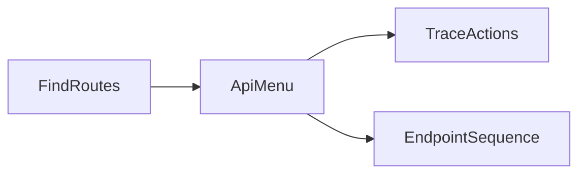

# Chapter 8. Interfaces

> An interface is where the product's verbs live — the doors every change request starts at. Three prompts read any API at three levels of zoom: the whole surface, one user action, one endpoint.

## What this chapter ships

A finder that collects the route/surface files in any framework, three prompts that read them at three zoom levels, a workflow that runs them, and a renderer that emits a self-contained HTML page plus a markdown twin.

```
ch08-interfaces/
├── prompts/
│   ├── api-menu.md           # group every endpoint into a feature menu + a tour
│   ├── trace-action.md       # trace 4-8 user gestures across services (swimlanes)
│   └── endpoint-sequence.md  # one endpoint as a Mermaid sequence diagram
├── workflow/
│   ├── routes_find.py        # collect the surface files; read handler source
│   ├── nodes.py              # FindRoutes → ApiMenu → TraceActions → EndpointSequence
│   ├── flow.py
│   ├── main.py               # CLI
│   ├── render.py             # 4-section HTML + markdown
│   └── requirements.txt
├── skill/API-MAP.md          # agent equivalent (drop into Claude Code or Cursor)
└── output/<repo>-interfaces/
    ├── index.md
    └── index.html
```

## Quickstart

```bash
pip install -r ../../utils/requirements.txt
export ANTHROPIC_API_KEY=...     # or OPENAI_API_KEY, or GEMINI_API_KEY

git clone https://github.com/calcom/cal.com path/to/cal.com
cd workflow
python main.py path/to/cal.com
```

Output:

```
  Surface: 90 route files (181,762 chars)
  Menu: 12 feature groups, 5 tour steps
  Flows: 4 actions traced
  Sequence: POST /api/recorded-daily-video (from 6 source files)

Wrote ../output/cal.com-interfaces/index.html
```

## Three views, one section each

| # | Section | Prompt | What it answers |
|---|---|---|---|
| 01 | Feature menu | `api-menu` | What can this product do? (every endpoint, grouped by feature, biggest first, auth-tagged) |
| 02 | The tour | `api-menu` | Which groups say the most about the product? (a narrative) |
| 03 | Action flows | `trace-action` | What fires when a user clicks *Confirm*? (services as lanes, in order) |
| 04 | Endpoint sequence | `endpoint-sequence` | What's the exact order of messages inside one endpoint? (a UML sequence diagram) |

## How it works



`FindRoutes` collects the surface files once. `ApiMenu` groups them; `TraceActions` reuses those groups; `EndpointSequence` picks the most illustrative endpoint from the menu, reads its handler source (an extra LLM call picks the files), and draws the diagram.

Robustness notes from building this against Cal.com's real ~300-endpoint surface:
- **The menu needs a big output budget.** It lists every one of ~300 endpoints in one reply; the default cap truncates it mid-menu, so `main.py` raises `LLM_MAX_OUTPUT_TOKENS` (a cap you're not billed for).
- **The sequence diagram declares every participant.** A model that references an inline participant (`->>(External Webhook)`) produces invalid Mermaid; the prompt forbids it, and the client-side parse-guard drops any diagram that still slips through — no error box.

## Example output

[`output/cal.com-interfaces/`](output/cal.com-interfaces/) is a real run on the full Cal.com repo (90 route files): a dozen feature groups (Admin & Moderation is larger than Scheduling), four traced user flows, and a seven-lifeline sequence diagram of a webhook endpoint that fans out to the database, email, transcription, and external subscribers. Open [`index.html`](output/cal.com-interfaces/index.html); [`index.md`](output/cal.com-interfaces/index.md) reads on GitHub.

## Agent equivalent

[`skill/API-MAP.md`](skill/API-MAP.md) runs the same three views inside an agent session — best when you're already exploring a repo in Claude Code or Cursor.
