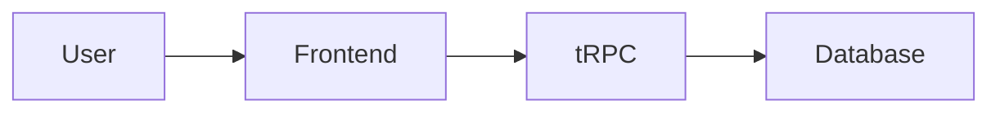
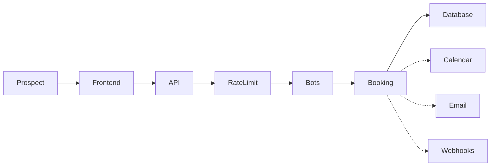
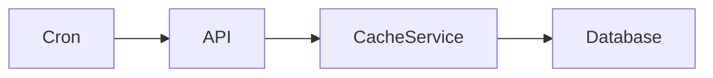
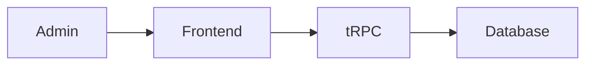
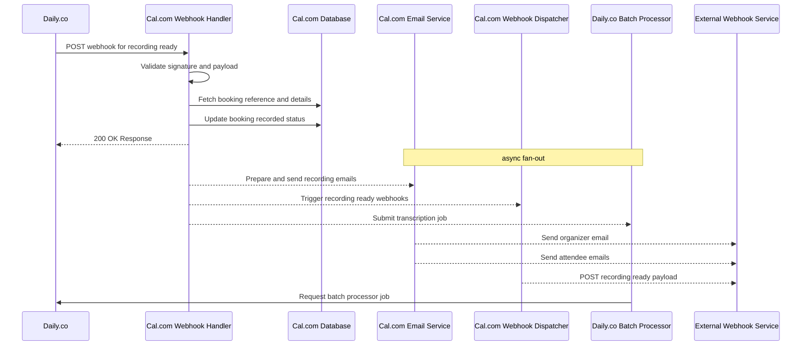

# cal.com: interfaces

Hey there, future Cal.com expert! Welcome to the team. You're diving into the heart of our platform, and I'm here to give you a friendly tour of our API surface.

Cal.com: Far from just a simple scheduling app, its extensive administrative and moderation features reveal a platform designed for rigorous community and content governance.

Cal.com is an extensive scheduling platform primarily characterized by its robust administrative and moderation features, extending far beyond typical calendaring applications to support rigorous community and content governance. The API surface reveals a multi-tenant system with granular access control, designed for managing diverse user interactions across three distinct feature groups.

## Feature menu

### Admin & Moderation (27 endpoints)
These endpoints empower platform administrators to manage users, features, and content across the entire system. From user account actions to detailed content monitoring via a watchlist, this is where the platform's operational control resides.
- `GET /api/trpc/admin.listPaginated` — List paginated members (admin)
- `POST /api/trpc/admin.sendPasswordReset` — Send password reset for a user (admin)
- `POST /api/trpc/admin.lockUserAccount` — Lock a user account (admin)
- `POST /api/trpc/admin.toggleFeatureFlag` — Toggle a feature flag (admin)
- `POST /api/trpc/admin.removeTwoFactor` — Remove 2FA for a user (admin)
- `GET /api/trpc/admin.getSMSLockStateTeamsUsers` — Get SMS lock state for teams/users (admin)
- `POST /api/trpc/admin.setSMSLockState` — Set SMS lock state (admin)
- `POST /api/trpc/admin.createSelfHostedLicense` — Create a self-hosted license key (admin)
- `POST /api/trpc/admin.createCoupon` — Create a coupon (admin)
- `GET /api/trpc/admin.getTeamsForFeature` — Get teams associated with a feature (admin)
- `POST /api/trpc/admin.assignFeatureToTeam` — Assign a feature to a team (admin)
- `POST /api/trpc/admin.unassignFeatureFromTeam` — Unassign a feature from a team (admin)
- `GET /api/trpc/admin.watchlist.list` — List watchlist entries (admin)
- `POST /api/trpc/admin.watchlist.create` — Create a watchlist entry (admin)
- `POST /api/trpc/admin.watchlist.delete` — Delete a watchlist entry (admin)
- `POST /api/trpc/admin.watchlist.bulkDelete` — Bulk delete watchlist entries (admin)
- `GET /api/trpc/admin.watchlist.getDetails` — Get details of a watchlist entry (admin)
- `GET /api/trpc/admin.watchlist.listReports` — List reports (admin)
- `POST /api/trpc/admin.watchlist.dismissReport` — Dismiss a report (admin)
- `POST /api/trpc/admin.watchlist.bulkDismiss` — Bulk dismiss reports (admin)
- `POST /api/trpc/admin.watchlist.addToWatchlist` — Add to watchlist (admin)
- `GET /api/trpc/admin.watchlist.pendingReportsCount` — Get count of pending reports (admin)
- `GET /api/trpc/users.get` — Get details of a specific user (admin)
- `GET /api/trpc/users.list` — List all users (admin)
- `POST /api/trpc/users.add` — Add a new user (admin)
- `POST /api/trpc/users.update` — Update an existing user (admin)
- `POST /api/trpc/users.delete` — Delete a user (admin)

### Event Type Management (22 endpoints)
This group handles the core scheduling logic, allowing users to define, manage, and configure the types of events they offer for booking. It covers everything from creating a new event type to advanced host assignment and location management.
- `GET /api/trpc/eventTypes.getByViewer` — Get event types visible to the viewer (user)
- `GET /api/trpc/eventTypes.getUserEventGroups` — Get user's event groups (user)
- `GET /api/trpc/eventTypes.getEventTypesFromGroup` — Get event types from a group (user)
- `GET /api/trpc/eventTypes.getActiveOnOptions` — Get active options for event types (user)
- `GET /api/trpc/eventTypes.list` — List all event types for the user (user)
- `GET /api/trpc/eventTypes.listWithTeam` — List event types including team info (user)
- `GET /api/trpc/eventTypes.get` — Get a specific event type (user)
- `POST /api/trpc/eventTypes.delete` — Delete an event type (user, admin/owner role)
- `GET /api/trpc/eventTypes.bulkEventFetch` — Bulk fetch events (user)
- `POST /api/trpc/eventTypes.bulkUpdateToDefaultLocation` — Bulk update event types to default location (user)
- `GET /api/trpc/eventTypes.getHashedLink` — Get a hashed link for an event type (user)
- `GET /api/trpc/eventTypes.getHashedLinks` — Get hashed links for multiple event types (user)
- `GET /api/trpc/eventTypes.getHostsForAvailability` — Get hosts for event type availability (user, admin/owner role)
- `GET /api/trpc/eventTypes.getHostsForAssignment` — Get hosts for event type assignment (user, admin/owner role)
- `GET /api/trpc/eventTypes.exportHostsForWeights` — Export hosts for weight configuration (user, admin/owner role)
- `GET /api/trpc/eventTypes.getChildrenForAssignment` — Get children for event type assignment (user, admin/owner role)
- `GET /api/trpc/eventTypes.getHostsWithLocationOptions` — Get hosts with location options (user, admin/owner role)
- `POST /api/trpc/eventTypes.massApplyHostLocation` — Mass apply host location to event types (user, admin/owner role)
- `GET /api/trpc/eventTypes.searchTeamMembers` — Search team members for an event type (user)
- `POST /api/trpc/eventTypesHeavy.create` — Create an event type (user)
- `POST /api/trpc/eventTypesHeavy.duplicate` — Duplicate an event type (user, admin/owner role)
- `POST /api/trpc/eventTypesHeavy.update` — Update an event type (user, admin/owner role)

### Authentication & User Accounts (19 endpoints)
These endpoints cover the full lifecycle of a user's account, from initial registration and setup to login, password management, and two-factor authentication. It also includes pathways for OAuth and managing referrals.
- `POST /api/auth/forgot-password` — Request a password reset email (public)
- `GET /api/auth/oauth/me` — Get current OAuth user profile (public)

## Action flows

Here's a warm guided tour of four different API flows within our product, designed to help you, a new developer, understand how different actions light up our backend services. We'll trace each step from the user's perspective right down to the database, noting which parts block the user interface and which run in the background.

---

### View Your Scheduled Event Types
This flow covers a simple read operation.

**Flow:** View Your Scheduled Event Types
**Title:** A user checks the list of event types they offer.
**Sub:** 4 lanes, 1 data fetch, User waits on Frontend.

**Lane 1 · User.** You, the user, open your web browser and navigate to your personal dashboard where you manage all the different types of appointments you offer. With a simple click or page load, your browser sends a request to fetch the content for this page.

**Lane 2 · Frontend.** The web application running in your browser receives the signal to display your event types. It understands that it needs a list of all your configured events, so it constructs a secure call to our backend API to retrieve this data. This initial API request is what kicks off the entire fetching process.

**Lane 3 · tRPC.** This is where our typed API magic happens! The frontend calls a tRPC endpoint, specifically `GET /api/trpc/eventTypes.getByViewer`. This procedure is designed to securely fetch all event types visible to your currently logged-in user account. It acts as a gateway, validating your request and preparing it for the data storage layer.

**Lane 4 · Database.** Our database is the authoritative source for all your event type configurations. The `getByViewerHandler` procedure executes a query against `prisma` to retrieve all event types linked to your user ID, including details like their names, durations, and booking settings. Once this data is retrieved, it's sent back up the chain through tRPC and the Frontend, allowing your dashboard to display your event types. This entire sequence happens synchronously, meaning the user interface waits for this data before fully rendering.

---

### Book a 30-Minute Intro Call
Let's switch gears from just looking at data to a more dynamic, write-heavy process: a prospect making a new booking, which involves several critical steps and integrations.

**Flow:** Book a 30-Minute Intro Call
**Title:** A new prospect schedules an introductory meeting with a team member.
**Sub:** 6 synchronous lanes + 3 asynchronous lanes, 1 booking, Prospect waits on API.

**Lane 1 · Prospect.** You're a prospective client looking to book an intro call. You've navigated to the team's booking page, selected a suitable time slot, and meticulously filled out the booking form with your contact details and any necessary questions. When you confidently click "Confirm," your web browser sends a request to finalize your appointment.

**Lane 2 · Frontend.** The web application captures all your booking information and packages it into a structured request. This bundle includes the chosen event type, the specific date and time, and all the contact information you provided. It then dispatches this data to our core booking API endpoint.

**Lane 3 · API.** Our main booking endpoint, `POST /api/book/event`, receives your booking request. This endpoint serves as the central orchestrator for creating new appointments, but it first takes a moment to process and parse the incoming data to ensure everything looks correct.

**Lane 4 · RateLimit.** To protect our service from abuse and ensure fair usage for everyone, your request first hits a rate limiter. The `checkRateLimitAndThrowError` function scrutinizes your IP address, ensuring you're not making too many requests in a short period. If you pass this crucial check, your request proceeds.

**Lane 5 · Bots.** Next, we engage our bot detection mechanisms. This involves `checkCfTurnstileToken` (if Cloudflare Turnstile is enabled) and a feature flag lookup for the specific event type. These checks are vital to confirm that a genuine human user, not an automated script, is attempting to make a booking, helping us maintain data integrity and prevent spam.

**Lane 6 · Booking.** Now, the core logic takes over! The `getRegularBookingService().createBooking` method uses all the validated information to construct and create a new `Booking` record. This is the heart of the booking process, ensuring your appointment is formally recorded and ready to be stored.

**Lane 7 · Database.** A brand new `Booking` entry is securely persisted in our `prisma` database, storing all the details of your scheduled event, including who booked it and for when. At this point, the API sends a confirmation back to the frontend, and the spinner on your screen stops, letting you know your booking is successful!

**Lane 8 · Calendar.** *Running in the background after you've received your confirmation,* the `BookingService` asynchronously integrates with external calendar providers like Google Calendar or Outlook. It adds the newly created event to the host's calendar, ensuring the appointment automatically appears in their external schedule without delaying your experience.

**Lane 9 · Email.** *Also happening asynchronously after the initial response,* the `BookingService` triggers our sophisticated email notification system. Both the host and you, the prospect, receive confirmation emails with all the event details, sent via methods like `sendOrganizerRequestReminderEmail`.

**Lane 10 · Webhooks.** Finally, *and also in the background after the user has received their confirmation,* the `BookingService` dispatches webhooks. If the host has configured any integrations, these webhooks notify external systems (such as CRMs, project management tools, or Slack) about the new booking, keeping all connected services effortlessly in sync.

---

### Nightly Calendar Cache Cleanup
Now, let's explore a process that runs entirely behind the scenes, without any direct user interaction: a critical scheduled job.

**Flow:** Nightly Calendar Cache Cleanup
**Title:** The system automatically cleans up old cached calendar events to optimize performance.
**Sub:** 4 lanes, 1 cleanup run, No user waits.

**Lane 1 · Cron.** An external scheduling system (think of it like an alarm clock for our servers), often a Kubernetes cron job or a cloud-based scheduled function, automatically triggers at a set interval, typically once every night. Its sole purpose is to send a simple HTTP request to our API, initiating the cleanup process.

**Lane 2 · API.** Our dedicated cron endpoint, `GET /api/cron/calendar-subscriptions-cleanup`, receives this scheduled trigger. It first performs a crucial authentication step, verifying a secret API key in the request header to ensure only authorized systems can trigger this sensitive job. If the key is valid, it then dispatches the command to the underlying cleanup service.

**Lane 3 · CacheService.** The `CalendarCacheEventService` is now in charge, actively working to identify and remove outdated or stale calendar cache entries. It leverages the `CalendarCacheEventRepository` to interact with the database, querying for records that have exceeded their designated expiry time. This proactive measure keeps our system lean and responsive, ensuring efficient calendar synchronization.

**Lane 4 · Database.** The `prisma` ORM performs the actual heavy lifting: the deletion of all identified expired cache records from the database. This critical write operation removes unnecessary data, which not only prevents database bloat but also guarantees that our calendar integrations always work with the freshest information. Once the deletions are complete, a success response is sent back to the cron trigger, confirming the job is done.

---

### Admin Assigns a Feature to a Team
Finally, let's look at an operation only accessible to administrators, demonstrating how feature flags are managed within a team.

**Flow:** Admin Assigns a Feature to a Team
**Title:** An administrator enables a new product feature for a specific team.
**Sub:** 4 lanes, 1 feature assignment, Admin waits on tRPC.

**Lane 1 · Admin.** As an administrator, you navigate to a specific team's settings page within the application, perhaps to roll out a new product capability. You locate a toggle or button to enable a new feature for that team, and with a click, you activate it. Your web browser then prepares and sends this administrative command to the backend.

**Lane 2 · Frontend.** The administration user interface in your browser captures your action and constructs a tRPC mutation request. This request is carefully bundled with essential information, including the `teamId` and the specific `feature` identifier that you intend to assign. It's the UI's job to ensure all necessary data is accurately packaged for the backend.

**Lane 3 · tRPC.** This request hits the `POST /api/trpc/admin.assignFeatureToTeam` endpoint. Crucially, our `authedAdminProcedure` first verifies that you are indeed an authenticated administrator with the necessary permissions. Once your authorization is confirmed, the procedure then invokes the `assignFeatureToTeam.handler` to perform the actual feature assignment.

**Lane 4 · Database.** The handler then interacts with our `prisma` database to create or update a record, explicitly linking the specified feature to the given `teamId`. This is a direct write operation, instantly changing the feature flag status for that team across the application. Once this database transaction is complete, a success response is sent back to the frontend, allowing the UI to update and confirm the feature is now active for the team.

## Endpoint sequence

**Endpoint:** `POST /api/recorded-daily-video`
**Title:** Daily.co notifies Cal.com that a video recording is ready.
**Subtitle:** 7 participants, 12 messages.

### Messages
1.  **Daily -> CalAPI**: POST webhook for recording ready (apps/web/app/api/recorded-daily-video/route.ts)
2.  **CalAPI -> CalAPI**: Verify webhook signature (apps/web/app/api/recorded-daily-video/route.ts:42)
3.  **CalAPI -> CalDB**: Fetch booking reference and details (apps/web/lib/daily-webhook/getBookingReference.ts, apps/web/lib/daily-webhook/getBooking.ts)
4.  **CalAPI -> CalDB**: Update booking recorded status (packages/features/bookings/repositories/BookingRepository.ts:1678)
5.  **CalAPI --> Daily**: 200 OK Response (apps/web/app/api/recorded-daily-video/route.ts:121)
6.  **CalAPI -->> CalEmail**: Prepare and send recording emails (packages/emails/daily-video-emails.ts:43)
7.  **CalAPI -->> CalWebhooks**: Trigger recording ready webhooks (apps/web/lib/daily-webhook/triggerWebhooks.ts:71)
8.  **CalAPI -->> DailyBatch**: Submit transcription job (packages/features/conferencing/lib/videoClient.ts:413)
9.  **CalEmail -->> ExtService**: Send organizer email (packages/emails/templates/organizer-daily-video-download-recording-email.ts)
10. **CalEmail -->> ExtService**: Send attendee emails (packages/emails/templates/attendee-daily-video-download-recording-email.ts)
11. **CalWebhooks -->> ExtService**: POST recording ready payload (packages/features/webhooks/lib/sendPayload.ts)
12. **DailyBatch -> Daily**: Request batch processor job (packages/features/conferencing/lib/videoClient.ts:413)

### Description
This endpoint is a webhook handler, meaning it listens for notifications from an external service, in this case, Daily.co, our video conferencing provider. The flow is split into two main parts: first, a quick synchronous response to Daily.co to acknowledge the event, followed by an asynchronous "fan-out" to handle various follow-up actions like sending emails and triggering other internal or external processes. The user (Daily.co, in this context) waits only for the initial database update and the `200 OK` response.

### Key takeaway
This endpoint exemplifies the "respond fast, fan out later" pattern. The core action (marking the booking as recorded) is completed synchronously, and the user receives a confirmation quickly. However, subsequent tasks like sending emails and triggering other webhooks are handled asynchronously, meaning if one of these background tasks fails, it doesn't prevent the primary operation from succeeding, but also won't roll back the initial database change.
