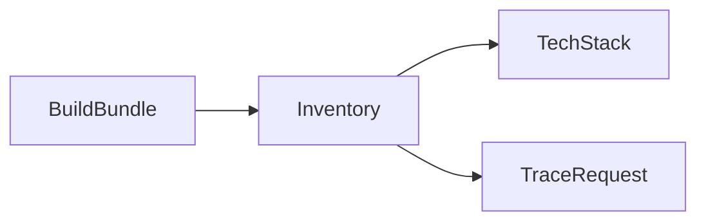

# Chapter 9. Architecture

> An architecture is a graph of programs and the wires between them. Three prompts map any multi-service system: inventory the nodes, open each box, and trace one request across them.

## What this chapter ships

A crawler that overlays the four architecture sources into one compact bundle, three prompts that read it, a workflow that runs them, and a renderer that emits a self-contained HTML page plus a markdown twin.

```
ch09-architecture/
├── prompts/
│   ├── inventory.md          # every node sorted into 4 bands + a service graph
│   ├── tech-stack.md         # open each box: the real tech inside the label
│   └── trace-request.md      # trace the core request hop by hop, plus variants
├── workflow/
│   ├── arch_crawl.py         # build the architecture bundle from the four sources
│   ├── nodes.py              # BuildBundle → Inventory → TechStack → TraceRequest
│   ├── flow.py
│   ├── main.py               # CLI
│   ├── render.py             # 3-section HTML + markdown
│   └── requirements.txt
├── skill/ARCHITECTURE-MAP.md # agent equivalent (drop into Claude Code or Cursor)
└── output/<repo>-architecture/
    ├── index.md
    └── index.html
```

## Quickstart

```bash
pip install -r ../../utils/requirements.txt
export ANTHROPIC_API_KEY=...     # or OPENAI_API_KEY, or GEMINI_API_KEY

git clone https://github.com/calcom/cal.com path/to/cal.com
cd workflow
python main.py path/to/cal.com
```

Output:

```
  Bundle: 10 config files, 250 env vars, 396 deps, 108 integrations, 78 SDK imports
  Inventory: 15 nodes (graph drawn)
  Tech stack: 15 nodes documented
  Trace: 5 cards (trace + variants)

Wrote ../output/cal.com-architecture/index.html
```

This chapter is for **multi-service** systems. A single-binary tool (a library, a CLI, PocketBase) is one process with no service graph — read its modules in ch13.

## Three views, one section each

| # | Section | Prompt | What it answers |
|---|---|---|---|
| 01 | The inventory | `inventory` | What are the nodes, and who runs each? (a band-grouped service graph: run · rent · call · client) |
| 02 | Tech stack | `tech-stack` | What is each box actually built from? ("the queue" → a Postgres table drained by a cron route) |
| 03 | The trace | `trace-request` | What fires when a user books? (hop by hop, and how each variant differs) |

## The four sources

No single file holds the architecture. `arch_crawl.py` overlays them into one bundle small enough for a single LLM pass:

- **compose / Procfile / k8s** — the services the team *runs*.
- **`.env` (names only, never values)** — the external services it's configured to *call*.
- **`package.json` dependencies + `git grep`'d SDK imports** — proof (with `file:line`) that a call is actually live.
- **IaC (`*.tf`)** — the managed cloud resources underneath.
- Plus the **integration directories** (Cal.com's `app-store` has 100+), the long tail of external services.

## How it works



`BuildBundle` overlays the four sources once. `Inventory` names every node (stable numbered IDs) and draws the graph; `TechStack` and `TraceRequest` reuse those IDs so all three passes describe the same architecture. The inventory + tech passes emit a card per node, so `main.py` raises `LLM_MAX_OUTPUT_TOKENS` (a cap you aren't billed for). The service graph renders client-side with a parse-guard: a diagram the model gets wrong is dropped, never shown as an error.

## Example output

[`output/cal.com-architecture/`](output/cal.com-architecture/) is a real run on the full Cal.com repo: a band-grouped service graph (a browser, a Next.js web app and NestJS API over Postgres and Redis, fanning out to Stripe, Google Calendar, SendGrid, and a long tail of integrations), a tech-stack card per node, and a hop-by-hop trace of the booking request with its free/paid/reschedule variants. Open [`index.html`](output/cal.com-architecture/index.html); [`index.md`](output/cal.com-architecture/index.md) reads on GitHub.

## Agent equivalent

[`skill/ARCHITECTURE-MAP.md`](skill/ARCHITECTURE-MAP.md) runs the same three passes inside an agent session — best when you're already exploring a repo in Claude Code or Cursor.
