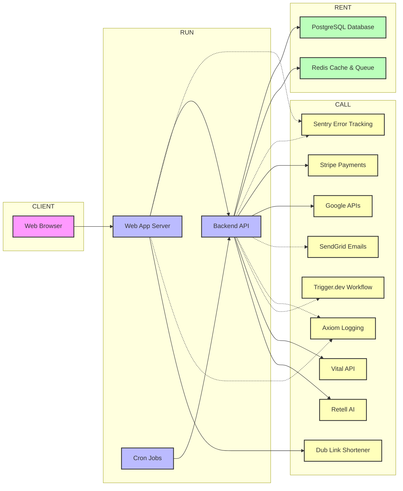

# cal.com: architecture

**Shape verdict:** A service-oriented architecture with a Next.js frontend (Calcom) communicating with a dedicated NestJS backend API (Calcom API), backed by PostgreSQL and Redis, and heavily integrating with numerous external SaaS providers.

Cal.com is a service-oriented scheduling platform, featuring a Next.js frontend (Calcom) that communicates with a dedicated NestJS backend API (Calcom API). This codebase reveals a distributed architecture, leveraging PostgreSQL for persistent data and Redis for caching or session management, while deeply integrating with numerous external SaaS providers to deliver its comprehensive scheduling capabilities.

## The inventory

Hey there, future Cal.com expert! Welcome to the team. Let me give you the lay of the land for our core architecture, so you can quickly get up to speed on where everything lives and how it talks to each other. Think of it like a city map: we have neighborhoods for what we run, what we rent, what we call, and what the user sees.

**Shape verdict:** A service-oriented architecture with a Next.js frontend (Calcom) communicating with a dedicated NestJS backend API (Calcom API), backed by PostgreSQL and Redis, and heavily integrating with numerous external SaaS providers.



### 1 · calcom_api
(RUN, code · `apps/api/v2/`) This is our core backend, a NestJS application handling all business logic, user authentication, data management, and integrations with external services.
→ postgres (sync, internal), redis (sync, internal), sentry (async, public), stripe (sync, public), google_apis (sync, public), sendgrid (async, public), axiom (async, public), trigger_dev (async, public), vital_api (sync, public), retell_ai (sync, public)

### 2 · postgres
(RENT, config · `DATABASE_URL` / `database` service) This is our primary data store, a PostgreSQL database that persistently stores all application data, such as user profiles, event types, and bookings.
→ (terminal — vendor)

### 3 · redis
(RENT, config · `REDIS_URL` / `redis` service) This is an in-memory data store used for caching frequently accessed data to speed up responses and as a message broker for job queues.
→ (terminal — vendor)

### 4 · calcom
(RUN, code · `apps/web/`) This is our Next.js web application server, responsible for server-side rendering, handling client-side routing, and acting as a gateway that sometimes processes requests directly or proxies them to the Backend API.
→ calcom_api (sync, internal), sentry (async, public), axiom (async, public), dub (sync, public)

### 5 · web_browser
(CLIENT, code · N/A) This represents the user's web browser, where the client-side code of our Next.js application runs, allowing users to interact with our platform.
→ calcom (sync, internal)

### 6 · cron_tasks
(RUN, config · `apps/web/vercel.json`) These are scheduled background jobs managed by Vercel's cron service, designed to perform routine maintenance, data synchronization, and other periodic tasks.
→ calcom_api (sync, internal)

### 7 · sentry
(CALL, config · `SENTRY_DSN`) This is an external service we use for real-time error tracking and performance monitoring, helping us identify and fix issues quickly.
→ (terminal — vendor)

### 8 · axiom
(CALL, config · `AXIOM_DATASET`) This is an external logging and observability platform where we send application logs to help diagnose issues and understand system behavior.
→ (terminal — vendor)

### 9 · stripe
(CALL, config · `STRIPE_API_KEY`) This is our trusted third-party payment processing platform, handling all financial transactions like subscriptions and one-off payments.
→ (terminal — vendor)

### 10 · google_apis
(CALL, config · `GOOGLE_API_CREDENTIALS`) This refers to various Google services we integrate with, primarily for calendar synchronization and OAuth-based user authentication.
→ (terminal — vendor)

### 11 · sendgrid
(CALL, config · `SENDGRID_API_KEY`) This is an external email delivery service used to reliably send out notifications, reminders, and marketing communications to users.
→ (terminal — vendor)

### 12 · trigger_dev
(CALL, config · `TRIGGER_API_URL`) This is an external event-driven framework for building and running long-running background jobs and workflows, offloading complex tasks from our main API.
→ (terminal — vendor)

### 13 · dub
(CALL, config · N/A) This is an external link shortening and analytics service used to create concise URLs and track their engagement.
→ (terminal — vendor)

### 14 · vital_api
(CALL, config · `VITAL_API_KEY`) This is an external API for integrating with health and fitness data, allowing users to connect and manage their vital metrics.
→ (terminal — vendor)

### 15 · retell_ai
(CALL, config · `RETELL_AI_KEY`) This is an external AI service integrated into our backend to power conversational AI experiences and smart interactions within the platform.
→ (terminal — vendor)

## Tech stack

Hey there, future Cal.com expert! Welcome to the team. Let me give you the lay of the land for our core architecture, so you can quickly get up to speed on where everything lives and how it talks to each other. Think of it like a city map: we have neighborhoods for what we run, what we rent, what we call, and what the user sees.

### 1 · calcom_api — the backend brain
This is the brain of our operation, a dedicated backend that handles all the complex logic, user accounts, and connections to other services, making sure everything runs smoothly behind the scenes.

Under the hood, it's a NestJS application (a Node.js framework) built with TypeScript. It talks to PostgreSQL using Prisma (and raw `pg` queries for some operations) and interacts with Redis via the `ioredis` client. It also orchestrates integrations with Stripe for payments, Google APIs for calendars, and SendGrid for emails, with Sentry for error tracking.

```ts
import { SentryGlobalFilter, SentryModule } from "@sentry/nestjs/setup";
import { Redis } from "ioredis";
import Stripe from "stripe";
```

See `apps/api/v2/src/app.module.ts` (line 7), `apps/api/v2/src/modules/redis/redis.service.ts` (line 4), and `apps/api/v2/src/modules/stripe/stripe.service.ts` (line 16).

### 2 · postgres — the data filing cabinet
Our primary data store is PostgreSQL, acting like our digital filing cabinet where all important information like user profiles, event details, and booking records are securely stored, ready to be retrieved at a moment's notice.

This is a managed PostgreSQL relational database, accessed by our `calcom_api` application using a standard `postgresql` connection string. Prisma is the ORM (Object-Relational Mapper) layer, abstracting database interactions, and it's also directly queried using the `pg` client library.

```yaml
services:
  database:
    image: postgres
    environment:
      - POSTGRES_DB=calendso
```

Configuration details can be found in `docker-compose.yml` (`database` service) and environment variables like `DATABASE_URL`.

### 3 · redis — the super-fast scratchpad
Next, we have Redis, which acts like a super-fast scratchpad for frequently needed data and a to-do list for tasks that can be handled later, ensuring our application stays quick and responsive.

This is a managed Redis instance, functioning as an in-memory key-value store for caching and as a message broker for job queues. The `calcom_api` connects to it using the `ioredis` client over the `REDIS_URL` environment variable.

```ts
import { Redis } from "ioredis";
// ...
this.redis = new Redis(dbUrl);
```

See the Redis service definition in `docker-compose.yml` and `apps/api/v2/src/modules/redis/redis.service.ts` (line 4 and 16).

### 4 · calcom — the web storefront
Our main user-facing application is the Cal.com web storefront, which is what users see and interact with directly, handling everything from displaying web pages to collecting user input.

This is a Next.js application (a React framework for Node.js) that performs server-side rendering and client-side routing. It's configured to handle various rewrites and headers via `next.config.ts` and integrates with `next-axiom` for logging and `@sentry/nextjs` for client-side error tracking.

```ts
import type { NextConfig } from "next";
import { withAxiom } from "next-axiom";
import * as Sentry from "@sentry/nextjs";
```

See `apps/web/next.config.ts` (plugin integration) and `apps/web/instrumentation-client.ts` (line 4) for Sentry setup.

### 5 · web_browser — the user's window
This isn't a server we manage, but the web browser represents the user's window through which they experience Cal.com, running the interactive parts of our website right on their device.

This refers to the client-side environment where JavaScript, HTML, and CSS delivered by the `calcom` Next.js application are executed. It provides the interactive user interface and client-side logic that users directly engage with.

No specific code block applies here as this represents the user's environment, not a deployed service.

### 6 · cron_tasks — the silent helpers
Our cron tasks are like our silent helpers, performing routine chores like tidying up data or sending out scheduled notifications, making sure everything runs smoothly in the background without user intervention.

These are recurring serverless functions, defined as cron jobs within `apps/web/vercel.json` and executed by the Vercel platform. They trigger specific API endpoints (e.g., `/api/cron/calendar-subscriptions`) within the `calcom_api` to perform their tasks.

```json
{
  "crons": [
    {
      "path": "/api/cron/calendar-subscriptions",
      "schedule": "*/5 * * * *"
    }
  ],
  "functions": {}
}
```

The schedule and paths for these tasks are defined in `apps/web/vercel.json` (line 3).

### 7 · sentry — the error watchdog
Sentry is our vigilant watchdog, barking whenever something goes wrong, alerting us to errors in our application so we can fix them quickly, often before they disrupt our users too much.

This is an external Software-as-a-Service (SaaS) platform for real-time error tracking and performance monitoring. Our application integrates with it using the `@sentry/nextjs` SDK for the `calcom` frontend and `@sentry/nestjs` for the `calcom_api` backend, configured via environment variables like `SENTRY_DSN`.

```ts
import * as Sentry from "@sentry/nextjs";
import { SentryGlobalFilter, SentryModule } from "@sentry/nestjs/setup";
```

See `apps/api/v2/src/app.module.ts` (line 7), `apps/web/instrumentation-client.ts` (line 4), and `apps/web/sentry.server.config.ts` (line 7).

### 8 · axiom — the digital notebook
Axiom is our digital notebook, meticulously recording everything that happens within our application, giving us a clear history to review if we ever need to understand why something behaved a certain way.

This is an external logging and observability platform. The `calcom` Next.js application integrates via `next-axiom` (a plugin for Next.js), sending logs from both client and server-side contexts. The `calcom_api` also utilizes Axiom, likely through a logging transport like `@axiomhq/winston`.

```ts
import { withAxiom } from "next-axiom";
// ...
plugins.push(withAxiom);
```

The integration is visible in `apps/web/next.config.ts` (line 211) where `withAxiom` is applied as a plugin. `AXIOM_DATASET` is an important environment variable for its configuration.

### 9 · stripe — the secure cashier
Stripe is our secure cashier, reliably handling all payments, subscriptions, and financial transactions, so you can focus on your meetings, not on billing hassles.

This is a trusted third-party payment processing platform. The `calcom_api` integrates with Stripe using their official Node.js client library (`stripe`), leveraging `STRIPE_API_KEY` for server-side operations. The `calcom` frontend likely uses `@stripe/react-stripe-js` for client-side payment forms.

```ts
import Stripe from "stripe";
// ...
this.stripe = new Stripe(configService.get("stripe.apiKey", { infer: true }) ?? "", {
```

See `apps/api/v2/src/modules/stripe/stripe.service.ts` (line 16 and 51), and `packages/app-store/stripepayment/lib/PaymentService.ts` (line 1 and 42).

### 10 · google_apis — the Google diplomat
The Google APIs are our direct lines to Google's services, mainly used to keep your calendar in sync with Cal.com and to allow you to log in securely using your Google account.

We integrate with various Google APIs (Calendar, OAuth2, Admin) using the `googleapis` Node.js client library. Authentication for these services is primarily handled via `OAuth2Client` and `JWT` tokens from `googleapis-common`, configured with `GOOGLE_API_CREDENTIALS` and `GOOGLE_CLIENT_ID`/`GOOGLE_CLIENT_SECRET`.

```ts
import { OAuth2Client } from "googleapis-common";
import { JWT } from "googleapis-common";
```

See `apps/api/v2/src/modules/apps/services/gcal.service.ts` (line 3) and `packages/app-store/googlecalendar/lib/CalendarAuth.ts` (line 2).

### 11 · sendgrid — the dedicated mail carrier
SendGrid is our dedicated mail carrier, making sure all your important emails—like booking confirmations and reminders—arrive in your inbox reliably and on time.

This is a third-party email delivery service. Our `calcom_api` uses the `@sendgrid/client` Node.js library to programmatically send transactional and marketing emails. The `EMAIL_FROM` and `SENDGRID_API_KEY` environment variables are essential for its configuration.

```ts
import client from "@sendgrid/client";
import type { ClientRequest } => "@sendgrid/client/src/request";
```

See `packages/lib/Sendgrid.ts` (line 1 and 2) which provides the client interface for SendGrid.

### 12 · trigger_dev — the workflow orchestrator
Trigger.dev is our workflow orchestrator, like a smart assistant for complex, multi-step tasks; it takes care of things that might take a while or involve several steps, freeing up our main systems to focus on immediate user requests.

This is an external event-driven platform for building and running background jobs and workflows. Our application sets a `TRIGGER_VERSION` environment variable, indicating integration via the `@trigger.dev/sdk` client library. The `TRIGGER_API_URL` and `TRIGGER_SECRET_KEY` environment variables are used for authentication.

```ts
import { TRIGGER_VERSION } from "./trigger.version";
// ...
env.TRIGGER_VERSION = TRIGGER_VERSION;
```

See `apps/web/next.config.ts` (line 19 and 88), which sets the `TRIGGER_VERSION` environment variable. The `@trigger.dev/sdk` package is listed in `PACKAGE DEPENDENCIES`.

### 13 · dub — the link shortener
Dub is our link shortener, an expert in making long, messy web addresses short and sweet, and it also helps us understand how many people click on those links.

This is an external link shortening and analytics service. The `calcom` frontend uses `@dub/analytics` for tracking and client-side operations. The `calcom`'s Next.js configuration includes a rewrite rule to proxy requests from `/_proxy/dub/track` directly to `https://api.dub.co/track`.

```ts
// In apps/web/next.config.ts
// ...
{
  source: "/_proxy/dub/track/:path",
  destination: "https://api.dub.co/track/:path",
},
```

See the rewrite rule in `apps/web/next.config.ts` (line 320). The `@dub/analytics` and `dub` packages are also listed in `PACKAGE DEPENDENCIES`.

### 14 · vital_api — the health data bridge
Vital API is our health data bridge, allowing users to connect their wearable devices and apps to manage their personal wellness information within Cal.com.

This is an external API for integrating with health and fitness data. The `calcom_api` uses the `@tryvital/vital-node` SDK to interact with this service. Authentication is managed via the `VITAL_API_KEY` environment variable.

No explicit SDK import or client construction is shown in the provided code snippets. However, its presence is confirmed by the `VITAL_API_KEY` environment variable and `@tryvital/vital-node` in `PACKAGE DEPENDENCIES`.

### 15 · retell_ai — the conversational wizard
Retell AI is our conversational wizard, providing the smarts for interactive AI experiences within Cal.com, from automated assistants to advanced scheduling tools.

This is an external AI service. The `calcom_api` likely integrates with it using the `retell-sdk` Node.js client library for backend conversational logic. The `RETELL_AI_KEY` environment variable is used for authentication.

No explicit SDK import or client construction is shown in the provided code snippets. Its presence is confirmed by the `RETELL_AI_KEY` environment variable and `retell-sdk` and `retell-client-js-sdk` in `PACKAGE DEPENDENCIES`.

## The trace

Alright, welcome to the team! Let's walk through the most important action in our product: a user successfully booking a meeting. Think of it like this: someone lands on a booking page, picks a slot, confirms, and boom – an event is scheduled! We'll go hop by hop, seeing which part of our system does what.

### The trace

**Hop 1 — node 5 · web_browser**
The journey begins when a real user, let's call her Alice, opens a Cal.com booking link (e.g., `cal.com/john/30min`) in her web browser. She sees John's available slots, picks one that works for her, fills in her name, email, and any notes, then clicks the "Confirm Booking" button. (user waits) (`apps/web/`)

**Hop 2 — node 4 · calcom**
Alice's browser sends her booking request as an API call to our main Next.js web application server. This `calcom` server acts like a smart front door, receiving the request and, based on its configuration, routes this specific API call to our dedicated backend API. (user waits) (`apps/web/next.config.ts:280`)

**Hop 3 — node 1 · calcom_api**
The NestJS backend API, our main logic powerhouse, receives Alice's booking request. It immediately gets to work, validating all the details she provided, checking that the time slot is still available, and preparing to record the new booking. (user waits) (`apps/api/v2/src/main.ts`)

**Hop 4 — node 2 · postgres**
The API now writes the new booking's essential information – the chosen time, Alice's contact details, and the event type – into our primary PostgreSQL database, ensuring it's durably stored. (user waits) (`packages/prisma/index.ts:2`)

**Hop 5 — node 10 · google_apis**
Next, if John (the meeting host) has connected his Google Calendar (or another external calendar integration), our `calcom_api` makes a real-time call to the Google Calendar API. It creates a new event on John's calendar and sends an invitation directly to Alice's email address. (user waits) (`apps/api/v2/src/modules/cal-unified-calendars/services/google-calendar.service.ts:15`)

**Hop 6 — node 3 · redis**
To keep things speedy for Alice, the `calcom_api` now puts a few follow-up tasks into a queue in Redis. These tasks include sending a formal confirmation email and triggering any webhooks (like updating a CRM), which can run in the background without making Alice wait. (user waits for enqueue) (`apps/api/v2/src/modules/redis/redis.service.ts:16`)

**Hop 7 — node 1 · calcom_api**
Having completed all the critical, immediate steps, the `calcom_api` sends a success message back to the `calcom` Next.js frontend, confirming that the booking has been successfully processed. (user waits) (`apps/api/v2/src/main.ts`)

**Hop 8 — node 4 · calcom**
The `calcom` frontend receives the success signal. It then renders a shiny confirmation page to Alice, showing her all the details of her newly booked meeting with John. (user waits) (`apps/web/next.config.ts:208`)

---
**Alice stops waiting here.** The meeting is booked, and she can move on. Everything from here happens quietly in the background.
---

**Hop 9 — node 3 · redis**
Now, a background worker process (which is essentially another part of our `calcom_api` service, or a dedicated worker) fetches the pending email task that was put into the Redis queue in Hop 6. (queued for a worker) (`apps/api/v2/src/modules/redis/redis.service.ts:16`)

**Hop 10 — node 1 · calcom_api**
This background worker, using the email sending capabilities built into the `calcom_api` codebase, carefully crafts the booking confirmation email, complete with all the event specifics for both Alice and John. (queued for a worker) (`packages/lib/Sendgrid.ts:1`)

**Hop 11 — node 11 · sendgrid**
The worker then hands off the confirmation email to SendGrid, our external email delivery service, which ensures the email reliably reaches Alice's and John's inboxes. (queued for a worker) (`packages/lib/Sendgrid.ts:1`)

**Hop 12 — node 12 · trigger_dev**
Finally, if John has set up any advanced, multi-step workflows for his bookings (like updating a Salesforce record or sending a personalized SMS), the `calcom_api` notifies Trigger.dev. This external workflow engine then takes over, executing these more complex, long-running processes in the background. (queued for a worker) (`@trigger.dev/sdk` in `package.json`)

### Variant — Paid Event Booking
Let's imagine John charges for his time. When Alice books a paid event, an extra crucial step happens after the `calcom_api` validates the booking details (Hop 3). Before the booking is written to the database or external calendars are updated, the `calcom_api` makes a synchronous call to **node 9 · stripe** to process Alice's payment. Only if the payment is successful does the booking proceed through the remaining steps. If payment fails, the transaction is rolled back, and Alice receives an error. (`packages/app-store/stripepayment/lib/PaymentService.ts:1`)

### Variant — Booking via a Routing Form
Sometimes, a user doesn't book a specific event directly. Instead, they might land on a "routing form" that asks a few questions to determine the best person or event type for them. In this scenario, Alice's initial browser request (Hop 1) would go to a `/forms` path. Our **node 4 · calcom** (Next.js server) recognizes this special path via its rewrite rules, directing her to our routing form application. After she submits the form, the `calcom` server sends her form data to the `calcom_api`, which then uses its logic to find the appropriate host or event type and *then* initiates the standard booking flow, possibly by redirecting Alice to the correct booking page or directly initiating the booking on her behalf. (`apps/web/next.config.ts:192`)

### Variant — Organization Member Booking on a Custom Domain
What if Alice is booking with a member of an organization that uses a custom domain, like `meetings.myorg.com/sarah/demo`? Her browser request (Hop 1) still hits **node 4 · calcom**, but the Next.js server intelligently recognizes the custom domain name from the incoming request's host header. Using its organization rewrite rules, `calcom` internally processes the request as if it were for `/org/:orgSlug/:user/:type`. The system resolves the organization and user details from the domain, and then the request proceeds through the rest of the trace (Hops 3-12) largely unchanged, but with all actions implicitly tied to the context of `myorg.com`. (`apps/web/next.config.ts:251`)

### What the variants reveal
These variants show that the Cal.com architecture is remarkably flexible and configurable, not rigid. The system uses a combination of runtime environment variables, feature flags, and sophisticated server-side routing in `apps/web/next.config.ts` to dynamically assemble the request flow based on the specific user interaction, subscription plan, or deployment context. This allows us to offer a rich, tailored experience without having to rewrite core booking logic for every single scenario.
