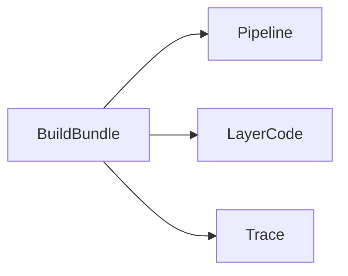

# Chapter 10. Backend

> Every backend, in every framework, is the same six layers: route, middleware, handler, service, database, response. Three prompts draw them, read the custom code, and trace one request through all six.

## What this chapter ships

A crawler that groups a backend's source into the six layers (with a count per layer), three prompts that read it, a workflow that runs them, and a renderer that emits a self-contained HTML page plus a markdown twin.

```
ch10-backend/
├── prompts/
│   ├── pipeline.md           # draw the six-layer pipeline, a count per layer
│   ├── layer-code.md         # the code only at the layers built non-standardly
│   └── trace.md              # trace the core request through all six layers
├── workflow/
│   ├── backend_crawl.py      # group the source into the six layers
│   ├── nodes.py              # BuildBundle → Pipeline → LayerCode → Trace
│   ├── flow.py
│   ├── main.py               # CLI
│   ├── render.py             # 3-section HTML + markdown
│   └── requirements.txt
├── skill/BACKEND-LAYERS.md   # agent equivalent (drop into Claude Code or Cursor)
└── output/<repo>-backend/
    ├── index.md
    └── index.html
```

## Quickstart

```bash
pip install -r ../../utils/requirements.txt
export ANTHROPIC_API_KEY=...     # or OPENAI_API_KEY, or GEMINI_API_KEY

git clone https://github.com/zulip/zulip path/to/zulip
cd workflow
python main.py path/to/zulip
```

Output:

```
  Bundle: 47 files (649,053 chars). Layers — route:4, middleware:4, handler:175, service:44, database:39, response:1
  Pipeline: 6 layer cards (diagram drawn)
  Layer code: 6 layers (4 novel)
  Trace: 6 cards (POST /json/messages)

Wrote ../output/zulip-backend/index.html
```

## Three views, one section each

| # | Section | Prompt | What it answers |
|---|---|---|---|
| 01 | The pipeline | `pipeline` | What are the six layers, and how big is each? (a flowchart with a count per layer + the `on_commit` fork) |
| 02 | The code | `layer-code` | Which layers did the team build in a non-standard way? (~20 real lines each; the rest are "standard") |
| 03 | The trace | `trace` | What runs for the core request, and where does state change? (six layers, `file:line`, plus variants) |

## The six layers

`backend_crawl.py` classifies every source file into one of six layers by its path, reports a **file count per layer** (so the pipeline prompt can lead with a number, not an adjective), and builds a bundle that includes the *spine* files in full — routing, middleware, and the response/decorator helpers, where teams write their custom idioms — plus a size-capped sample of handlers, services, and models.



The three passes are independent reads of the same bundle. `main.py` raises `LLM_MAX_OUTPUT_TOKENS` (the passes emit a card per layer with code excerpts). The pipeline diagram renders client-side with a parse-guard: a diagram the model gets wrong is dropped, never shown as an error; code excerpts are syntax-highlighted.

## Example output

[`output/zulip-backend/`](output/zulip-backend/) is a real run on the full Zulip repo (Django + Tornado): the six-layer pipeline (~650 endpoints in one `urls.py`, an 11-class middleware stack, a dashed `on_commit` fork to Tornado), the custom code at routing and middleware (Zulip's `rest_path` wrapper and `@typed_endpoint` decorator), and a trace of `POST /json/messages` — the atomic write committing before the 200, the fan-out after — with its direct-message, edit, and rate-limited variants. Open [`index.html`](output/zulip-backend/index.html); [`index.md`](output/zulip-backend/index.md) reads on GitHub.

## Agent equivalent

[`skill/BACKEND-LAYERS.md`](skill/BACKEND-LAYERS.md) runs the same three passes inside an agent session — best when you're already exploring a repo in Claude Code or Cursor.
