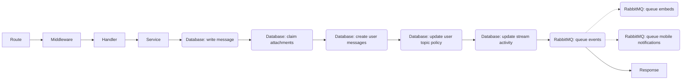

# zulip: backend

_Core endpoint: `POST /json/messages`_

Zulip is a real-time, multi-tenant team communication platform designed for asynchronous collaboration and discussion. This codebase, particularly centered around the core `POST /json/messages` endpoint, reveals an architecture characterized by extensive message processing, granular user permissions, and a deeply integrated data model to support thread-based conversations across organizations.

## The pipeline

Alright team, let's get you spun up on how requests flow through our backend! Think of it like a carefully choreographed dance, always in the same six steps. We've got our **Route** to get the party started, **Middleware** setting the stage, the **Handler** running the specific show, the **Service** doing the heavy lifting, the **Database** keeping score, and finally, the **Response** wrapping it all up.

Here's the grand overview:

```mermaid
flowchart LR
    Route[Route<br/>4 files<br/>zproject/urls.py]:::requestPath --> Middleware[Middleware<br/>6 classes<br/>LogRequests]:::sharedChecks
    Middleware --> Handler[Handler<br/>175 files<br/>@typed_endpoint]:::validateRequest
    Handler --> Service[Service<br/>44 files<br/>@transaction.atomic]:::businessRule
    Service --> Database[Database<br/>39 files<br/>models.Model]:::dataIO
    Database --> Response[Response<br/>1 file<br/>json_success]:::packageResult
    Response -.-> Async[Async Work<br/>send_event_on_commit]:::asyncWork

    classDef requestPath fill:#ACE8FF,stroke:#29B6F6,stroke-width:2px,color:#000;
    classDef sharedChecks fill:#B39DDB,stroke:#7E57C2,stroke-width:2px,color:#000;
    classDef validateRequest fill:#FFE082,stroke:#FFCA28,stroke-width:2px,color:#000;
    classDef businessRule fill:#C5E1A5,stroke:#8BC34A,stroke-width:2px,color:#000;
    classDef dataIO fill:#FFAB91,stroke:#FF7043,stroke-width:2px,color:#000;
    classDef packageResult fill:#B2DFDB,stroke:#4DB6AC,stroke-width:2px,color:#000;
    classDef asyncWork fill:#F8BBD0,stroke:#F06292,stroke-width:2px,color:#000;
```



---

### Layer 1 — Route: 4 URL files, `zproject/urls.py` is the central hub
This is where every request begins its journey, finding its matching URL pattern and binding it to a specific Python function. Our team uses standard Django `path` definitions for most pages, alongside custom `rest_path` for API endpoints that map HTTP verbs to handler functions. `zproject/urls.py` acts as the main entry point, including URL configurations from other feature-specific `urls.py` files like `analytics` and `corporate`.

Shell trick: `grep -rn "path" zproject/urls.py | wc -l`

---

### Layer 2 — Middleware: 6 Django middleware classes, `LogRequests` the standout
After the URL finds its target handler, the request flows through middleware, a series of shared checks and transformations. This layer handles crucial cross-cutting concerns like logging, rate limiting requests, and converting exceptions into JSON responses. Key middleware classes like `LogRequests` record important request details, `JsonErrorHandler` gracefully catches exceptions, and `RateLimitMiddleware` ensures fair resource usage.

Shell trick: `grep -rn "class .*Middleware" zerver/middleware.py | wc -l`

---

### Layer 3 — Handler: 175 handler files, `@typed_endpoint` is the key decorator
Once middleware has run its shared checks, a specific handler function takes over, focusing on validating the unique parameters of this one request. These functions, often found in `zerver/views/` and frequently decorated with `@typed_endpoint`, parse incoming data, perform initial input validation, and enforce permissions specific to the request's context. Examples include `json_change_settings` for user preferences, `send_message_backend` for core communication, and `get_messages_backend` for fetching content.

Shell trick: `grep -rn "@typed_endpoint" zerver/views/ | wc -l`

---

### Layer 4 — Service: 44 files, `@transaction.atomic` is used widely
The handler then delegates the core business logic to one or more service functions, typically found in `zerver/actions/`. These `do_` prefixed functions encapsulate the "what" of our application, orchestrating complex operations and ensuring data integrity. They often use `@transaction.atomic(durable=True)` to group database operations into a single, all-or-nothing unit. Standout examples include `do_send_messages` for dispatching messages, `do_create_user` for new accounts, and `do_update_message` for content edits.

Shell trick: `grep -rn "def do_" zerver/actions/ | wc -l`

---

### Layer 5 — Database: 39 model files, `models.Model` is the foundational class
For persistent data changes, service functions interact with the database layer using Django's Object-Relational Mapper (ORM). This layer defines our data schemas through `models.Model` classes, translating Python objects into database rows and vice versa. It handles the actual reading and writing of information, ensuring our application state is consistently stored. Fundamental models like `UserProfile`, `Message`, and `Realm` dictate how our core data is structured and accessed.

Shell trick: `grep -rn "class .*models.Model" zerver/models/ | wc -l`

---

### Layer 6 — Response: 1 file, `json_success` is the primary helper
After all processing, the response layer takes the result, formats it, and sends it back to the client. Our `zerver/lib/response.py` file is dedicated to this, providing helpers like `json_success` for standard successful API replies, `json_unauthorized` for authentication failures, and `MutableJsonResponse` for building the final JSON payload. Crucially, many actions often trigger `send_event_on_commit` which queues async work that runs *after* the client receives its response.

Shell trick: `grep -rn "def json_success" zerver/lib/response.py | wc -l`

## The code

Here's an overview of our backend codebase, layer by layer, pointing out where we've built something unique and where we stick to standard framework patterns.

### Layer 1 — Route: novel

Routes here are built on Django's standard `urls.py` files, but we've added a neat wrapper called `rest_path` to simplify defining API endpoints. Instead of separate URL entries for each HTTP verb (GET, POST, PATCH), `rest_path` lets you declare all supported verbs for a single URL path in one go. This makes our `urls.py` files much cleaner and more explicit for RESTful APIs.

```python
# From analytics/urls.py
# All of these paths are accessed by either a /json or /api prefix
v1_api_and_json_patterns = [
    # get data for the graphs at /stats
    rest_path("analytics/chart_data", GET=get_chart_data),
    rest_path("analytics/chart_data/stream/<stream_id>", GET=get_chart_data_for_stream),
    rest_path("analytics/chart_data/realm/<realm_str>", GET=get_chart_data_for_realm),
    rest_path("analytics/chart_data/installation", GET=get_chart_data_for_installation),
]

if settings.ZILENCER_ENABLED:
    from analytics.views.stats import (
        get_chart_data_for_remote_installation,
        get_chart_data_for_remote_realm,
    )

    v1_api_and_json_patterns += [
        rest_path(
            "analytics/chart_data/remote/<int:remote_server_id>/installation",
            GET=get_chart_data_for_remote_installation,
        ),
        rest_path(
            "analytics/chart_data/remote/<int:remote_server_id>/realm/<int:remote_realm_id>",
            GET=get_chart_data_for_remote_realm,
        ),
    ]

i18n_urlpatterns += [
    path("api/v1/", include(v1_api_and_json_patterns)),
    path("json/", include(v1_api_and_json_patterns)),
]
```
You'll see this `rest_path` pattern in `corporate/urls.py`, `zilencer/urls.py`, and `zproject/urls.py`.

### Layer 2 — Middleware: novel

While we use Django's `MiddlewareMixin` for our middleware classes, we've heavily customized how authentication and request lifecycle logging work, especially for API endpoints. We have a set of custom decorators in `zerver/decorator.py` that handle API key validation, user activity logging, and rate limiting *before* a request even hits our view logic. This allows us to abstract away common concerns and keep our handlers focused.

```python
# From zerver/decorator.py
def authenticated_rest_api_view(
    *,
    webhook_client_name: str | None = None,
    allow_webhook_access: bool = False,
    skip_rate_limiting: bool = False,
    beanstalk_email_decode: bool = False,
) -> Callable[
    [Callable[Concatenate[HttpRequest, UserProfile, ParamT], HttpResponse]],
    Callable[Concatenate[HttpRequest, ParamT], HttpResponse],
]:
    # ... (other logic)
    def _wrapped_view_func(
        view_func: Callable[Concatenate[HttpRequest, UserProfile, ParamT], HttpResponse],
    ) -> Callable[Concatenate[HttpRequest, ParamT], HttpResponse]:
        @csrf_exempt
        @wraps(view_func)
        def _wrapped_func_arguments(
            request: HttpRequest, /, *args: ParamT.args, **kwargs: ParamT.kwargs
        ) -> HttpResponse:
            role, api_key = get_basic_credentials(
                request, beanstalk_email_decode=beanstalk_email_decode
            )

            # Now we try to do authentication or die
            try:
                user_profile = validate_api_key(
                    request,
                    role,
                    api_key,
                    allow_webhook_access=allow_webhook_access,
                    client_name=full_webhook_client_name(webhook_client_name),
                )
            except JsonableError as e:
                raise UnauthorizedError(e.msg)
            try:
                if not skip_rate_limiting:
                    rate_limit_user(request, user_profile, domain="api_by_user")
                return view_func(request, user_profile, *args, **kwargs)
            except Exception as err:
                # ... (error logging)
                raise err
        return _wrapped_func_arguments
    return _wrapped_view_func
```
You'll find these decorators used extensively in `zerver/views/auth.py`, `zerver/views/users.py`, `zerver/views/message_edit.py`, and many other handler files.

### Layer 3 — Handler: standard

These view functions, found in `zerver/views/` and `corporate/views/`, typically receive an `HttpRequest` and an authenticated `UserProfile` (thanks to our middleware and decorators). They then delegate the actual business logic to functions in the "Service" layer (`zerver/actions/`), format any data received, and return an `HttpResponse`. Follows the standard framework pattern — a thin handler calls a service that makes an ORM call; nothing to read closely.

### Layer 4 — Service: novel

Our Service layer, primarily located in `zerver/actions/` and `corporate/lib/`, is where the core business logic lives. We have a strong convention of naming these functions `do_<action>` (e.g., `do_create_user`, `do_send_messages`). What's novel here is the consistent and disciplined use of Django's `transaction.atomic(durable=True)` to ensure data consistency, combined with `send_event_on_commit` for event publishing. This pattern ensures that any side effects, like real-time updates or notifications, only happen if the entire database transaction is successful.

```python
# From zerver/actions/message_send.py
@transaction.atomic(savepoint=False)
def do_send_messages(
    send_message_requests_maybe_none: Sequence[SendMessageRequest | None],
    *,
    mark_as_read: Sequence[int] = [],
) -> list[SentMessageResult]:
    # Filter out messages which didn't pass internal_prep_message properly
    send_message_requests = [
        send_request
        for send_request in send_message_requests_maybe_none
        if send_request is not None
    ]

    # Save the message receipts in the database
    # ... (code to bulk create Message objects)

    # Claim attachments in message
    # ... (code to update message attachments)

    ums: list[UserMessageLite] = []
    for send_request in send_message_requests:
        # ... (code to create UserMessageLite objects)
        ums.extend(user_messages)

        # ... (code to prepare service_queue_events)

    bulk_insert_ums(ums)

    for send_request in send_message_requests:
        do_widget_post_save_actions(send_request)

    # This next loop is responsible for notifying other parts of the
    # Zulip system about the messages we just committed to the database:
    # * Sender automatically follows or unmutes the topic...
    # * Notifying clients via send_event_on_commit
    # * Triggering outgoing webhooks via the service event queue.
    # * Updating the `first_message_id` field for streams...
    # * Implementing the Welcome Bot reply hack
    # * Adding links to the embed_links queue for open graph processing.
    for send_request in send_message_requests:
        # ... (event sending logic using send_event_on_commit)
```
You'll see this `transaction.atomic(durable=True)` and `send_event_on_commit` pattern in `zerver/actions/create_realm.py`, `zerver/actions/message_edit.py`, `zerver/actions/muted_users.py`, and `zerver/actions/user_groups.py`.

### Layer 5 — Database: standard

Our Database layer uses Django's Object-Relational Mapper (ORM) exclusively. The files in `zerver/models/` and `corporate/models/` define our data models as standard `models.Model` classes, specifying fields, relationships (e.g., `ForeignKey`, `ManyToManyField`), unique constraints, and indexes. Follows the standard Django ORM pattern for model definition.

### Layer 6 — Response: novel

The Response layer, handled by `zerver/lib/response.py`, is built around a custom `MutableJsonResponse` class that extends Django's `HttpResponse`. This class provides two key benefits: it allows for mutable JSON content that can be modified before serialization, and it uses `orjson` for highly optimized, lazy JSON serialization. This is a performance-focused customization beyond Django's default `JsonResponse`.

```python
# From zerver/lib/response.py
class MutableJsonResponse(HttpResponse):
    def __init__(
        self,
        data: dict[str, Any],
        *,
        content_type: str,
        status: int,
        exception: Exception | None = None,
    ) -> None:
        super().__init__("", content_type=content_type, status=status)
        self._data = data
        self._needs_serialization = True
        self.exception = exception

    def get_data(self) -> dict[str, Any]:
        """Get data for this MutableJsonResponse. Calling this method
        after the response's content has already been serialized
        will mean the next time the response's content is accessed
        it will be reserialized because the caller may have mutated
        the data."""
        self._needs_serialization = True
        return self._data

    @override
    @property
    def content(self) -> Any:
        """Get content for the response. If the content hasn't been
        overridden by the property setter, it will be the response data
        serialized lazily to JSON."""
        if self._needs_serialization:
            self.content = orjson.dumps(
                self._data,
                option=orjson.OPT_APPEND_NEWLINE | orjson.OPT_PASSTHROUGH_DATETIME,
            )
        return super().content

    @content.setter
    def content(self, value: Any) -> None:
        """Set the content for the response."""
        content: object = super(MutableJsonResponse, type(self)).content
        assert isinstance(content, property)
        content.__set__(self, value)
        self._needs_serialization = False
```
This custom response object is used by helper functions like `json_success` and `json_response_from_error`, which are widely imported and used across our `zerver/views/` and `corporate/views/` handler files.

## The trace

**Endpoint:** `POST /json/messages`
**Action:** a logged-in user submits a chat message.

### The trace


*   **Layer 1 — Route** *locates the `send_message_backend` function for the API path `/json/messages`* (`zproject/urls.py:352`).
*   **Layer 2 — Middleware** *processes the incoming request, authenticates the user, and prepares the request context for the handler*. The `TagRequests` middleware sets the response format to JSON (`zerver/middleware.py:302`), `SetRemoteAddrFromRealIpHeader` sets the client IP (`zerver/middleware.py:339`), `LogRequests` starts request timing and identifies the client application (`zerver/middleware.py:194`). The `authenticated_rest_api_view` decorator (`zerver/decorator.py:649`) authenticates the user via their API key in the `Authorization` header, rate-limits their request, and populates `request.user` with their `UserProfile` object.
*   **Layer 3 — Handler** *validates message parameters and delegates to the service layer*. The `send_message_backend` function (`zerver/views/message_send.py:126`) receives the `content`, `type`, `to`, and `topic_name` parameters from the API request. It constructs an `Addressee` object and calls `check_message` in the service layer to perform core message sending logic.
*   **Layer 4 — Service** *orchestrates message creation, rendering, and notification triggering*. The `check_message` function (`zerver/actions/message_send.py:1571`) performs extensive validations, renders the message content with Markdown, detecting mentions and alert words, and then passes control to `do_send_messages`. Inside `do_send_messages` (`zerver/actions/message_send.py:1274`):
    *   The `Message` object is saved to the database, initiating the first foreign-state boundary (`zerver/actions/message_send.py:1278`).
    *   Attachments linked in the message content are claimed, updating their status in the database (`zerver/actions/message_send.py:1283`).
    *   `UserMessage` objects are created for each recipient, marking read status, mentions, and alert words. These are bulk-inserted into the database (`zerver/actions/message_send.py:1330`).
    *   If the sender's user topic visibility policy should change (e.g., auto-follow a new topic), `do_set_user_topic_visibility_policy` updates the `UserTopic` table (`zerver/actions/user_topics.py:30`).
    *   For stream messages, the stream's `last_activity_time` and `last_message_id` fields are updated (`zerver/actions/message_send.py:1418`).
    *   Events for various message-related actions (e.g., new message, mentions, notifications) are queued to RabbitMQ, an external API call (`zerver/actions/message_send.py:1385`). This queueing happens within a Django `transaction.atomic` block to ensure consistency. Further asynchronous work (like URL embedding, mobile push notifications, etc.) is triggered via these queued events.
*   **Layer 5 — Database** *persists the message and related metadata*. This request involves writes to the `Message`, `UserMessage`, `Attachment`, `UserTopic`, and `Stream` tables.
*   **Layer 6 — Response** *returns a success message*. The `json_success` helper (`zerver/lib/response.py:80`) creates a `MutableJsonResponse` with a 200 HTTP status code, indicating that the message was successfully stored and its processing initiated.

### What this trace reveals
This trace reveals a robust, transaction-aware architecture where the core message sending is an atomic database operation. The 200 OK response signifies that the message is durably stored in the database and that events have been reliably queued to RabbitMQ. Subsequent processing, such as delivering push notifications or fetching URL embeds, is handled asynchronously by background workers, ensuring the API response remains fast and responsive without waiting for potentially slow external services.

### Variant — User editing an existing message within the time limit
When a user edits their own message (e.g., `PATCH /json/messages/<message_id>`), the `update_message_backend` handler (`zerver/views/message_edit.py:108`) is invoked. It calls `check_update_message` and `do_update_message` (`zerver/actions/message_edit.py:596`), which validate permissions and the edit time limit. If allowed, the `Message` object's `content`, `rendered_content`, `last_edit_time`, and `edit_history` fields are updated in the database, potentially also updating `Attachment` or `UserMessage` flags. An `update_message` event is then sent via RabbitMQ to notify clients of the change.

### Variant — User trying to delete a message they don't own
If a user attempts to delete a message (e.g., `DELETE /json/messages/<message_id>`) that they did not send, the `delete_message_backend` handler (`zerver/views/message_edit.py:206`) is reached. This handler calls `validate_can_delete_message` (`zerver/views/message_edit.py:183`). Since `message.sender != user_profile`, this validation fails and raises a `JsonableError(_("You don't have permission to delete this message"))`. The `JsonErrorHandler` middleware (`zerver/middleware.py:279`) catches this error and returns a 400 JSON response, preventing any database writes or further processing.

### Variant — Sending a message with a stream wildcard mention
If a user sends a message to a stream with an `@all` or `@everyone` mention (e.g., `POST /json/messages` with `content: "Hello @all!"`), the `send_message_backend` handler (`zerver/views/message_send.py:126`) and `do_send_messages` service call proceed as usual. However, during message rendering (`zerver/actions/message_send.py:512`), the `MessageRenderingResult` will indicate `mentions_stream_wildcard = True`. This information is then used by `get_recipient_info` (`zerver/actions/message_send.py:595`) to identify all stream subscribers who should receive a notification, and these user IDs are included in the `realm_message` event sent to RabbitMQ for further processing.
